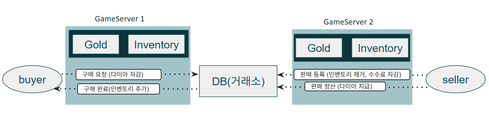

# 통합 거래소 시스템 (Bazaar)

## 1. 개요
이 문서는 게임 로직 중 거래소 구현에 대해 설명한다.
 
거래소 시스템은 플레이어 간 아이템 거래를 지원하며 서버간 거래도 가능하도록 설계되었다.   
판매자가 아이템을 등록하면 구매자가 다이아(과금 재화)로 구매하고, 판매자가 정산을 청구하는 방식으로 동작한다.  

### 도입 배경
MMORPG 플레이 경험상 소규모 서버에서는 거래소가 활발하지 않아 불편함을 느꼈다.  
거래소 데이터를 중앙 DB에서 관리하면 여러 GameServer에 걸친 통합 거래소를 구현할 수 있어 이를 해소할 수 있다.  
다만 모든 서버를 통합할 경우 서버 경제 균형이 깨질 수 있어, 거래가 활발하지 않은 소규모 서버끼리만 통합하는 방향이 운영상 바람직할 것으로 판단된다.

### 한계점
- __두 장군 문제__: DB와 Cache 간 완전한 일관성을 보장하는 것은 수학적으로 불가능하다.
- Crash 시 인벤토리 반영 누락이 발생할 수 있으며, 이는 Bounded Loss로 수용한다.
- 과금 재화(Diamond)는 트랜잭션으로 보호되지만, 아이템 유실 가능성은 잔존한다.
- 거래 로그(bazaar_log) 기반 수동 복구로 피해를 최소화한다.

## 2. 핵심 설계 결정

### 2.1 재화 관리 전략: 데이터 특성 기반 계층 분리

재화 종류별 데이터 특성이 다르므로 저장 전략을 분리 적용했다.

| 구분 | Gold (게임플레이 재화) | Diamond (과금 재화) |
|------|----------------------|-------------------|
| 갱신 빈도 | 고빈도 (몬스터 처치, 퀘스트 보상 등) | 저빈도 (아이템 구매, 부활 등) |
| 손실 허용 | 제한적 손실 수용 가능 | 0 (실제 금전 환산 가능) |
| 저장 전략 | In-Process 캐시 | DB 직접 관리 + 트랜잭션 |
| 이유 | DB 부하 최소화, 저지연 처리 | 완전한 ACID 보장, 감사 추적 필수 |

> 현재는 거래소 처리만 로그를 남기고 있지만, 다이아몬드 같은 유료 재화는 모든 변동이력을 별도 테이블에 기록해야한다. 

### 2.2 Diamond 트랜잭션 처리 구조

초기 설계에서는 다이아를 캐시에 유지하는 방식을 고려했으나, Crash 시 데이터 유실을 막을 수 없는 구조였다.  
__두 장군 문제(Two General's Problem)__ 로 인해 DB와 캐시의 상태를 수학적으로 완전히 일치시킬 수 없으므로, 결국 다이아를 DB에 두고 트랜잭션으로 처리하는 구조를 채택했다.

다이아 거래는 트랜잭션(Stored Procedure)으로 처리하여 완전한 ACID를 보장한다.

__애플리케이션 레벨 트랜잭션 처리의 한계__
```cpp
// 애플리케이션 레벨 트랜잭션 (예시)
conn->setAutoCommit(false);
conn->ExecuteUpdate("UPDATE characters_diamond SET diamond = diamond - ? WHERE char_id = ?", price, buyerID);  // 홉 1
conn->ExecuteUpdate("UPDATE bazaar SET status = 'SOLD' WHERE listing_id = ?", listingID);                     // 홉 2
conn->ExecuteUpdate("INSERT INTO bazaar_log ...");                                                             // 홉 3
conn->commit();  // 홉 4 — lock 점유 시간: 홉 1 ~ 홉 4
```
- MysqlConnector는 한번에 쿼리 1개만 처리할 수 있는 구조이다.  
- 쿼리마다 네트워크 홉을 오가는 구조에서는 애플리케이션 레벨에서 트랜잭션을 처리하는것은 성능적으로 부적절하다고 판단했다. 
- 따라서 트랜잭션 처리가 필요한 로직은 Stored Procedure로 구현하여 DB에서 원자적으로 처리하도록 설계하였다. 


### 2.3 두 장군 문제와 Bounded Loss 수용

거래소 아이템 등록/취소 과정에서 Item이 유실될 수 있는 문제는 여전히 존재한다.  
이는 두 장군 문제의 한계로, __완전한 일관성을 보장하는 것은 불가능__ 하다.  

대응 전략:
- Diamond는 Stored Procedure + 트랜잭션으로 ACID 보장
- 거래 로그(bazaar_log)에 이전 아이템 수량 기록 → Crash 후 수동 복구 가능
- 이외의 데이터 유실은 시스템 장애 시 발생할 수 있는 불가피한 손실로 간주
- 정기적인 백업과 모니터링으로 최소화 

## 3. 거래 흐름


| 저장소 | 관리 데이터 | 전략 |
|--------|------------|------|
| Cache (In-Process) | Inventory, Gold | Write-Back, 손실 수용 |
| DB (Billing) | Diamond, Bazaar, bazaar_log | 트랜잭션, 감사 추적 |


## 4. BUY 처리 상세 (sp_bazaar_buy)

1. listing 정보 조회 (`status = 'TRADING'` 조건)
2. 구매자 diamond 차감 (`diamond >= price` 조건으로 원자적 처리)
3. bazaar CAS: `TRADING → SOLD` (`ROW_COUNT() = 0`이면 rollback)
4. bazaar_log INSERT (`buyer_prev_quantity` 포함 — 복구용)
5. COMMIT → 인벤토리 PartialUpdate

__Crash Point__: COMMIT 이후 ~ PartialUpdate 전 Crash 시

| 항목 | 상태 |
|------|------|
| diamond | 차감 완료 |
| bazaar status | SOLD |
| bazaar_log | 기록 있음 |
| 인벤토리 (Cache) | 미반영 |
| 복구 가능 여부 | bazaar_log의 buyer_prev_quantity 기반 수동 복구 가능 |

## 5. CLAIM 처리 상세 (sp_bazaar_claim)

1. listing 조회 (`status = 'SOLD'`, `seller_id` 조건)
2. bazaar CAS: `SOLD → CLAIMED`
3. seller diamond 지급
4. bazaar_log `claim_status` 업데이트 (`READY → CLAIMED`)
5. COMMIT

CLAIM 처리는 전부 Transaction 단위 내에서 처리되기 때문에 데이터 유실은 발생하지 않는다. 

## 6. 고가 아이템 거래 리스크 대응

### 현재 구현
- 모든 아이템 등급 거래 가능
- Crash 시 Bounded Loss 수용 (두 장군 문제)

### 한계 인식
- 전설/신화급 아이템은 Crash 시 손실 추적 어려움
- 거래 빈도 자체가 낮아 현실적 리스크는 제한적

### 향후 개선책
- 전설 이상 아이템에 `unique_item_id` 부여
- `unique_items` 테이블로 소유권 추적
- 거래 시 `unique_item_log`에 이력 기록
- Crash 후 로그 기반 정확한 복구 가능


## 7. 참고

- [BazaarTest.md](BazaarTest.md)