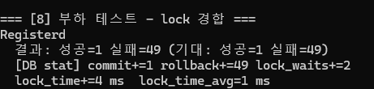

# 통합 거래소 테스트 (BazaarTest)

## 1. 개요

이 문서는 [통합 거래소 시스템](Bazaar.md)의 기능 테스트, 경합 상황 테스트, Crash 시나리오 테스트, 부하 테스트를 기록한다.

## 2. 목적

- 기본 거래 흐름 (REGISTER → BUY → CLAIM) 정상 동작 검증
- Crash 시 DB 정합성 및 복구 가능성 확인
- 동시 구매 경합 상황에서 정합성 검증
- lock contention 발생 수준 관측

## 3. 테스트 환경

- CacheLib를 인스턴스화하여 각 인스턴스를 GameServer 1개로 설정하여 테스트를 진행한다.   
- MockMessageQueue를 통해 CacheLib에 메시지를 직접 주입하고 응답을 수신하는 방식으로 동작한다. 
- 커넥션 풀 크기 - Game DB: 3, Billing DB: 3

## 4. 테스트

### 4.1 기본 기능 테스트 (Test 1 ~ 5)

| 테스트 | 설명 |
|--------|------|
| Test1 | 인벤토리 아이템 추가/제거 |
| Test2 | Currency (Gold) 추가/조회 |
| Test3 | Diamond 추가/조회 |
| Test4 | Bazaar 기본 동작 (REGISTER → BUY → CLAIM) |
| Test5 | Seller 오프라인 상태에서 BUY + 재접속 후 CLAIM |

__결과__   

- Test1: 아이템 추가/제거 정상 동작 확인 (인벤토리 상태 변화 확인)
- Test2: Gold 추가 및 조회 정상 동작 확인 (Gold 상태 변화 확인)
- Test3: Diamond 추가 및 조회 정상 동작 확인 (Diamond 상태 변화 확인)
- Test4: 기본 거래 흐름 정상 동작 확인 (bazaar 상태 변화, 구매자 diamond 차감, 판매자 다이아몬드 지급)
- Test5: 판매자가 오프라인 상태에서도 BUY가 정상 처리되고, 판매자 재접속 시 CLAIM이 정상 처리 확인. 

### 4.2 Crash 상황 테스트 (Test 6)

__시나리오__: `CRASH_POINT_BUY` 매크로 활성화 시, sp_bazaar_buy() COMMIT 이후 ~ 인벤토리 PartialUpdate 전 `abort()` 발생

__목적__: Crash 이후에도 bazaar_log 기반으로 복구 가능한 상태임을 확인

__흐름__:
1. Seller가 아이템 등록
2. Buyer가 구매 요청 → DB 트랜잭션 성공 후 abort()
3. DB 상태 및 인벤토리 상태 확인

__기대 결과__:

| 항목 | 기대 상태 |
|------|----------|
| bazaar status | SOLD |
| diamond | 차감 완료 |
| bazaar_log | 기록 있음 (buyer_prev_quantity 포함) |
| 인벤토리 (Cache) | 아이템 미반영 |
| 복구 가능 여부 | bazaar_log 기반 수동 복구 가능 |

__결과__:  

- Crash 없이 테스트: 정상 결과  

- Crash 상황: inventory에 아이템이 반영되지 않은 상태  

- Crash 후 DB 상태 확인: transaction 정상 처리 확인 및 다이아몬드 차감 확인. (900 -> 800)
- buyer_prev_quantity가 0으로 기록되어 있어, 수동 복구 시 아이템 수량을 buyer_prev_quantity 기준으로 1개 추가하여 복구할 수 있음을 확인하였다.

### 4.3 경합 상황 테스트 (Test 7)

__시나리오__: 10개 buyer가 5개 listing에 동시 구매 요청

__목적__: 동시 구매 경합 상황에서 CAS로 중복 구매가 발생하지 않음을 검증

| 항목 | 값 |
|------|-----|
| Buyer 수 | 10 |
| Listing 수 | 5 |
| 총 요청 수 | 50 |
| 기대 성공 | 5 |
| 기대 실패 | 45 |

__결과__

| 항목 | 결과 |
|------|------|
| 성공 | 5 |
| 실패 | 45 |
| commit | +5 |
| rollback | +45 |
| lock_waits | +1 |

### 4.4 부하 테스트 - lock contention 관측 (Test 8)

__목적__: 서버 성능 검증보다는 단일 listing에 대한 최대 lock contention이 얼마나 발생하는지 관측하는 것이 목적

__시나리오__: 50개 buyer가 단일 listing에 동시 구매 요청

| 항목 | 값 |
|------|-----|
| Buyer 수 | 50 (Server 10 × 5) |
| Listing 수 | 1 |
| 총 요청 수 | 50 |
| 기대 성공 | 1 |
| 기대 실패 | 49 |

__결과__ 

| 항목 | 결과 |
|------|------|
| 성공 | 1 |
| 실패 | 49 |
| commit | +1 |
| rollback | +49 |
| lock_waits | +2 |
| lock_time | +4 ms |
| lock_time_avg | 1 ms |

로컬 환경 특성상 네트워크 레이턴시가 없어 실제 운영 환경과 차이가 있을 수 있다.  
거래소 BUY는 발생 빈도가 낮은 작업이므로 lock contention이 서버 전체 성능에 미치는 영향은 제한적일 것으로 판단된다.

## 5. 테스트 결과 정리

| 테스트 | 결과 | 비고 |
|--------|------|------|
| 기본 기능 (1~5) | 통과 | - |
| Crash 시나리오 (6) | 통과 | bazaar_log 기반 복구 가능 확인 |
| 경합 상황 (7) | 통과 | 정합성 검증 — 중복 구매 없음 |
| lock contention (8) | 통과 | 단일 listing 50 동시 요청 — lock_waits: 2회, lock_time_avg: 1ms |

## 6. 참고

- [Bazaar.md](Bazaar.md)