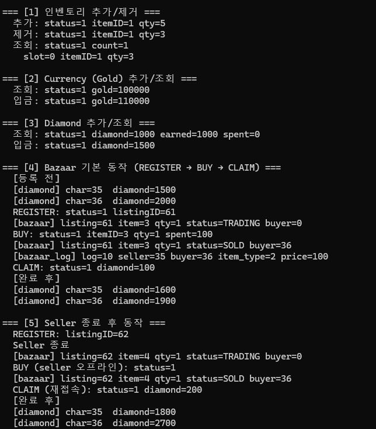
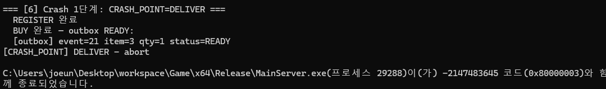
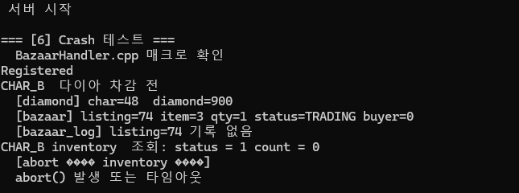
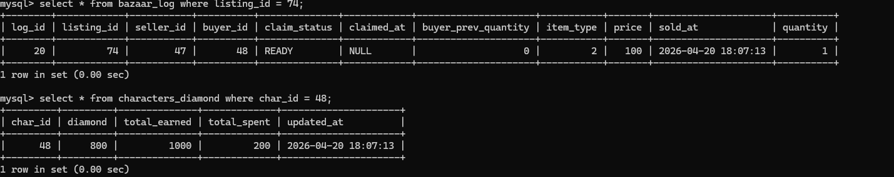
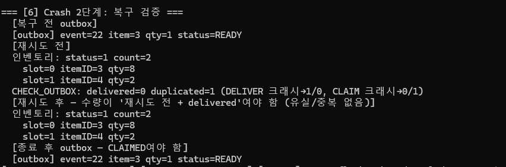
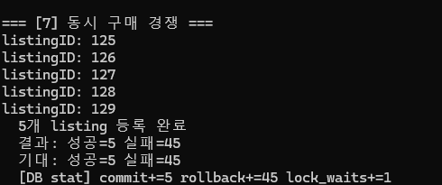
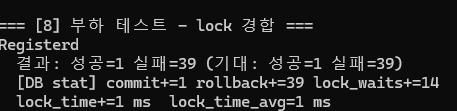
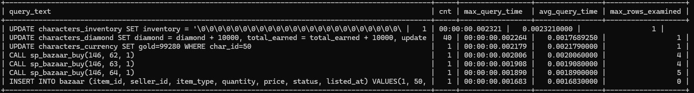

# 통합 거래소 테스트 (BazaarTest)

## 1. 개요

이 문서는 [통합 거래소 시스템](Bazaar.md)의 기능 테스트, 경합 상황 테스트, Crash 시나리오 테스트, 부하 테스트를 기록한다.


## 2. 목적

- 기본 거래 흐름 (REGISTER → BUY → 배송 → CLAIM) 정상 동작 검증  
- Crash 시 배송의 exactly-once 수렴(유실·중복 없음) 확인  
- 동시 구매 경합 상황에서 정합성 검증
- lock contention 발생 수준 관측

## 3. 테스트 환경

- CacheLib를 인스턴스화하여 각 인스턴스를 GameServer 1개로 설정하여 테스트를 진행한다.   
- MockMessageQueue를 통해 CacheLib에 메시지를 직접 주입하고 응답을 수신하는 방식으로 동작한다. 
- 커넥션 풀 크기 - Game DB: 3, Bazaar DB: 3

## 4. 테스트

### 4.1 기본 기능 테스트 (Test 1 ~ 5)

| 테스트 | 설명 |
|--------|------|
| Test1 | 인벤토리 아이템 추가/제거 |
| Test2 | Currency (Gold) 추가/조회 |
| Test3 | Diamond 추가/조회 |
| Test4 | Bazaar 기본 동작 (REGISTER → BUY → CHECK_OUTBOX 배송 → CLAIM) + 중복 배송 방어(CheckOutbox 2회 → 수량 불변, outbox CLAIMED 수렴) |
| Test5 | Seller 오프라인 상태에서 BUY + Seller 재접속 CLAIM + Buyer 재접속 CHECK_OUTBOX 수령 |

__결과__   


- Test1: 아이템 추가/제거 정상 동작 확인 (인벤토리 상태 변화 확인)
- Test2: Gold 추가 및 조회 정상 동작 확인 (Gold 상태 변화 확인)
- Test3: Diamond 추가 및 조회 정상 동작 확인 (Diamond 상태 변화 확인)
- Test4: 기본 거래 흐름 정상 동작 확인 (bazaar 상태 변화, 구매자 diamond 차감, 판매자 다이아몬드 지급)
- Test5: 판매자가 오프라인 상태에서도 BUY가 정상 처리되고, 판매자 재접속 시 CLAIM이 정상 처리 확인. 

### 4.2 Crash 상황 테스트 (Test 6) — exactly-once 배송 검증  

Outbox·Inbox 배송 파이프라인의 두 취약 지점에서 크래시를 유발하고, 재시작 후 **유실도 중복도 없이** 수렴하는지 확인한다.  
크래시 지점은 매크로가 아니라 **환경변수**로 제어한다 (재빌드 불필요, `Cache::CrashPoint`).  

__실행 방법__ (2단계):  

```
# 공통: 테스트 모드 진입 (미설정 시 일반 서버로 기동)
set TEST_BAZAAR=1

# 1단계: 크래시 유발
set CRASH_POINT=DELIVER   (또는 CLAIM) 후 실행 → abort

# 2단계: 복구 검증 (cleanup 없이 크래시 당시 DB 상태에서 재시작)  
set CRASH_VERIFY=1        후 재실행
```

__크래시 지점과 기대 결과__:  

| 지점 | 타이밍 | 크래시 직후 DB | 복구(2단계) 기대 |
|------|--------|---------------|-----------------|
| `DELIVER` | 배송(DeliverItem) 반영 후, blob flush 전 | 인벤토리에 아이템 없음 + outbox READY | 재배송 (delivered=1) → 아이템 정확히 1개 |
| `CLAIM` | blob flush 성공 후, outbox CLAIM 전 | 인벤토리에 아이템 있음 + outbox READY | dedup 스킵 (duplicated=1) → 수량 불변, flush 후 CLAIMED |

두 경우 모두 최종 상태는 동일해야 한다: **수량 = 재시도 전 + delivered, outbox 전부 CLAIMED**.  
DELIVER 케이스는 재배송으로 유실이 없는지를, CLAIM 케이스는 dedup으로 중복이 생기지 않는지를 확인한다.  

__결과__:  


> DELIVER 크래시: 배송 반영 후 flush 전 abort — outbox READY, 인벤토리 미반영 상태


> 복구: 재배송(delivered=1)으로 수량 6 → 7 (재시도 전 + delivered), outbox CLAIMED — **유실 없음**


> CLAIM 크래시: 인벤토리 flush 후 outbox CLAIM 전 abort — 배송 자체는 이미 durable, outbox만 READY로 남음


> 복구: CLAIM 크래시는 인벤토리가 이미 DB에 반영된 상태이므로, dedup이 재배송을 스킵(duplicated=1)하고
> **아이템 수량 변화 없이 outbox만 READY → CLAIMED로 전환** — **중복 없음**.

### 4.3 경합 상황 테스트 (Test 7)

__시나리오__: 10개 buyer가 5개 listing에 동시 구매 요청

__목적__: 동시 구매 경합 상황에서 CAS로 중복 구매가 발생하지 않음을 검증

| 항목 | 값 |
|------|-----|
| Buyer 수 | 10 |
| Listing 수 | 5 |
| 총 요청 수 | 50 |
| 기대 성공 | 5 |
| 기대 실패 | 45 |

__결과__



| 항목 | 결과 |
|------|------|
| 성공 | 5 |
| 실패 | 45 |
| commit | +5 |
| rollback | +45 |
| lock_waits | +1 |

### 4.4 부하 테스트 - lock contention 관측 (Test 8)

__목적__: 서버 성능 검증보다는 단일 listing에 대한 최대 lock contention이 얼마나 발생하는지 관측하는 것이 목적

__시나리오__: 40개 buyer가 단일 listing에 동시 구매 요청

| 항목 | 값 |
|------|-----|
| Buyer 수 | 40 (Server 20 × 2) |
| Listing 수 | 1 |
| 총 요청 수 | 40 |
| 기대 성공 | 1 |
| 기대 실패 | 39 |

__결과__ 



| 항목 | 결과 |
|------|------|
| 성공 | 1 |
| 실패 | 39 |
| commit | +1 |
| rollback | +39 |
| lock_waits | +14 |
| lock_time | +1 ms |
| lock_time_avg | 1 ms |

__slow query 관측 결과__


전부 2ms 내외로 측정되었으며, stored procedure의 max_rows_examined도 4~5로 측정되어 풀스캔 없이 필요한 row만 접근하는 것을 확인할 수 있다.  
stored procedure 40회 호출 중 3회만 slow query로 기록되었으며, 이는 lock contention으로 인해 query_time이 1ms 임계값을 초과한 것으로 추정된다.   
나머지 37회는 1ms 미만에 처리되어 기록되지 않았다.   
임계값을 1ms로 설정했기 때문에 관측된 수치인 것일 뿐 실제로는 전부 정상범위 내에서 처리된 것이다. 

## 5. 테스트 결과 정리

| 테스트 | 결과 | 비고 |
|--------|------|------|
| 기본 기능 (1~5) | 통과 | Test4에 배송·중복 방어(dedup), Test5에 buyer 재접속 수령 포함 |
| Crash 시나리오 (6) | 통과 | DELIVER: 재배송으로 유실 없음 / CLAIM: dedup 스킵으로 중복 없음 — exactly-once 수렴 |
| 경합 상황 (7) | 통과 | 정합성 검증 — 중복 구매 없음 |
| lock contention (8) | 통과 | 단일 listing 40 동시 요청 — lock_waits: 14회, lock_time_avg: 1ms |

__lock_waits는 발생했지만 lock_time은 짧았던 이유__
40건의 동시 요청 중 14건이 실제로 락 대기를 겪었으므로 경합 자체는 발생했다. 다만 대기 시간은 평균 1ms로 매우 짧았는데, 그 이유는 다음과 같다.  
- 테스트 환경에서 요청 타이밍을 정확히 일치시킬 수 없어, 14건 각각의 대기가 다수 요청이 동시에 몰린 것이 아니라 소수 요청끼리 겹친 수준에 그쳤다.
- stored procedure로 트랜잭션이 DB 내부에서 완결되어 lock holding time 자체가 짧다.
- 프로시저는 SELECT FOR UPDATE 없이 CAS 패턴(UPDATE WHERE status = 'TRADING')으로 경합을 처리하므로, 경합 지점이 bazaar 테이블의 단일 UPDATE로 한정되고 실패한 트랜잭션은 즉시 rollback된다.

## 6. 참고

- [Bazaar.md](Bazaar.md)