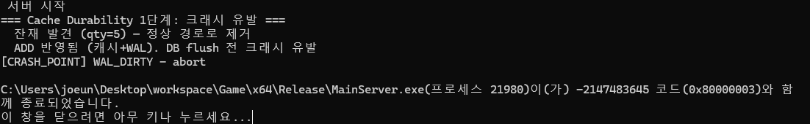
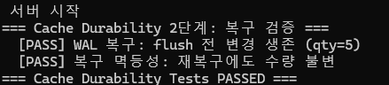

# Cache Durability Test (WAL)

## 1. 개요
본 문서는 [WAL](WAL.md) 도입 이후 캐시의 durability를 검증한 테스트를 기록한다.  
검증 대상은 "DB flush 이전에 크래시가 나도 변경이 유실되지 않는가"와 "복구를 여러 번 반복해도 안전한가(멱등성)" 두 가지다.  

## 2. 목적
- flush(30초 주기) 이전 크래시 시, WAL Replay로 dirty 변경이 복구되는지 확인
- 복구를 반복 실행해도 중복 적용 없이 수량이 유지되는지(멱등성) 확인
- 크래시로 반쯤 쓰인 로그 꼬리(torn tail), CRC 손상, 세그먼트 회전 등 WAL 자체의 견고성을 단위 테스트로 별도 검증  

## 3. 테스트 환경
- CacheLib를 인스턴스화하여 GameServer 1개로 설정하고 테스트를 진행한다 (`MockMessageQueue`로 메시지 직접 주입).
- 크래시 지점은 매크로가 아니라 **환경변수**로 제어한다 (재빌드 불필요, `Cache::CrashPoint`).  
- WAL 세그먼트 파일(`redo.*`)은 테스트 종료 시 삭제하지 않는다 — WAL과 DB의 `lastLsn`은 한 몸이라, WAL만 지우면 세그먼트 번호가 리셋되어 새로 발급되는 LSN이 DB에 남은 값보다 작아지고 복구가 조용히 무력화된다.   

__실행 방법__ 

```
# 공통: 테스트 모드 진입
set TEST_CACHE_DURABLE=1

# 1단계: 크래시 유발
set CRASH_POINT=WAL_DIRTY   후 실행 → 캐시+WAL 반영 직후, DB flush 전 abort

# 2단계: 복구 검증 (cleanup 없이 크래시 당시 상태에서 재실행)
set CRASH_VERIFY=1          후 재실행
```

## 4. 시나리오

1단계에서 인벤토리에 아이템을 추가(qty=5)한다. 이 시점에 캐시와 WAL에는 반영되지만, write-back 주기(30초)에는 한참 못 미쳐 **DB에는 아직 반영되지 않은 상태**에서 `CrashPoint("WAL_DIRTY")`로 프로세스를 abort시킨다.  
2단계는 같은 WAL 파일을 그대로 둔 채 재기동한다. `Initializer::Initialize()`가 부팅 시 WAL을 replay하여 "DB에 반영된 적 없는(lsn > blob.lastLsn) 최신 이미지"를 캐시에 되살리고, 이어서 조회로 수량이 살아있는지 확인한다.   
이후 노드를 한 번 더 띄워 같은 WAL을 재복구시켜, 이번엔 direct flush로 DB의 `lastLsn`이 레코드를 따라잡아 restore가 스킵되고 수량이 그대로인지(멱등성) 확인한다.  

## 5. 결과


> 1단계: 이전 실행 잔재(qty=5)를 정상 경로로 정리한 뒤 재차 ADD 반영 → `WAL_DIRTY` 크래시 포인트에서 abort.  
> DB flush 전이므로 이 시점 DB에는 해당 변경이 없다.


> 2단계: 재기동 시 WAL Replay가 flush 전 변경(qty=5)을 캐시에 복원 — **유실 없음**.  
> 이어서 재복구를 한 번 더 수행해도 수량이 그대로 유지됨 — **복구 멱등성 확인**.

| 검증 항목 | 결과 |
|---|---|
| flush 전 크래시 → 변경 유실 여부 | 유실 없음 (WAL 복구로 qty=5 생존) |
| 복구 반복 시 중복 적용 여부 | 중복 없음 (dbLSN이 레코드를 따라잡으면 restore 스킵) |

## 6. WAL 단위 테스트 (Google Test)

WAL 자체의 견고성은 `UnitTests/BaseLib/WAL.cpp`에서 별도로 검증한다.

| 테스트 | 검증 내용 |
|---|---|
| `Init` | 레코드 하나를 기록하고 파일 바이트를 직접 읽어 헤더, payload가 정확히 직렬화되는지 확인 |
| `Replay` | 100개 레코드 기록 → 재오픈 시 순서대로 전부 replay되는지 확인 |
| `Segment` | 세그먼트 LIMIT 도달 시 회전(rotation)하고, 재시작 후 마지막 세그먼트의 이어쓰기가 정확한 offset에서 재개되는지 확인 |
| `CorruptedCrcRecovery` | 마지막 레코드의 payload 1바이트를 손상시킨 뒤 replay가 그 레코드 직전까지만 복구하고 파일을 해당 지점으로 truncate하는지 확인 |
| `TruncateAndAppend` | 헤더 크기 미만의 torn tail(쓰다 만 꼬리)을 흉내낸 뒤, 절단 후 이어쓰기가 빈틈없이 이어지고 재기동 시 전부 replay되는지 확인 |
| `MultiTypeDispatch` | 서로 다른 타입(A/B) 레코드를 교차 기록 후, replay에서 타입별로 정확히 분기되고 레코드 검증되는지 확인 |
| `TruncateBefore` | 경계(boundary) 이전 세그먼트만 삭제되는지, 활성 세그먼트는 경계와 무관하게 항상 보존되는지, truncate 후 이어쓰기, 재기동 replay가 정상 동작하는지 확인 |

## 7. 참고
- [WAL](WAL.md) — 설계 근거, LSN·truncate·degraded mode 상세
- [CacheLib ACID](CacheLib_ACID.md)
- [CacheDurabilityTest.h](MainServer/CacheDurabilityTest.h)
- [WAL.cpp (Google Test)](UnitTests/BaseLib/WAL.cpp)
