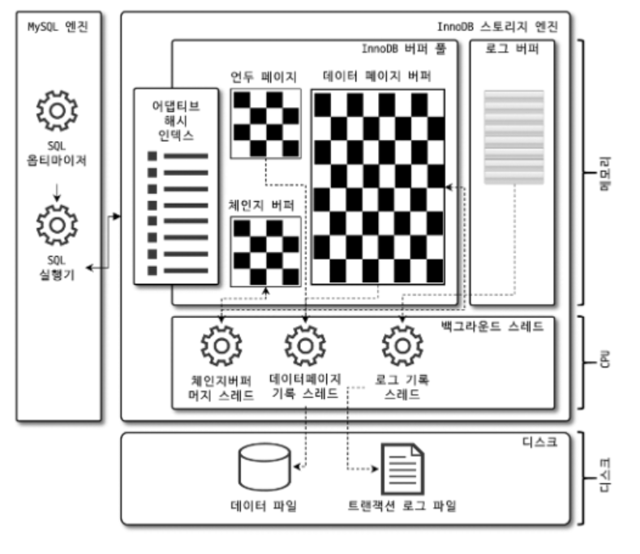
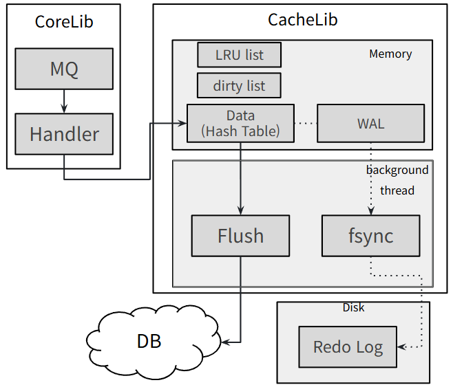

# CacheLib

## 1. 개요
본 문서는 CacheLib의 구조와 Cache 시스템과 DB와의 동작을 설명한다.  
캐시 동작 검증을 위해 Inventory 데이터를 기준으로 구체적인 캐시 동작을 설계하였다.


## 2. 캐시 배치 전략

캐시 서버를 별도 클러스터로 분리할지, 게임 서버에 직접 탑재할지는 데이터 특성에 따라 결정하였다.

__In-Process 캐시 (게임 서버 내 탑재)__

인벤토리와 같이 레이턴시에 민감한 데이터는 게임 서버에 직접 탑재한다.
- 별도 캐시 서버와의 네트워크 통신 비용 제거
- 현대 서버의 메모리 용량과 성능상 분리의 이점이 크지 않음

__External 캐시 (별도 캐시 서버)__

여러 서버 간에 공유되어야 하고 레이턴시에 민감하지 않은 데이터는 Redis 등 별도 캐시 서버에서 처리하는 것이 적합하다.

__vs Redis__

Redis는 캐시 안정성이 입증되었고 클러스터(샤드) 지원 등 
운영 측면에서 장점이 있다.

다만 Redis를 캐시로 사용하는 경우 게임 서버가 캐시 조회/업데이트와 
DB 조회/업데이트를 모두 직접 처리해야 하며, Redis에 맞는 형태로 
데이터를 파싱해야 한다.

```
[ 클라이언트 ] ──→ [ 게임 서버 ] ──→ [ Redis ]
                       ↑  ↓
                       [ DB ]
```

본 프로젝트에서는 Write-Back을 캐시 서버 내부에서 직접 처리하는 
구조가 필요했기 때문에 In-Process 캐시를 직접 구현하였다.


## 3. 목적

부하가 큰 DB IO를 줄여 게임 서버의 안정성을 높이기 위해 In-Process 메모리 캐시를 사용하여 DB write-back 구조를 설계하였다.  
Inventory 데이터를 기준으로 구체적인 캐시 동작을 설계하고 검증한다.

```
[ 클라이언트 ] ──→ [ 게임 서버 ] ──→ [ CacheLib (In-Memory) ]
                                              ↓ write-back
                                          [ DB ]
```


## 4. 구조
### 서버 동작 흐름

| 색상 | 스레드 |
|---|---|
| 흰색 | CacheMQ worker 스레드 |
| 노란색 | FlushDispatcher 스레드 |
| 파란색 | CacheFlush 스레드 |

__Write-Back__


update 요청이 CacheStorage에 반영된 후 일정 시간이 지나면 FlushDispatcher가 dirty 데이터를 감지하여 CacheFlush를 통해 DB에 write-back한다.

__Read-Through__


캐시 미스 발생 시 DB에서 데이터를 읽어와 CacheStorage에 적재한 후 응답을 반환한다.  
CacheMQ는 수신 MQ, GameMQ는 캐시 서버 기준 응답 송신 MQ이다.


### 공용 템플릿 메서드

| 메서드 | 설명 |
|---|---|
| `TryGet` | 캐시에서 데이터 조회 시도 |
| `Rollback` | DB 쓰기 실패 시 재시도(재flush) 처리. 처음 2회는 즉시 재시도, 3회째부터는 `dirty_list` 재등록으로 백오프하여 무한정 재시도(데이터는 버리지 않음) |
| `WriteDone` | DB 쓰기 완료 후 재시도 카운터 초기화. LRU에서 이미 제거된(evict 대상) 항목만 캐시에서 최종 삭제하고, 그 외에는 AVAILABLE 상태로 캐시에 유지한다 |
| `ForEachDirty` | dirty 상태의 캐시 항목 순회 |
| `TrySetReading` | DB 조회 중 상태 설정 (중복 조회 방지) |
| `Insert` | 캐시에 데이터 삽입 |
| `SetEmpty` | 캐시 항목을 빈 상태로 설정 |

> `dirty_list`에서의 제거는 `WriteDone` 시점이 아니라 `FlushDispatcher`가 flush를 큐에 넣는 시점(발행 시점)에 이루어진다. 따라서 `WriteDone`은 dirty 여부를 다시 판단하지 않고, 순수하게 "eviction 완료 처리"와 "재시도 카운터 리셋"만 담당한다.

### 개별 캐시 메서드

| 메서드 | 설명 |
|---|---|
| `LoadFromDB` | DB에서 데이터를 읽어 캐시에 적재 |
| `Getter` | 캐시 데이터 반환 |
| `PartialUpdate` | 캐시 데이터 부분 업데이트 |
| `GetFlushCommand` | DB write-back용 FlushCommand 생성 |
| `ResultToString` | 캐시 데이터를 문자열로 변환 (로깅용) |

### 사용자 접근 패턴 (Inventory 기준)

__Read__
```
클라이언트 요청
    → TryGet
        → cache hit  → Getter → 응답
        → cache miss → TrySetReading → LoadFromDB → Insert → Getter → 응답
```

__Update__
```
클라이언트 요청
    → TryGet
        → PartialUpdate → dirty 마킹 → 응답
            → FlushDispatcher → GetFlushCommand → DB write-back
                → 성공 → WriteDone
                → 실패 → Rollback
```

__종료 처리__

정상 종료 시에는 `CleanUp()`이 dirty 데이터를 **먼저 동기적으로 DB에 반영**한다. WAL은 그 이후 소멸자에서 마지막 fsync만 수행하는데, 이 시점엔 이미 모든 dirty 데이터가 DB에 반영된 뒤라 durability 관점에서는 하우스키핑에 가깝다 — 정상 종료는 WAL Replay 없이도 데이터 유실이 없다.  
비정상 종료(크래시) 시에는 이 flush 자체가 일어나지 않으므로, 재기동 시 WAL Replay를 통해 flush되지 못한 변경 사항을 복구한다. LSN 기반 복구 규칙 등 상세 설계는 [WAL.md](WAL.md) 참고.

### InnoDB 아키텍처와 비교


>InnoDB 아키텍처


>CacheLib 아키텍처

CacheLib의 구조는 InnoDB 스토리지 엔진의 Buffer Pool과 유사한 설계 철학을 따른다.  

__유사한 점__
- Write-Ahead Logging(WAL) 기반 변경 기록
- 메모리 캐싱 후 비동기 디스크 반영
- LRU 기반 교체 정책
- Dirty 데이터 관리 및 백그라운드 Flush

__차이점__

| 항목 | InnoDB Buffer Pool | CacheLib |
|------|-------------------|----------|
| 영속성 | Redo Log(WAL) + Checkpoint | WAL(Write-Ahead Log) + DB Write-Back |
| 장애 복구 | Redo Log Replay | WAL Replay 후 Cache 복원 |
| 데이터 접근 | B+Tree (범위/조건 탐색 지원) | Hash Table (O(1) point lookup) |
| 메모리 관리 | Free List  | 미적용 — Hash Table 기반 동적 할당 구조 |
 
## 5. 특징

- __샤드 기반 lock 분리__ — CacheStorage 내부적으로 샤드 단위로 mutex를 분리하여 lock 경합을 최소화
- __순환 의존 방지__ — 의존성 주입 대신 함수 객체(function object) 사용으로 구조적 순환 의존을 방지
- __TOCTOU 처리__ — 캐시 조회 후 lock 획득 시 상태를 다시 확인하는 구조로 Time-of-check to time-of-use 경쟁 상황을 방지하였다
- __LRU eviction__ — eviction 발생 시 데이터를 즉시 제거하지 않고 LRU 리스트에서만 제거 후 DB write-back 완료 후 최종 제거. 
- __ACID를 고려한 설계__ — 캐시 동작 전반에 걸쳐 ACID를 따르도록 설계. 자세한 내용은 [ACID 설계 문서](CacheLib_ACID.md) 참고  
- __WAL 기반 장애 복구__ — 캐시 변경과 WAL 기록을 하나의 임계 구역에서 처리하며, 서버 장애 발생 시 WAL Replay를 통해 Flush되지 않은 Dirty 데이터를 복원한다. 상세 설계는 [WAL 설계 문서](WAL.md) 참고

## 6. 참고
- [CacheLib ACID 설계 문서](CacheLib_ACID.md)
- [CacheLib 단위 테스트 문서](CacheLib_Test.md)
- [WAL 설계 문서](WAL.md)
- [Cache Durability Test](CacheDurabilityTest.md)
