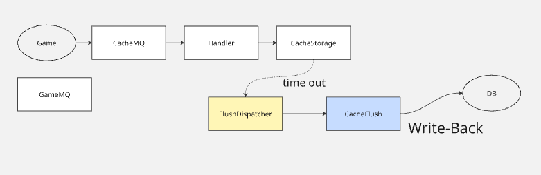
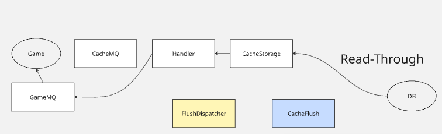

# CacheLib

## 1. 개요
본 문서는 CacheLib의 구조와 Cache 시스템과 DB와의 동작을 설명한다.  
캐시 동작 검증을 위해 Inventory 데이터를 기준으로 구체적인 캐시 동작을 설계하였다.


## 2. 캐시 배치 전략

캐시 서버를 별도 클러스터로 분리할지, 게임 서버에 직접 탑재할지는 데이터 특성에 따라 결정하였다.

__In-Process 캐시 (게임 서버 내 탑재)__

인벤토리와 같이 레이턴시에 민감한 데이터는 게임 서버에 직접 탑재한다.
- 별도 캐시 서버와의 네트워크 통신 비용 제거
- 현대 서버의 메모리 용량과 성능상 분리의 이점이 크지 않음

__External 캐시 (별도 캐시 서버)__

여러 서버 간에 공유되어야 하고 레이턴시에 민감하지 않은 데이터는 Redis 등 별도 캐시 서버에서 처리하는 것이 적합하다.

__vs Redis__

Redis를 캐시 서버로 사용하는 경우 Redis 서버에서 직접 DB에 Write 할 수 없다.  
또한 Redis에 맞는 형태로 데이터를 파싱해야 하는 단점이 존재한다.  
즉 게임 서버에서 캐시 조회, 업데이트, DB 조회, 업데이트를 모두 처리해야 하는 구조이다.

```
[ 클라이언트 ] ──→ [ 게임 서버 ] ──→ [ Redis ]
                       ↑  ↓
                       [ DB ]
```

반면 Redis를 사용하는 경우 캐시의 안정성이 입증되었고, 클러스터(샤드) 지원 등의 장점이 있다.


## 3. 목적

부하가 큰 DB IO를 줄여 게임 서버의 안정성을 높이기 위해 In-Process 메모리 캐시를 사용하여 DB write-back 구조를 설계하였다.  
Inventory 데이터를 기준으로 구체적인 캐시 동작을 설계하고 검증한다.

```
[ 클라이언트 ] ──→ [ 게임 서버 ] ──→ [ CacheLib (In-Memory) ]
                                              ↓ write-back
                                          [ DB ]
```


## 4. 구조

### 서버 동작 흐름

| 색상 | 스레드 |
|---|---|
| 흰색 | CacheMQ worker 스레드 |
| 노란색 | FlushDispatcher 스레드 |
| 파란색 | CacheFlush 스레드 |

__Write-Back__




update 요청이 CacheStorage에 반영된 후 일정 시간이 지나면 FlushDispatcher가 dirty 데이터를 감지하여 CacheFlush를 통해 DB에 write-back한다.

__Read-Through__




캐시 미스 발생 시 DB에서 데이터를 읽어와 CacheStorage에 적재한 후 응답을 반환한다.  
CacheMQ는 수신 MQ, GameMQ는 캐시 서버 기준 응답 송신 MQ이다.


### 공용 템플릿 메서드

| 메서드 | 설명 |
|---|---|
| `TryGet` | 캐시에서 데이터 조회 시도 |
| `Rollback` | DB 쓰기 실패 시 이전 상태로 복구 |
| `WriteDone` | DB 쓰기 완료 후 dirty 플래그 해제 |
| `ForEachDirty` | dirty 상태의 캐시 항목 순회 |
| `TrySetReading` | DB 조회 중 상태 설정 (중복 조회 방지) |
| `Insert` | 캐시에 데이터 삽입 |
| `SetEmpty` | 캐시 항목을 빈 상태로 설정 |

### 개별 캐시 메서드

| 메서드 | 설명 |
|---|---|
| `LoadFromDB` | DB에서 데이터를 읽어 캐시에 적재 |
| `Getter` | 캐시 데이터 반환 |
| `PartialUpdate` | 캐시 데이터 부분 업데이트 |
| `GetFlushCommand` | DB write-back용 FlushCommand 생성 |
| `ResultToString` | 캐시 데이터를 문자열로 변환 (로깅용) |

### 사용자 접근 패턴 (Inventory 기준)

__Read__
```
클라이언트 요청
    → TryGet
        → cache hit  → Getter → 응답
        → cache miss → TrySetReading → LoadFromDB → Insert → Getter → 응답
```

__Update__
```
클라이언트 요청
    → TryGet
        → PartialUpdate → dirty 마킹 → 응답
            → FlushDispatcher → GetFlushCommand → DB write-back
                → 성공 → WriteDone
                → 실패 → Rollback
```

__종료 처리__

별도의 종료 처리 없이 write-back과 LRU에 의해 자연스럽게 처리된다.
- LRU eviction으로 메모리 내 데이터를 직접 제거할 필요 없음
- 재접속 시 캐시에 데이터가 남아있어 유리함

## 5. 특징

- __샤드 기반 lock 분리__ — CacheStorage 내부적으로 샤드 단위로 mutex를 분리하여 lock 경합을 최소화
- __순환 의존 방지__ — 의존성 주입 대신 함수 객체(function object) 사용으로 구조적 순환 의존을 방지
- __TOCTOU 처리__ — lock 획득 후 재조건 체크하는 구조 적용. 캐시 미스 후 동시 요청이 들어오는 경우 첫 번째 요청이 DB 조회 중일 때 두 번째 요청은 READING 상태를 감지하고 재시도를 클라이언트에 위임
- __LRU eviction__ — eviction 발생 시 데이터를 즉시 제거하지 않고 LRU 리스트에서만 제거 후 DB write-back 완료 후 최종 제거. 
- __ACID 준수__ — 캐시 동작 전반에 걸쳐 ACID를 따르도록 설계. 자세한 내용은 [ACID 설계 문서](CacheLib_ACID.md) 참고


## 6. 참고
- [CacheLib ACID 설계 문서](CacheLib_ACID.md)
- [CacheLib 단위 테스트 문서](CacheLib_Test.md)