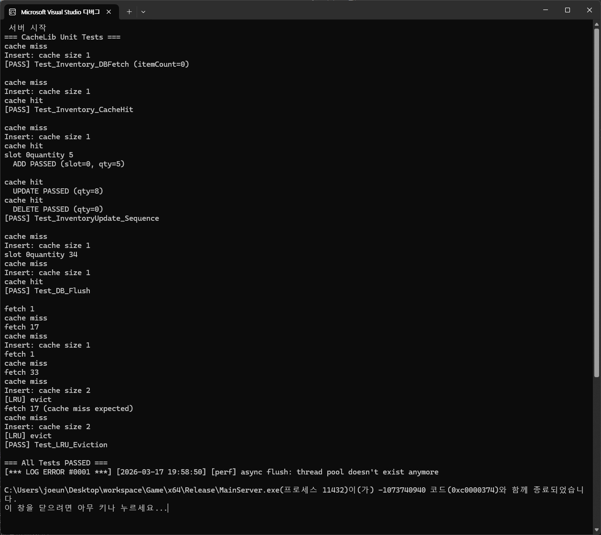

# CacheLib Test

## 1. 개요
본 문서는 CacheLib의 단위 테스트 결과를 기록한다.

## 2. 테스트 범위
CacheLib의 기본적인 동작을 검증하고 관측 범위 내에서 기능을 테스트한다.  
ACID 검증의 경우 단위 테스트에서 유의미한 검증 수단이 없어 테스트 항목에서 제외하였다.  
다만 테스트 과정에서 버그 추적을 통해 Rollback 등 ACID 관련 동작이 정상적으로 수행되는 것을 간접적으로 확인하였다.  

__테스트 항목__  
1. DB에서 fetch가 제대로 이루어지는지
1. cache hit가 발생하는지
1. update 요청이 캐시에 반영되는지
1. 종료 시 캐시에 업데이트된 내용이 DB에 저장되는지
1. 캐시 사이즈 초과 시 LRU 정책에 의해 데이터가 정리되는지

__테스트 준비__  
`CacheLib/Config.h`에서  LRU eviction 테스트를 위해 CACHE_SIZE를 2로 설정한다.  
단위 테스트에서는 캐시 내부에 가시성이 없기 때문에 동작 검증을 위해 CacheLib 내부에 다음 출력문을 추가하였다.  
- cache hit
- cache miss
- insert시 cache size
- LRU evict 발생  

다중 스레드 환경에서 콘솔 출력이 뒤섞이지 않도록 Block(sleep) 메서드로 임시 제어한다.
각 테스트 메서드에서 CacheLib를 초기화하여 메서드 종료 시 소멸자에 의해 캐시가 정리되도록 하였다.

## 3. 테스트 결과 분석

> 유닛 테스트 결과

### Test_Inventory_DBFetch
목적 : 처음 read 요청 시 DB에서 데이터를 읽어와 처리하는지 검증  
결과 : 최초 요청에서 cache miss 발생 후 DB에서 읽어와 캐시에 insert되는 것을 확인  

### Test_Inventory_CacheHit
목적 : 동일 데이터에 재요청 시 cache hit가 발생하는지 검증  
결과 : 최초 요청에서 cache miss 발생 후 두 번째 요청에서 cache hit가 발생하여 insert가 발생하지 않는 것을 확인  

### Test_InventoryUpdate_Sequence
목적 : update 요청 동작 및 아이템 사용 완료 슬롯 처리 검증  
결과 : 추가(+5) → 추가(+3) → 감소(-8) 순서의 입력 처리 결과가 정상 동작하는 것을 확인  

### Test_DB_Flush
목적 : 업데이트된 캐시 내용이 Flush 동작에 의해 DB에 저장되는지 검증  
시나리오 : 추가(id: 33, qty: 34) → CacheLib 소멸자 → CacheLib 생성자 → 조회(id: 33, qty: 34)  
결과 : 캐시에 업데이트한 내용이 DB에 정상적으로 저장되는 것을 확인  

### Test_LRU_Eviction
목적 : 캐시 용량 제한을 위해 설계된 LRU 동작이 정상 수행되는지 검증  
시나리오 : 캐시 크기 2 설정 → 데이터 3개 삽입 → LRU evict 확인 → 최초 삽입 데이터 재조회 → cache miss 확인  
결과 : evict 동작이 정상 수행되는 것을 확인하였으며 캐시 서버의 메모리 누수가 없음을 검증  

## 4.참고
[UnitTestCache.h](MainServer/UnitTestCache.h)