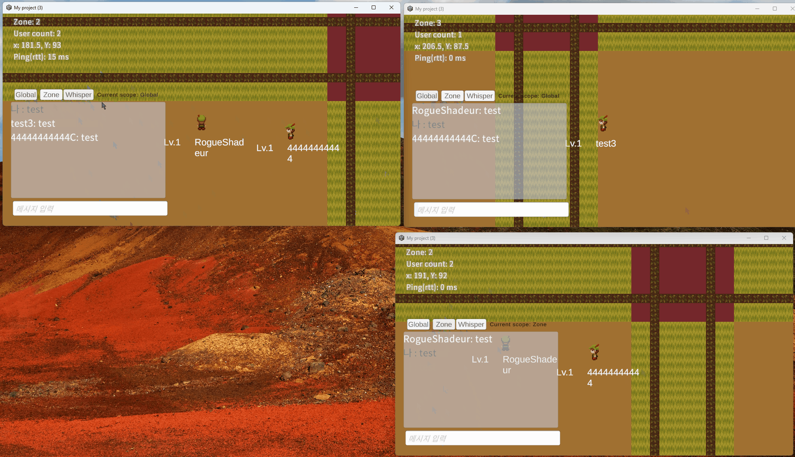

# 채팅 기능 리팩토링

## 1. 개요
이 문서는 MMORPG 서버의 채팅 기능을 Zone 중심 구조에서 독립된 Chat Thread 구조로 리팩토링한 과정을 정리한 기술 문서이다.

## 2. 문제상황
초기 설계에서는 Zone 단위 채팅만을 고려하여, Zone 내부 ID 관리와 채팅 처리를 하나로 묶어 Zone Thread에서 처리하였다.    
이 구조는 구현이 단순하다는 장점은 있었으나, 다음과 같은 문제가 있었다.  
- Zone Thread에 채팅 로직으로 인한 불필요한 부하가 추가됨
- Global 채팅, Whisper 채팅 등 채팅 기능 확장이 어려움  

## 3. 수정사항
__구조 변경__  
채팅 처리를 Zone Thread에서 분리하고, 전용 Chat Thread를 두는 구조로 리팩토링하였다.
- 모든 채팅 대상은 ChatID를 기준으로 식별하며, Session과 매핑하여 관리
- Session 관리가 일부 중복되지만, Session의 생명주기와 ChatID의 생명주기를 일치시키는 방향으로 설계
	- SessionManager의 처리 결과(Zone Change, Disconnect)를 이벤트로 전달받아 반영  
	
__처리 방식__  
채팅 전송, Session 추가/제거, Zone 이동과 같은 처리를 하나의 이벤트 구조체로 통합 
- 외부 호출자에 의한 lock이 발생하지 않도록 하였다.

## 4. 설계 결정 및 트레이드오프
- Lock-free 큐에 재시도(back-off) 정책은 적용하지 않음
	- 큐가 가득 찬 경우 채팅 이벤트는 드롭
	- Back-pressure 상황에서 재시도로 인한 CPU 소모가 채팅 유실보다 더 치명적이라고 판단
- World / Zone 채팅은 Batch 처리를 적용
	- 한 틱에서 여러 채팅을 묶어 패킷 전송
	- 채팅 지연은 증가하지만, 실시간성 요구가 상대적으로 낮은 채팅 특성상 허용 가능한 수준이라고 판단  

## 5. 시연
 
> Whisper 채팅  
UI 복잡도를 줄이기 위해 Whisper 창을 하나로 통합하였다.  
채팅 메시지를 클릭하면 해당 대상을 Whisper 타겟으로 설정하여 메시지를 전송할 수 있다.

## 6. 참고
- 관련 PR: [채팅 기능 리팩토링 #11](https://github.com/JoEunil/MMORPG/pull/11)
- [ChatThreadPool](CoreLib/ChatThreadPool.cpp)
