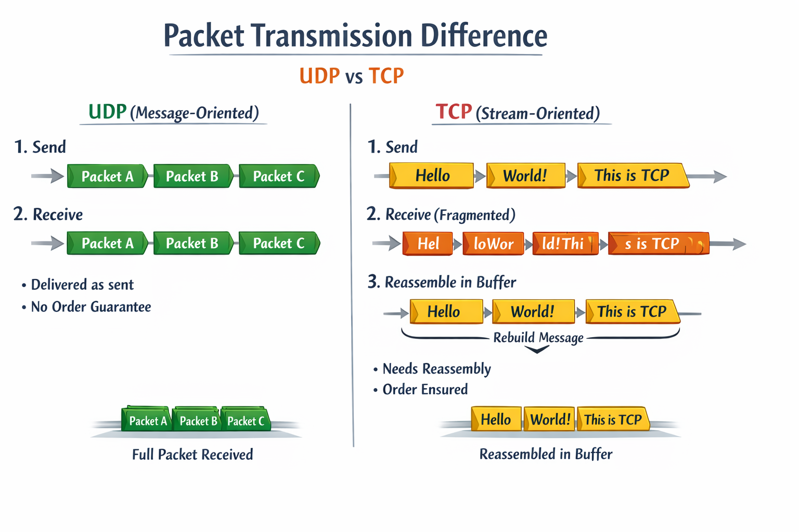

# ClientContext

## 1. 개요
TCP 수신 처리 시 누적버퍼 처리를 위해 사용되는 ClientContext를 설명하는 문서이다.

##  2. TCP vs UDP 메시지 처리

> TCP와 UDP 패킷 처리 차이  

UDP
- 메시지 단위 프로토콜
- 애플리케이션이 보낸 단위(데이터그램)가 그대로 전달됨
	- recv 호출 시 한 번에 보낸 단위 그대로 읽음
- MTU보다 큰 경우 IP 레벨에서 fragment → 수신 시 재조합됨
- 순서 보장 및 재전송 없음 → 손실 가능

TCP
- 스트림 단위 프로토콜
- 애플리케이션이 보낸 메시지 단위가 보장되지 않음
	- recv 호출로 읽는 데이터는 TCP가 결정한 스트림 조각 단위
- 수신 측에서 여러 send() 호출 데이터가 하나로 합쳐지거나,
- 하나의 send()가 여러 recv() 호출로 쪼개져 도착할 수 있음
- 따라서 TCP를 사용할 경우 애플리케이션 레벨에서 __수신 버퍼를 재조합하여 원래 메시지 단위의 패킷__을 만들어야 함

## 3. ClientContext 개념
`ClientContext` 클래스는 각 클라이언트 연결에 대한 TCP 수신 버퍼를 관리하며,
패킷 단위로 데이터를 분리하기 전까지의 누적 데이터를 처리하는 역할을 수행한다.

- 목적: 클라이언트별 TCP 수신 버퍼 관리
- 책임:
  - 수신된 데이터를 누적 버퍼에 저장
  - 패킷 단위로 분리할 수 있는 구조 제공 (RingBuffer + PacketView)
  - Zero-copy 전략 유지
  - Buffer Release 관리 (작업 완료 후 반환)

## 4. 구조
- 멤버 변수
  - `RingBuffer m_buffer` : TCP 수신 누적 버퍼
  - `uint64_t m_sessionID` : 연결된 세션 ID (캐시)
  - `std::atomic<int16_t> m_workingCnt` : 버퍼 점유 중인 작업 수
  - `std::vector<std::pair<uint16_t, uint16_t>> m_releaseQ` : 버퍼 반환 큐
- Mutex 사용
  - 내부 버퍼 Release 경로에만 사용
  - 수신/처리 경로는 lock-free 유지, 싱글 스레드 접근이 보장됨

## 5. 동작
1. 수신 데이터는 `EnqueueRecvQ()` 호출로 누적
2. 패킷 분리가 완료되면 `PacketView`를 통해 외부로 전달
3. 처리 완료 후 `ReleaseBuffer()`로 RingBuffer 반환
4. 게임 세션 종료 시 `ClienContextPool`에 반납되고 workingCnt가 0이 되면 flush 로직에 의해 처리됨.

## 6. 설계 결정 및 트레이드오프
- 포인터로 외부에서 사용하도록 설계
  - 수명 관리는 ContextPool에서 flush 정책과 workingCnt를 통해 안전하게 보장
- Session 상태와 직접 연관시키지 않음
  - Session 관련 상태는 `SessionManager` 및 `SessionState`에서 관리

## 7. 참고
- [PacketView.h](NetLibrary/PacketView.h)
- [SessionManager.h](NetLibrary/SessionManager.h)
- [RingBuffer.h](NetLibrary/RingBuffer.h)