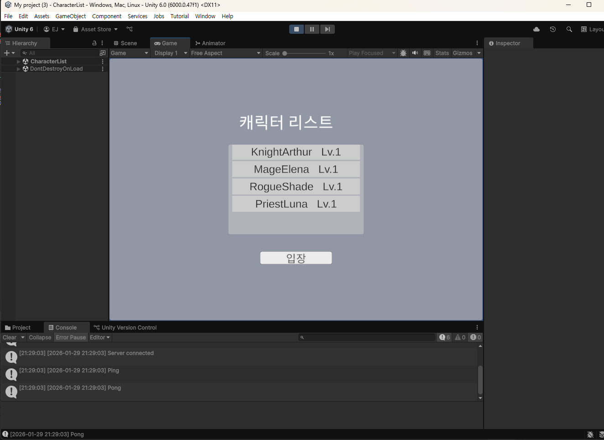

# DB

## 1. 개요
본 문서는 이 프로젝트에서 사용된 DB 구성과 설계 결정에 대해 설명한다.

## 2. 구성
| 데이터베이스 | 테이블 | 설명 |
|---|---|---|
| Login | users | 사용자 계정 정보 |
| Game | characters | 캐릭터 정보 |
| Game | characters_inventory | 캐릭터 인벤토리 (수직 파티셔닝) |
| Game | characters_currency | 캐릭터 재화 (수직 파티셔닝) |
| Game | v_user_characters | 캐릭터 목록 조회용 View |
| Billing | bazaar | 거래소 등록 정보 |
| Billing | bazaar_log | 거래 이력 |
| Billing | bazaar_claim | 판매자 정산 처리 |
| Billing | characters_diamond | 캐릭터 유료 재화 |

>거래소 관련 내용은 [거래소 설계 문서](Bazaar.md) 참고

## 3. 사용 기술
### 수직 파티셔닝

`characters` 테이블은 캐릭터 정보를 담는 테이블로, 기존에는 `inventory(blob)` 컬럼도 같은 테이블에서 관리하였다.

하지만 인벤토리 데이터는 다음과 같은 특성을 가진다.

- Zone 내부 시뮬레이션 로직에서 접근할 필요가 없음
- 접근 빈도와 응답 속도를 고려하여 Cache Server에서 유지 및 관리

따라서 애플리케이션 레벨에서 별도로 조회/저장되는 데이터를 같은 테이블에 두어 lock 경합 가능성을 높이는 것보다,   
`characters_inventory` 테이블로 수직 파티셔닝하는 것이 적합하다고 판단하였다.

### Composite Index

게임 접속 흐름은 다음과 같다.

```
로그인 서버 토큰 발급 → 게임 서버 진입 요청 → 토큰 검증(user_id 인가) → 캐릭터 선택 → 게임 진입
```
  
> 캐릭터 선택 화면

캐릭터 선택 단계에서 `characters` 테이블을 `user_id`, `channel_id` 기준으로 필터링하여 캐릭터 목록을 조회해야 한다.   
탐색 속도와 lock 범위를 줄이기 위해 복합 인덱스를 설정하였다.

인덱스 효율은 카디널리티가 높을수록(데이터가 분산될수록) 좋기 때문에 `user_id → channel_id` 순서로 설정하였다.

```sql
CREATE INDEX idx_user_channel ON characters(user_id, channel_id);
```


### View Table

```sql
CREATE OR REPLACE VIEW v_user_characters AS
SELECT 
    c.user_id,
    c.channel_id,
    c.char_id,
    c.name,
    c.level
FROM characters c
WHERE c.deleted_at IS NULL;
```

MySQL은 쿼리를 수신할 때마다 다음 단계를 거친다.

```
1. 파싱  →  2. 실행 계획 수립  →  3. 실행
```

초기 설계 의도는 반복 쿼리의 파싱 및 실행 계획 수립 비용을 줄이기 위함이었으나, 해당 캐싱은 Prepared Statement에 의해 처리된다.

View Table의 실질적인 이점은 다음과 같다.

- __쿼리 추상화__ — 애플리케이션 코드 단순화
- __유지보수__ — 조건 변경 시 View 한 곳만 수정하면 됨
- __민감 데이터 노출 제한__ — 필요한 컬럼만 노출하여 불필요한 데이터 접근 차단

### Stored Procedure
거래소의 구매(sp_bazaar_buy), 정산(sp_bazaar_claim) 등 원자성이 필수인 작업은 Stored Procedure로 처리한다. 
트랜잭션이 DB 내부에서 완결되어 lock holding time을 최소화하고, 애플리케이션 크래시가 트랜잭션 안정성에 영향을 주지 않는다.

프로시저 상세는 [거래소 설계 문서](Bazaar.md) 참고

## 4. 추후 업데이트

- Transaction - 상점 거래 등 중요 데이터 유실 방지 
- Sharding - 튜플 증가로 탐색 속도 저하 시 적용. `channel_id` 기준 수평 샤딩 검토 
- 로그 DB - 로그인 기록 등 이력 관리용 별도 테이블 구성 

## 5. 참고
- [DB 초기화 스크립트](Resources/DB/init.sql)
