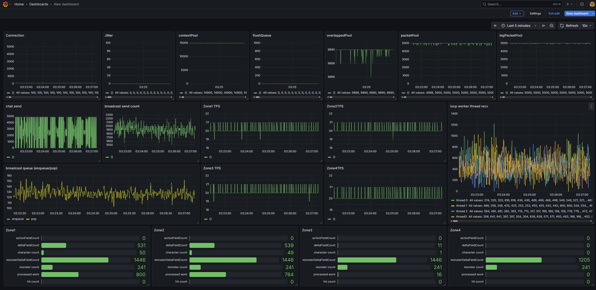

# Dummy client test

## 1. 개요

이 문서는 서버 성능 검증을 위해 사용되는 __더미 클라이언트 테스트(Dummy Client Test)__ 의 구조와 동작 방식에 대해 설명한다.  
더미 클라이언트는 실제 사용자 행동을 단순화하여 시뮬레이션함으로써, 서버가 특정 부하 조건에서 어떻게 동작하는지 측정하기 위한 도구이다.

## 2. 목적

게임 서버는 운영 환경에서 메모리 풀 고갈로 인해 추가 할당이 발생하면 성능 저하나 일시적 지연 같은 부하 문제가 발생할 수 있다.
따라서 서버가 감당 가능한 부하 수준을 사전에 식별하고, 메모리 관리 전략이 정상적으로 동작하는지 검증하기 위해 더미 클라이언트를 이용한 부하 테스트가 필요하다.

이 테스트를 통해 다음 항목을 관측할 수 있다:
- 서버 메모리 풀 사용량 변화
- 패킷 처리량 증가 시 TPS 변화
- 모니터링 시스템(Grafana + Loki + Promtail)과 연동한 실시간 성능 상태
- 예상 병목 지점(네트워크 IO, 로직 스레드 등)
> 운영 환경에서는 Prometheus와 같은 서버 메트릭 수집기를 통해 CPU, Memory, Network I/O 등 다양한 성능 지표를 수집·분석하는 것이 일반적이다.  
다만 본 테스트 환경은 단일 PC 기반의 로컬 테스트였기 때문에 별도의 메트릭 수집기를 구성하지 않았으며,  
기본적인 리소스 사용량은 Windows 작업관리자를 통해 확인하였다.

## 3. 테스트 환경

더미 클라이언트는 실제 네트워크 부하를 모사하되, 로직 연산은 최소화하여 서버의 한계를 측정할 수 있도록 구성하였다.   
__하드웨어__   
- 단일 4코어 PC (Server, DB, Monitoring, Dummy Clients)

__모니터링__  
- Grafana + Loki + Promtail

__더미 클라이언트 동작__ 
- I/O 방식: 수신은 비동기 처리, 송신은 싱글 스레드 루프 기반.
- 로직 최적화: 초기 진입 시 필요한 패킷 외 플레이 패킷은 수신 즉시 폐기.
- 연결 추적: 연결중인 클라이언트 수를 추적하고, 주기적으로 콘솔에 출력함.
- 부하 패턴: 매 Tick(20 FPS) 이동 패킷 송신 및 1.6초 주기로 Zone 대상 채팅 패킷 송신, Ping 패킷 응답(1초 주기)
	- Action 패킷: 12 byte * 20 / sec = 240 byte / sec
	- Chat 패킷: 17 byte + 6 byte (message) / 1.6 ~= 14 byte / sec 
	- Pong 패킷: 14 byte / sec = 14 byte / sec
	- 클라이언트 1명당 송신 부하: 268 byte / sec  = 268 byte / sec = 2,144 bps
> 클라이언트 -> 서버 네트워크 부하는 매우 적음

## 4. 100명 테스트 결과 분석 

### 4.1 자원 효율성 및 풀 상태

- Memory Pool: overlapped pool, packet pool 모두 객체 자원 반납이 즉각적으로 이루어짐을 확인하였다.  
 전체 객체 사용량이 정상 범위 내에서 안정적으로 유지되고 있다.
- Broadcast Queue: Lock-free 기반 작업 큐의 enqueue, pop 횟수를 실시간 추적한 결과, 두 그래프의 오차가 거의 발생하지 않았다.   
 이는 큐에 작업이 적체되지 않고 원활하게 처리되고 있음을 의미한다.
 
### 4.2 전송 처리량(Throughput)

채팅 송신 (Server → Client):
- 설정: 1.6초당 1회 채팅 발송.
- 현황: 1번 Zone(50명), 2번 Zone(49명), 3번 Zone(1명) 
- 분포.결과: 한 Zone에서 50명이 채팅 시 50 * 50 = 2,500 회의 송신 발생. 
- 모니터링 그래프에서 0~5,000 사이의 진폭을 그리며 정상적으로 브로드캐스트됨을 확인하였다.

스냅샷 송신 (Broadcast Send Count):
- 이론적 최대치: `(20FPS (character) + 10FPS(monster)) * 100(명) = 3000 Send/s`
- 실측치: 중앙값 약 1,900 Send/s (1,500 ~ 2,300 구간 형성)
- AOI 효율: 실측 결과 약 **37%**의 전송 절감 효과를 보임.   
  예측치(64%)보다 낮은 이유는 클라이언트가 Grid 내에 균등하게 분배되지 않고 특정 Cell에 밀집 되어 시야 내 객체 수가 증가했기 때문이다.  
[AOI](AOI.md)에서 AOI 평균 효율 계산 참고.

> 유저가 Cell에 균등하게 분포되어있지 않음

### 4.3 시스템 안정성 지표

- Zone TPS: 4개 Zone 모두 19~21 FPS를 유지. 틱 지연 없이 로직 주기를 정확히 수행하고 있다.
- Worker Threads: IOCP 수신 호출 횟수가 모든 워커 스레드에 고르게 분포되어, 작업 분배가 잘 이루어지고 있음을 확인하였다.
- 데이터 정밀도:
	- Monster Delta Field: 몬스터 수의 약 6배 검출 (10 FPS 처리 반영).  
	-> 몬스터 상태 변화가 없기 때문에 단순 이동만 처리하고 있음. 10 FPS 단위로 Delta 처리하고 있기 때문에 정확한 수치.
	- Action Reult, hit count는 스킬 입력이 없어 0으로 관측됨. 
	- 설계된 필드 갱신 로직이 누락 없이 작동하고 있음을 수치로 증명하였다.
	
### 4.4 Character Delta Field 관측값과 이동 입력 분석

__현상: 이론치 대비 낮은 Delta 발생 빈도__    
- 이론치: 20 FPS 설정에서 Full Snapshot(1회)을 제외한 초당 19배의 유저당 Delta 발생이 예상됨.  
- 실측치: 유저 수의 약 11배 수준으로 검출됨.  

__원인 분석 1: 틱 불일치 및 패킷 병합__  
더미 클라이언트가 20 FPS로 이동 패킷을 송신하더라도, 다음과 같은 네트워크/스케줄링 요인으로 인해 서버 틱 내에서 데이터가 압축된다.    
비동기 타이밍: 클라이언트 송신 틱과 서버 수신 틱이 정확히 일치하지 않아, 서버의 한 틱(50ms) 내에 2개 이상의 이동 패킷이 도착하거나 0개가 도착하는 불균형 발생.    
Nagle: TCP_NODELAY 설정을 하지 않은 환경에서 패킷 뭉침 현상 발생.    
Dirty Flag 로직: 서버는 한 틱에 여러 패킷이 수신되더라도, 틱이 종료되는 시점의 최종 변경 상태만을 Delta로 기록하므로, 틱 내의 중간 변화 과정은 자연스럽게 압축된다.  

__원인 분석 2: 지표 측정 방식의 특성__  
현재 지표는 "변경 필드의 총 개수"가 아닌 "Delta가 발생한 엔티티(유저/몬스터)의 수"를 추적하고 있다. (실수)  
즉, 한 틱에 특정 유저의 필드가 5개 변하든 1개 변하든 '1'로 카운트된다.  
결과적으로 초당 11배라는 수치는 "초당 20번의 서버 틱 중 약 11번의 틱에서 해당 유저의 유효한 이동 변화가 감지되었다"는 것을 의미하며, 이는 네트워크 환경과 서버 틱 메커니즘이 결합된 현실적인 수치로 해석된다.  

__개선 방향: 좌표 기반 검증 체계로의 전환 필요성__  
Authoritative 구조의 유지: 서버 권위를 포기하는 것이 아니라, 검증의 대상을 입력에서 결과(좌표)로 변경해야 한다.    
검증 로직의 고도화: 클라이언트로부터 최종 이동 좌표를 받되, 서버는 이전 좌표와의 거리와 시간차를 계산하여 유저의 속도 범위 내에 있는지를 검증하는 방식으로 개선이 필요하다.  
기대 효과: 이를 통해 패킷 전송이 불규칙하더라도 결과적으로 동일한 위치 정합성을 유지할 수 있으며, 서비스 품질과 서버의 보안성을 동시에 확보할 수 있다.  

## 5. 1000명 테스트 실패 분석  
### 5.1 테스트 개요 및 현상  
환경: 단일 4코어 PC에 게임 서버, DB(Redis), 모니터링(Loki/Grafana), 1,000개의 더미 클라이언트를 동시 구동.  
결과: CPU 리소스 고갈로 인한 서버 로직 처리 지연 및 일부 클라이언트 연결 끊김 발생.  

### 5.2 원인 분석  
관측 지표:   
- 모니터링 시스템에서 Overlapped Pool 사용량의 급격한 증가 확인.    
  이는 커널에 요청한 I/O 작업이 완료되지 못하고 대기 상태로 쌓여 있음을 의미함.   
- CPU 사용률 100%   

추정 원인:
1. 과도한 Context Switching 및 CPU Starvation:Process Explorer 분석 결과, 특정 스레드의 독점은 발견되지 않았으나, 시스템 전체의 스레드 수가 코어 수에 비해 과도함.  
1. CPU 부하가 임계치를 넘어서며 IOCP의 완료 보고(CQ)를 처리하는 속도가 패킷 수신 속도를 따라가지 못함.
1. 서버의 I/O 처리 지연으로 인해 수신 버퍼가 가득 차고, 버퍼 오버플로우에 의해 소켓 연결 종료된 것으로 추정
	1. 로컬에서 테스트는 네트워크 대역폭 문제에서 자유로움
	1. 에러 로그는 관측되지 않았고, 소켓 종료 로그가 관측됨.

### 5.3 추후 개선 사항
1개의 서버에 5000명의 클라이언트 테스트를 통과하기 위해 필요한 것
1. 서버 분리
	1. 로그인 서버, Redis, 모니터링 도구, 게임 서버를 분리하여 CPU 및 I/O 경쟁을 제거해야 한다.
1. 패킷 대역폭 최적화
	1. Full 패킷에서 Name 필드를 제거하고, 별도 로드 방식으로 변경하여 패킷 크기를 경량화해야 한다.
	1. Full 패킷 발송 주기를 5~7초 수준으로 늘려 전체 대역폭을 줄인다.
	1. 현재는 grid 기반의 단순 AOI를 사용하지만, CPU 사이클을 더 사용하더라도 대역폭 절감을 위한 AOI 알고리즘 적용이 필요하다.
1. Zone 전환 로직 개선
	1. 현재는 None Zone 핸들러에서 zone 전환 요청을 받으면 zone thread에 lock을 걸어 전환을 처리하고 있다.
	1. 각 zone에 작업 큐를 두어 mutex 없이 작업큐를 통해 비동기적으로 처리되도록 해야한다.
	1. zone 내부로직은 zone 전환을 제외하고는 싱글스레드 접근이라 모든 mutex를 제거할 수 있게된다.

## 6.참고
- [DummyClient](DummyClients/Program.cs)
- [NetPerfCollector.h](NetLibrary/NetPerfCollector.h)
- [CorePerfCollector.h](CoreLib/CorePerfCollector.h)
