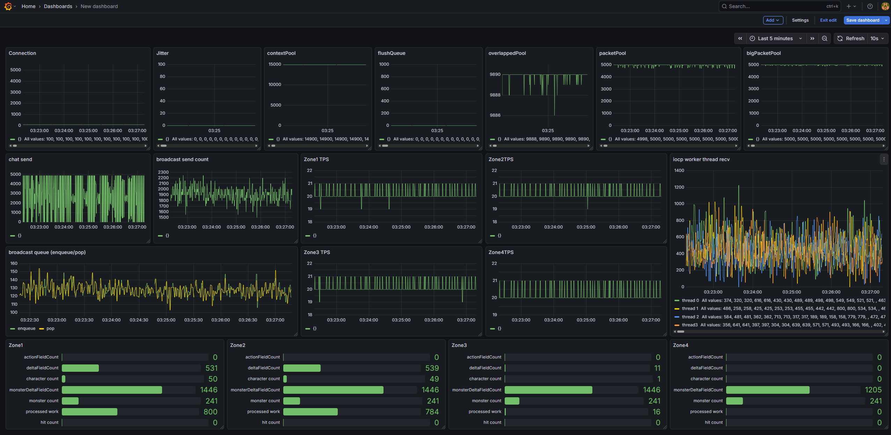
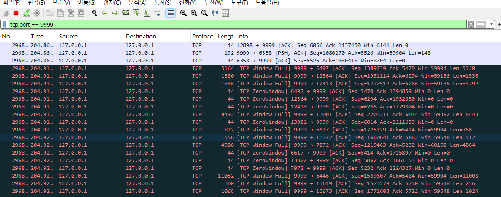

# Dummy client test

## 1. 개요

이 문서는 서버 성능 검증을 위해 사용되는 __더미 클라이언트 테스트(Dummy Client Test)__ 의 구조와 동작 방식에 대해 설명한다.  
더미 클라이언트는 실제 사용자 행동을 단순화하여 시뮬레이션함으로써, 서버가 특정 부하 조건에서 어떻게 동작하는지 측정하기 위한 도구이다.

## 2. 목적

게임 서버는 운영 환경에서 메모리 풀 고갈로 인해 추가 할당이 발생하면 성능 저하나 일시적 지연 같은 부하 문제가 발생할 수 있다.
따라서 서버가 감당 가능한 부하 수준을 사전에 식별하고, 메모리 관리 전략이 정상적으로 동작하는지 검증하기 위해 더미 클라이언트를 이용한 부하 테스트가 필요하다.

이 테스트를 통해 다음 항목을 관측할 수 있다:
- 서버 메모리 풀 사용량 변화
- 패킷 처리량 증가 시 TPS 변화
- 모니터링 시스템(Grafana + Loki + Promtail)과 연동한 실시간 성능 상태
- 예상 병목 지점(네트워크 IO, 로직 스레드 등)
> 운영 환경에서는 Prometheus와 같은 서버 메트릭 수집기를 통해 CPU, Memory, Network I/O 등 다양한 성능 지표를 수집·분석하는 것이 일반적이다.  
다만 본 테스트 환경은 단일 PC 기반의 로컬 테스트였기 때문에 별도의 메트릭 수집기를 구성하지 않았으며,  
기본적인 리소스 사용량은 Windows 작업관리자를 통해 확인하였다.


## 3. 테스트 환경

더미 클라이언트는 실제 네트워크 부하를 모사하되, 로직 연산은 최소화하여 서버의 한계를 측정할 수 있도록 구성하였다.   
__하드웨어__   
- 단일 4코어 PC (Server, DB, Monitoring, Dummy Clients)

__모니터링__  
- Grafana + Loki + Promtail

__더미 클라이언트 동작__ 
- I/O 방식: 수신은 비동기 처리, 송신은 싱글 스레드 루프 기반.
- 로직 최적화: 초기 진입 시 필요한 패킷 외 플레이 패킷은 수신 즉시 폐기.
- 연결 추적: 연결중인 클라이언트 수를 추적하고, 주기적으로 콘솔에 출력함.
- 부하 패턴: 매 Tick(20 FPS) 이동 패킷 송신 및 1.6초 주기로 Zone 대상 채팅 패킷 송신, Ping 패킷 응답(1초 주기)
	- Action 패킷: 12 byte * 20 / sec = 240 byte / sec
	- Chat 패킷: 17 byte + 6 byte (message) / 1.6 ≈ 14 byte / sec 
	- Pong 패킷: 14 byte / sec
	- 클라이언트 1명당 송신 부하: 268 byte / sec ≈ 2,144 bps
> 클라이언트 -> 서버 네트워크 부하는 매우 적음

## 4. 100명 테스트 결과 분석 

### 4.1 자원 효율성 및 풀 상태

- Memory Pool: overlapped pool, packet pool 모두 객체 자원 반납이 즉각적으로 이루어짐을 확인하였다.  
 전체 객체 사용량이 정상 범위 내에서 안정적으로 유지되고 있다.
- Broadcast Queue: Lock-free 기반 작업 큐의 enqueue, pop 횟수를 실시간 추적한 결과, 두 그래프의 오차가 거의 발생하지 않았다.
 이는 큐에 작업이 적체되지 않고 원활하게 처리되고 있음을 의미한다.
 
### 4.2 전송 처리량(Throughput)

채팅 송신 (Server → Client):
- 설정: 1.6초당 1회 채팅 발송.
- 현황: 1번 Zone(50명), 2번 Zone(49명), 3번 Zone(1명) 
- 결과: 한 Zone에서 50명이 채팅 시 50 * 50 = 2,500 회의 송신 발생. 
- 모니터링 그래프에서 0~5,000 사이의 진폭을 그리며 정상적으로 브로드캐스트됨을 확인하였다.


### 4.3 시스템 안정성 지표

- Zone TPS: 4개 Zone 모두 19~21 FPS를 유지. 틱 지연 없이 로직 주기를 정확히 수행하고 있다.
- Worker Threads: IOCP 수신 호출 횟수가 모든 워커 스레드에 고르게 분포되어, 작업 분배가 잘 이루어지고 있음을 확인하였다.
- 데이터 정밀도:
	- Monster Delta Field: 몬스터 수의 약 6배 검출 (10 FPS 처리 반영).  
	-> 몬스터 상태 변화가 없기 때문에 단순 이동만 처리하고 있음. 10 FPS 단위로 Delta 처리하고 있기 때문에 정확한 수치.
	- Action Result, hit count는 스킬 입력이 없어 0으로 관측됨. 
	- 설계된 필드 갱신 로직이 누락 없이 작동하고 있음을 수치로 증명하였다.


## 5. 1000명 테스트 실패 분석  
### 5.1 테스트 개요 및 현상  
환경: 단일 4코어 PC에 게임 서버, DB, Redis, 모니터링(Loki/Grafana), 1,000개의 더미 클라이언트를 동시 구동.  
결과: CPU 리소스 고갈로 인한 서버 로직 처리 지연 및 일부 클라이언트 연결 끊김 발생.  

### 5.2 원인 분석  
관측 지표:   
- 모니터링 시스템에서 Overlapped Pool 사용량의 급격한 증가 확인.    
  이는 커널에 요청한 I/O 작업이 완료되지 못하고 대기 상태로 쌓여 있음을 의미함.   
- CPU 사용률 100%   

추정 원인:
1. 과도한 Context Switching 및 CPU Starvation:Process Explorer 분석 결과, 특정 스레드의 독점은 발견되지 않았으나, 시스템 전체의 스레드 수가 코어 수에 비해 과도함.  
1. CPU 부하가 임계치를 넘어서며 IOCP의 완료 보고(CQ)를 처리하는 속도가 패킷 수신 속도를 따라가지 못함.
1. 서버의 I/O 처리 지연으로 인해 수신 버퍼가 가득 차고, 버퍼 오버플로우에 의해 소켓 연결 종료된 것으로 추정
	1. 로컬에서 테스트는 네트워크 대역폭 문제에서 자유로움
	1. 에러 로그는 관측되지 않았고, 소켓 종료 로그가 관측됨.


### 5.3  검증

> WireShark 캡처

추측한 가설을 검증하기 위해 wireshark로 패킷을 캡쳐하여 종료 원인을 추적하였다.  
- 클라이언트 -> 서버 (:9999) 패킷 __TCP ZeroWindow__ 
- 서버 (:9999) -> 클라이언트 패킷 __TCP Window Full__ 

TCP ZeroWindow는 수신자가 자신의 수신 버퍼가 가득 찼음을 알리는 상태.  
TCP Window Full은 송신자가 상대방이 허용한 수신 버퍼 용량만큼 데이터를 전부 보냈음을 인지한 상태 

```
서버 (:9999)                클라이언트
    |                          |
    |---- [Data 전송] -------->| (수신 버퍼 차오름)
    |                          |
    |<--- [TCP Zero Window] ---| (클라이언트: "나 꽉 찼어! 윈도우=0")
    |                          |
[TCP Window Full]              | (서버: "상대방 공간 없네? 전송 중단")
    |                          |
    |                          | (이 상태 지속 시 타임아웃/연결 종료)
```

즉, 서버가 송신한 데이터가 클라이언트의 수신 버퍼에 가득차서 발생한 상황이다.  
-> CPU 사용률 100%로 인해 클라이언트 애플리케이션이 소켓 버퍼를 비워주는(recv) 작업이 지연되어 일부 연결이 종료되는 현상이 발생한 것이다.

### 5.4  분석 결과
- 서버측 데이터 송신 정상 확인
	- TCP Window Full 상태가 관측된 것은 서버가 데이터를 전송할 준비가 완벽히 되어 있었음을 시사한다
- 클라이언트 측 수신 처리 불능
	- 클라이언트는 수신 패킷을 즉시 폐기하였음에도, CPU가 부족하여 처리가 지연됨.
- Overlapped Pool 사용량 증가 원인 
	- 서버의 Overlapped Pool 사용량 급증은 클라이언트의 응답 지연에 따른 부수적 현상이다.

__실제 원인 ([DummyTest2.md](DummyTest2.md) 참고)__
이후 분석에서 더미 클라이언트가 단일 스레드에서 1000개의 연결을 처리하고 있었음을 확인하였다.  
클라이언트 측 IO 병목이 수신 버퍼 초과로 이어졌으며, 서버 리소스 부족이 아닌 더미 클라이언트 구조적 결함이 실패의 주원인이었다.

__결론__  
클라이언트 처리 병목이 I/O 처리 속도를 저하시켰고, 이것이 `클라이언트의 수신 버퍼 고갈(Zero Window) → 
서버의 송신 적체(Window Full) → 서버의 자원 점유(Overlapped Pool 증가)`로 이어지는 연쇄적 병목 현상을 일으킨 것이다.

## 6.참고
- [DummyClient](DummyClients/Program.cs)
- [NetPerfCollector.h](NetLibrary/NetPerfCollector.h)
- [CorePerfCollector.h](CoreLib/CorePerfCollector.h)
- [DummyTest2.md](DummyTest2.md)
