# Dummy client test2

## 1. 개요

이 문서는 [DummyTest.md](DummyTest.md)에서 실패한 테스트 원인을 다시 분석하고 테스트한 결과를 기술한다.

## 2. 이전 테스트 실패 원인 재분석

이전에 1000명 부하테스트 결과 실패의 원인을 PC의 리소스 부족이라고 결론지었다.
하지만 더미테스트 클라이언트를 노트북에 옮겨 실행하려고 구상하던 중, 스레드풀을 설정하지 않고 단일 스레드에서 1000명의 연결을 처리하고 있었고,
이 지점이 이전 테스트 실패의 원인임을 알아차렸다.
이전 테스트 분석 결과에서 리소스가 터진 이유가 IO 병목으로 인해 발생하였고, 클라이언트 측에서 TCP 수신 버퍼 초과로 터진 것까지 확인했었다.
즉, 단일 스레드에서 1000명의 클라이언트 처리를 따라가지 못해 IO 병목이 발생한 것이다.

## 3. 변경 사항

### 3.1 더미 클라이언트 스레드풀 설정

이전의 테스트 실패에서 병목 지점 원인이 더미 클라이언트에서 싱글스레드로 처리했기 때문이다.
IO-bound 스레드이기 때문에 넉넉하게 10개의 스레드풀을 설정했다.

### 3.2 더미 클라이언트 분리하지 않기

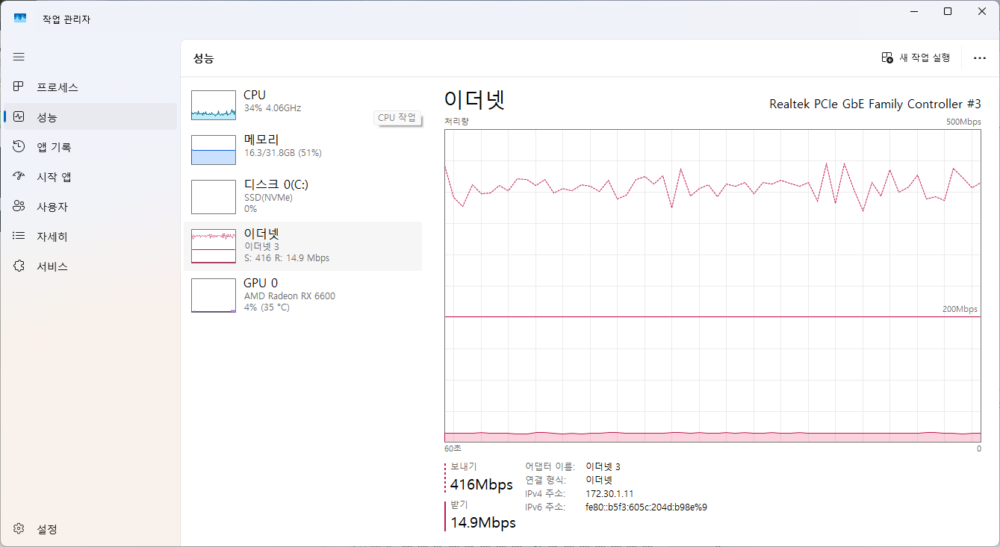
랩탑에서 더미클라이언트를 실행해 부하를 분산하려 하였지만, 1000명 테스트(채팅 제거한 후)에서 서버 송신 대역폭이 400~500Mbps로 측정되었다.
서버의 NIC 한계가 1Gbps이고, 랩탑은 Wifi 환경이기 때문에 네트워크에서 병목이 발생할 것이 보여서
더미 클라이언트를 분리하지 않기로 결정하였다.

### 3.3 Zone 스레드 코어 고정 변경

현재 PC는 4코어에 하이퍼스레드 8개이다.  
하이퍼스레드는 하나의 물리 코어에 2개의 레지스터 세트(아키텍처 상태)를 두어 두 스레드를 동시에 실행 가능하게 한다.  
한 스레드가 메모리 대기 등으로 파이프라인이 스톨될 때, 다른 스레드의 명령어로 실행 유닛을 채워 활용률을 극대화하는 것이 목적이다.  

기존에 Zone 스레드를 0~3번 논리 코어에 고정하였는데, 이는 하이퍼스레드 구조를 고려하지 않은 설정이다.  
0번과 1번은 같은 물리 코어를 공유하는 논리 코어이므로, CPU 바운드 성격의 Zone 스레드 2개가 ALU 등 실행 유닛을 경합하게 된다.  
또한 L1/L2 캐시를 공유하기 때문에 서로의 캐시라인을 밀어내는 경합이 빈번하게 발생할 수 있다.  
따라서 각 Zone 스레드가 서로 다른 물리 코어를 점유하도록 **0, 2, 4, 6번 코어에 고정**하도록 변경하였다.

### 3.4 스레드 우선순위 제거

1000명의 더미테스트를 돌리는 환경에서 Unity Client로 접속하여 테스트 했을 때, 서버 진입 과정이 매우 느리게 처리되는 현상을 관측했다.  
Zone 접속 이후에 수신되는 monster, character의 움직임과 이동 입력의 경우 전혀 지연 없이 처리되었다.  
CPU 점유율은 40~50% 수준으로 여유 있는 상황이었기 때문에, 우선순위가 높은 스레드들(IOCP - above normal, zone - highest)이 서버 진입 처리를 담당하는 스레드(noneZoneThreadPool)의 스케줄링 기회를 빼앗은 것으로 추정된다.  
PC의 코어 수가 충분하지 않고, Zone 수를 줄일 경우 탐색 Depth, 패킷 크기 증가 등 부하가 커져서 모든 스레드의 Priority를 제거하는 것을 선택했다.

> 실제 운영환경에서는 게임 틱을 처리하는 Zone 스레드, IOCP 스레드의 경우 우선순위를 높게 설정하여 게임 틱의 안정성과 IO 처리의 안정성을 보장해야 한다.
> Priority를 설정한 스레드 수가 코어 수의 1배 정도를 유지하는 것이 좋다고 생각한다.

### 3.5 채팅 패킷 제거

채팅 처리를 현재는 단일 스레드에서 처리하고 있고, 테스트로 설정한 채팅의 범위(Zone)로 인해 부하가 커서 채팅 패킷은 제거하고, 이동 입력만 유지한다.  
[채팅 패킷 제거 전](#42-1000명-테스트) 테스트 결과를 보면, 채팅 처리 스레드 1개가 안정적으로 처리할 수 있는 채팅 수(채팅 * 전송 대상)는 초당 50000개 수준으로 보인다.

## 4. 테스트 결과

주요 관측 지표인 `packetProcessed`는 Zone 내부 작업 요청(Action) count이며, 이상적인 기준치는 __클라이언트 수 × 20 (game tick/s)__ 이다.
더미 클라이언트에서 입력 틱 처리를 1틱 처리후 50ms를 sleep하는 방식으로 처리하기 때문에, 20FPS에는 못미치게 측정될것으로 예상된다.

### 4.1 스레드 우선순위 제거 전 - 3000명

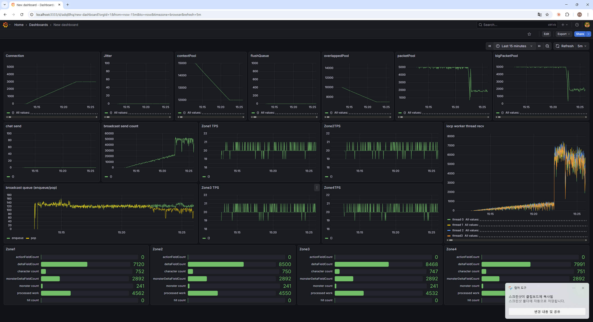
스레드 우선순위를 제거하기 전 3000명 부하테스트의 지표이다.

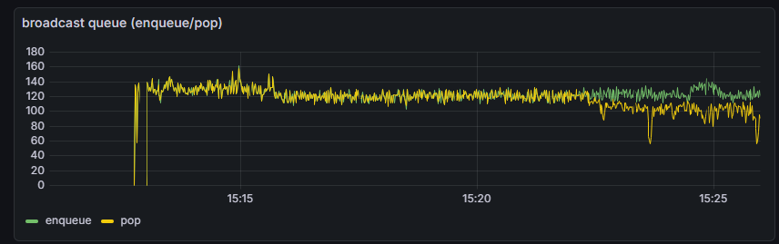
Broadcast에서 pop이 push count를 따라잡지 못하는 현상이 지속적으로 관측되었다.  
broadcast 스레드 수가 2개로 부족했던 것이 주요 원인으로 보이며, 스레드 우선순위 설정으로 인해 broadcast 스레드의 스케줄링 기회가 줄어든 것도 영향을 미쳤을 가능성이 있다.  
broadcast 스레드 수를 늘리고, 스레드 우선순위 설정을 완전히 제거하였다.  

broadcast 스레드가 여러 개이기 때문에 같은 zone에 대한 패킷이 순서 보장 없이 처리될 수 있다.  
따라서 클라이언트에서는 seq를 기반으로 zone 내부 로직을 순차적으로 처리해야 하며, 순서가 어긋난 패킷은 재시도 없이 버리는 방식으로 처리해야 한다.  

Lock-free 작업 큐의 push 실패 여부를 별도로 추적할 필요성을 인지하고, 이후 push 실패 시 count를 로그로 남기는 지표를 추가하였다.

### 4.2 1000명 테스트

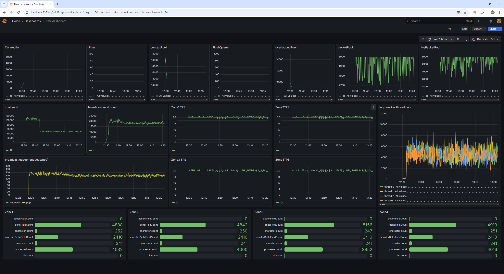
**관측 지표**
packetProcessed - 유저수 × 15 정도 수준. 클라이언트 틱 처리 방식(지연 보정 없음)을 고려하면 정상적인 수준.

> 채팅패킷 제거 전

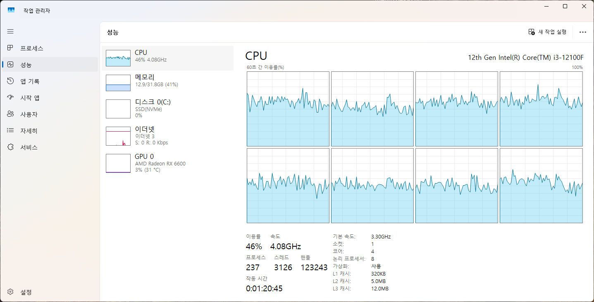
CPU 40~50%

### 4.3 2000명 테스트

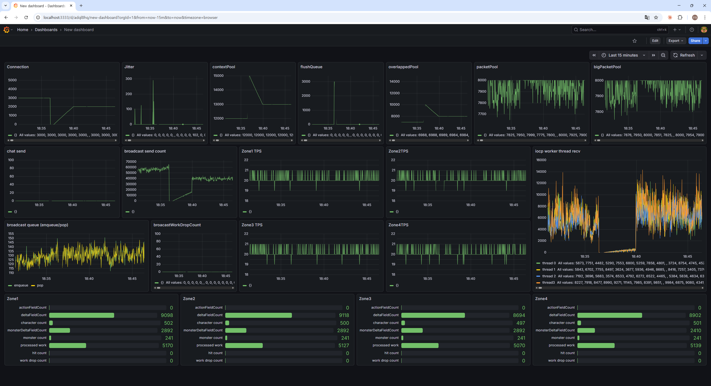
**문제 지표**
packetProcessed - 유저수 × 10~11 정도 수준으로, 20FPS에 미치지 못함.

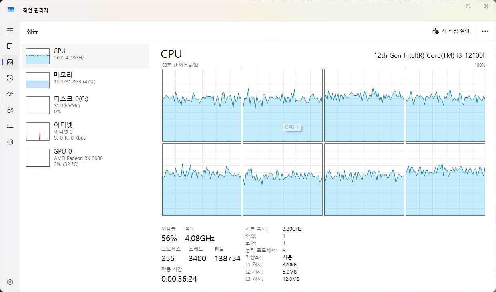
CPU 50~60%

유니티 클라이언트 접속 테스트 영상: https://youtu.be/Rb85hnGldNQ
### 4.4 3000명 테스트

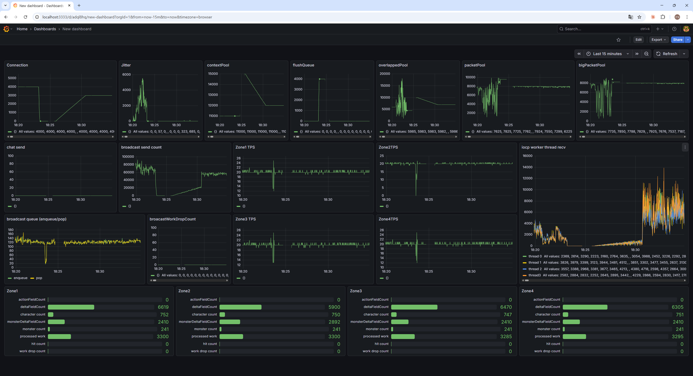
objectPool, packetPool, bigPacketPool 리소스는 모두 안정적임.
**문제 지표**
packetProcessed - 유저수 × 4~5 정도 수준으로, 20FPS에 크게 미치지 못함.

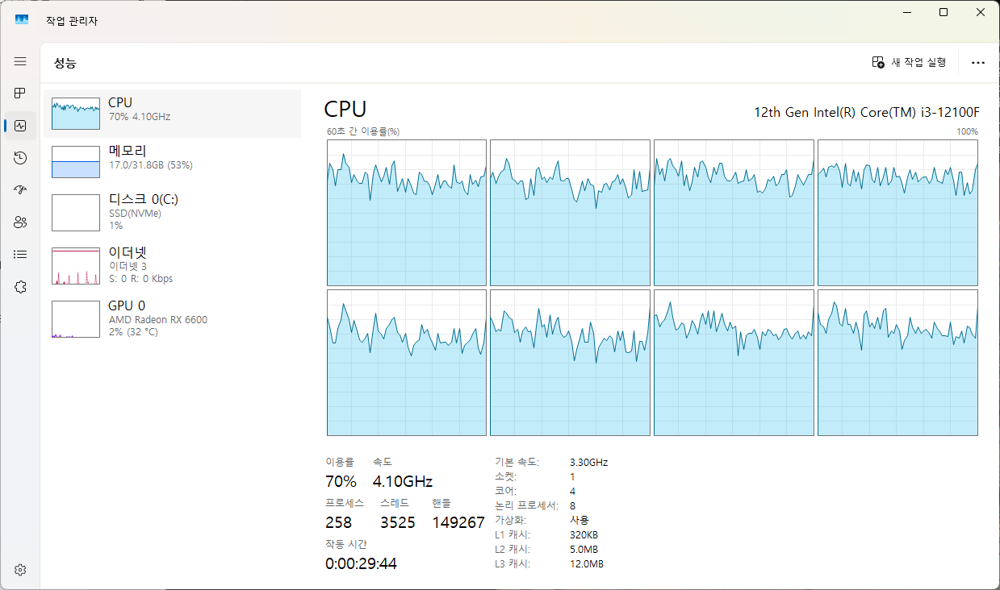
CPU 70~80%

유니티 클라이언트 접속 테스트 영상: https://youtu.be/zosQ-nD3ZnI

### 4.5 4000명 테스트

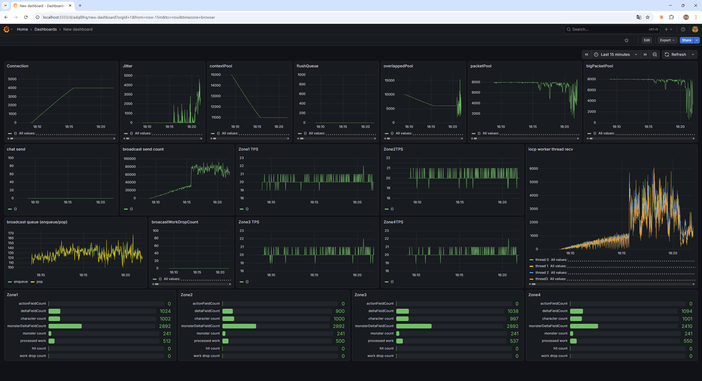
**문제 지표**
overlappedPool, packetPool, bigPacketPool - 리소스 사용량이 안정적이지 않음.
packetProcessed - 유저 수 × 0.5 수준으로 측정됨 (기준치 대비 매우 낮음).
packet drop은 발생하지 않고, IOCP 워커의 작업량도 높지 않은 것으로 보아
더미 클라이언트에서 스레드 부족이나 코어 선점이 늦어져 TPS가 떨어진 것으로 보임.

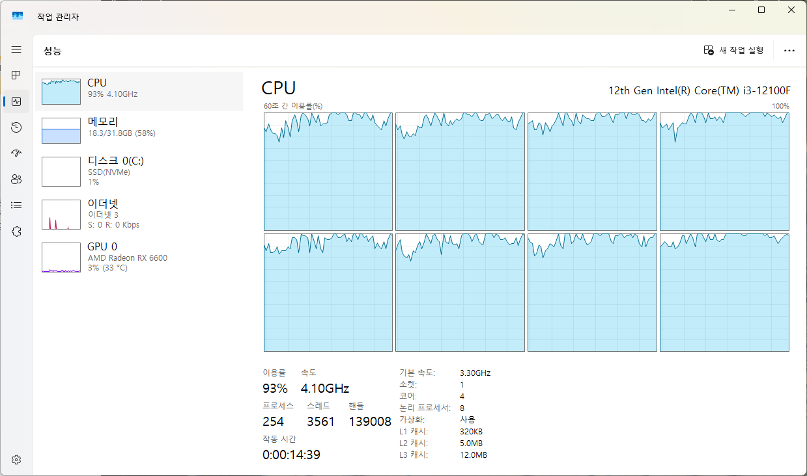
CPU 90% 이상

유니티 클라이언트 접속 테스트 영상: https://youtu.be/LCpZS3XKpos
### 4.6 5000명 테스트

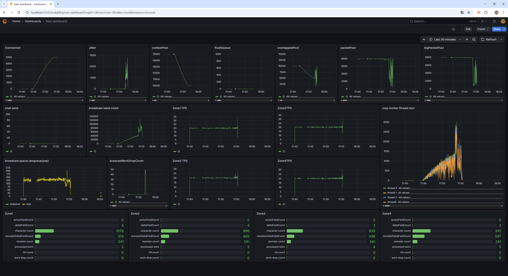  
테스트 중 서버에서 freeze가 발생하였다. 마우스 포인터도 버벅이는 상태였고 프로세스를 강제 종료할 수 없는 상황이어서, PC를 강제종료하고 재부팅한 뒤
Loki에 남아있는 모니터링 지표를 확인하였다.  
초기에 리소스를 많이 사용하는 것까지는 관측되었지만, 이후 CPU 병목으로 인해 로그를 남기지 못한 것으로 보인다.  

### 4.7 2000명 최종 테스트 - 더미 클라이언트 틱 스레드 우선순위 적용

4.2 ~ 4.5 테스트에서 packetProcessed가 목표치(유저수 × 20)에 미치지 못하는 원인이 더미 클라이언트의 틱 스레드가 서버 및 모니터링 프로세스와 코어를 경합하면서 제때 스케줄링되지 못하기 때문임을 파악하였다.    
더미 클라이언트 틱 스레드에 __Above Normal__ 우선순위를 부여한 결과, 2000명 기준으로 packetProcessed가 유저수 × 20 수준에 근접하는 것을 확인하며 안정적인 테스트 수행에 성공하였다.  

CPU 이용률은 이전의 테스트 결과와 달리 80~90% 수준으로 더 높게 측정되었다.  
더미 클라이언트 틱 스레드의 TPS가 정상 수준에 가까워져 작업량이 많아진 것으로 보인다.  

유니티 클라이언트 접속 테스트 영상: https://youtu.be/2q2kZwI3uSQ

## 5. 결론 및 한계점

더미 클라이언트 스레드풀 설정, Zone 스레드 코어 고정 변경, 스레드 우선순위 제거, 더미 틱 스레드 우선순위 부여의
일련의 최적화를 통해 단일 4코어 PC 환경에서 **2000명 동시 접속 부하테스트를 안정적으로 수행**하는 것에 성공하였다.

**한계점**
본 테스트 환경은 4코어 단일 PC에 게임 서버, DB(Redis), 모니터링(Loki/Grafana), 더미 클라이언트를 모두 구동하는 구성이기 때문에
리소스 여유가 충분하지 않다.  
실제 운영 환경에서는 서버, DB, 모니터링, 더미 클라이언트를 각각 분리된 머신에서 구동해야 정확한 서버 성능을 측정할 수 있다.  

## 6. 참고
- [DummyTest.md](DummyTest.md)
- [Monitoring.md](Monitoring.md)
- [DummyClient](DummyClients/Program.cs)
- [NetPerfCollector.h](NetLibrary/NetPerfCollector.h)
- [CorePerfCollector.h](CoreLib/CorePerfCollector.h)
