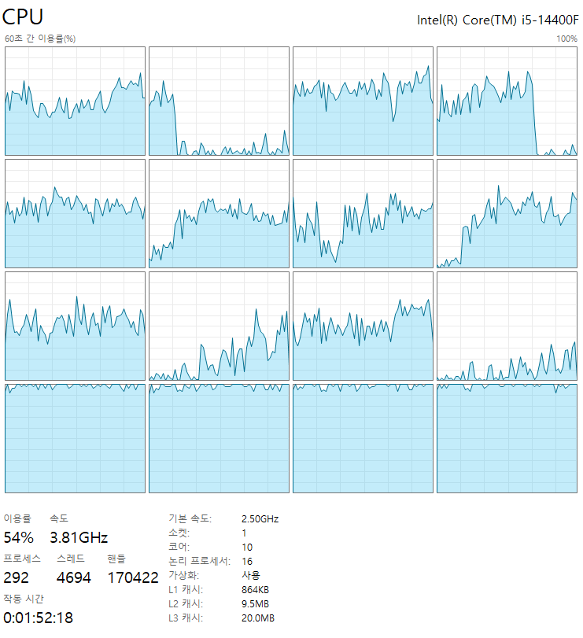
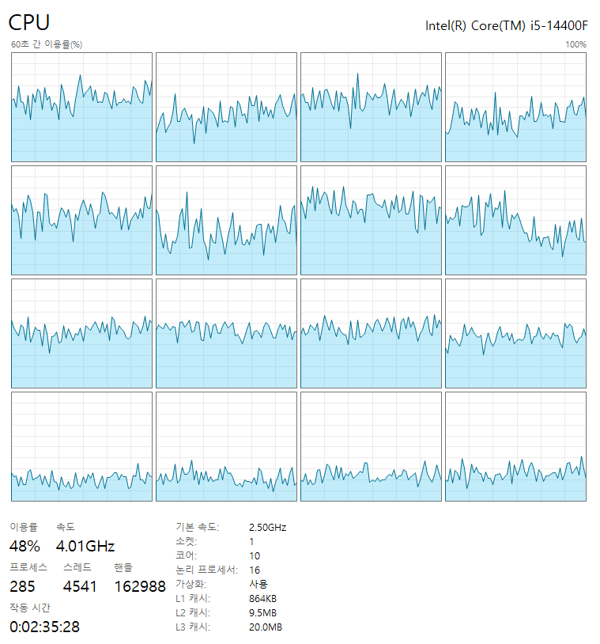
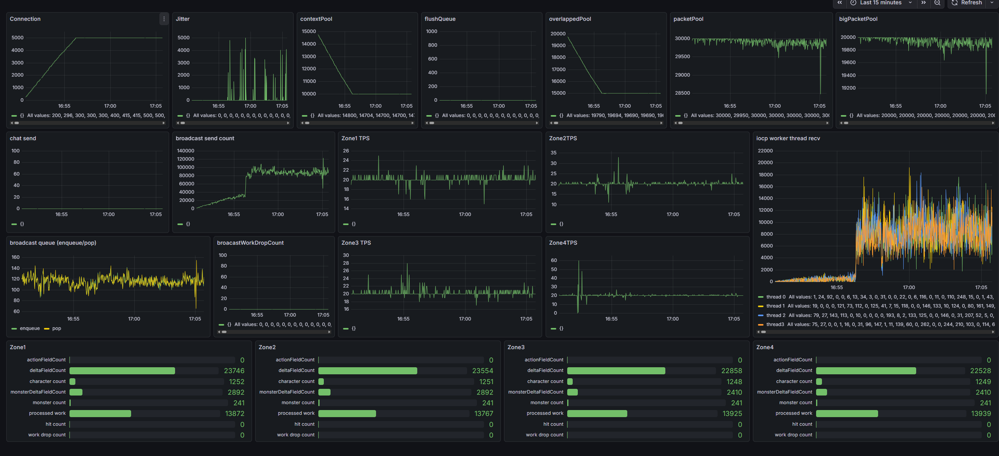

# Dummy Client Test 3

## 1. 개요

이 문서는 [DummyTest2.md](DummyTest2.md)에서 서버 Freeze로 실패했던 **5,000명 부하 테스트**를 CPU 업그레이드 후 다시 수행한 결과를 정리한 문서이다.

## 2. 테스트 환경

### 하드웨어

- 변경 전 : Intel Core i3-12100F (P-Core 4, 8 Threads)
- 변경 후 : Intel Core i5-14400F (P-Core 6 + E-Core 4, 16 Threads)

### 서버 구성

- Zone : **4개** (lobby 제외)

Zone 수가 적을수록 Zone당 수용 유저 수가 많아져 시뮬레이션·AOI·브로드캐스트 부하가 소수의 Zone 스레드에 집중된다.  
즉, 같은 유저 수를 더 많은 Zone에 분산한 경우보다 Zone 스레드 기준으로는 더 높은 부하 조건에서 테스트한 것이다.

## 3. 개선 및 변경 사항

아래 더미 클라이언트 변경은 서버 개선이 아니라 **부하 생성기가 서버보다 먼저 막히는 것을 걷어내는 작업**이다.    
이 비대칭은 구조적이다. 서버는 Cell당 chunk를 한 번 조립해 그 Cell을 보는 모든 세션에게 같은 버퍼를 보내므로, 페이로드를 만드는 비용이 **Cell 수**(4 zone × 25)에 비례한다. 송신 자체는 버퍼를 가리키는 것뿐이다.  
반면 더미는 그 브로드캐스트를 **한 프로세스가 전부 수신**하고, 커넥션마다 따로 버퍼에 쌓아 따로 패킷 경계를 잘라야 한다. 공유할 대상이 없으므로 비용이 **커넥션 수**(5,000)에 비례한다.  

실제 운영에서는 5,000명이 5,000대에 나뉘어 기기당 1인분이므로 이 비대칭이 드러나지 않는다. 한 프로세스로 접은 부하 테스트에서만 생기는 문제이고, 서버의 브로드캐스트 공유가 잘 될수록 격차는 오히려 벌어진다.  

### 3.1 수신부 Pipeline 적용 (더미 클라이언트)
클라이언트에서는 매 수신 시 스트림 처리를 **누적 버퍼를 앞으로 당기는 방식** 으로 처리했다. 수천개의 Connection을 처리하는 DummyClient에서는 이 방식의 영향이 크다.    
`System.IO.Pipelines`는 버퍼를 세그먼트로 관리하고 소비한 만큼 읽기 위치만 전진시키므로 이 이동이 없다. 남은 꼬리는 그 자리에 두고 다음 세그먼트와 이어 읽는다.  

### 3.2 액션 패킷 재사용 (더미 클라이언트)
기존에는 모든 세션이 액션 패킷을 개별적으로 생성하였다.  
동일한 틱에서는 모든 세션이 같은 액션 패킷을 사용하므로, **틱당 1회만 생성하여 모든 세션이 공유**하도록 변경하였다.  
이를 통해 CPU 사용량과 GC 부하를 줄이고 더미 클라이언트의 TPS를 개선하였다.  

### 3.3 IOCP 워커 수 증가 (서버)
CPU가 8스레드에서 16스레드로 늘어나면서, 기존 **4개**였던 서버의 IOCP 워커 스레드를 **8개**로 증설하였다.  
늘어난 P-Core 자원을 활용해 수신·완료(Completion) 처리량을 확보하고, 대규모 접속에서 IOCP 워커가 병목이 되지 않도록 하였다.  
8개 워커는 모두 P-Core의 논리 코어에 고정하였다. (4.2 참고)

## 4. 테스트 결과
### 4.1 Send Queue Full
#### 현상
서버에서 `send queue full` 로그가 발생하였다.  
CPU 사용률은 약 5~60% 수준으로 여유가 있었으며, 클라이언트의 수신 처리가 병목으로 판단되었다.  

#### 해결

BIOS 업데이트 이후 동일한 현상이 재현되지 않았다.  
> BIOS가 원인이라고 예상하지 못하여 업데이트 이전의 성능 지표는 기록하지 못하였다.    
> 정확한 원인은 확인하지 못했지만 다음과 같은 가능성을 추정하고 있다.  
> - Intel Microcode 업데이트로 Hybrid Scheduler 동작이 개선되었을 가능성
> - CPU 전력 관리(C-State, Turbo Boost 등) 관련 Firmware 수정  
	
### 4.2 간헐적인 연결 종료
#### 현상
이전 테스트처럼 시작 직후 전체 연결이 종료되지는 않았지만, 일부 세션에서 간헐적인 연결 종료가 발생하였다.  

> E-Core 사용률이 지속적으로 100%에 도달하는 것을 확인하였다.  

#### 원인 분석
테스트 중 E-Core 사용률이 지속적으로 100%에 도달하는 것을 확인하였다.  
게임서버의 코어는 Busy Spin을 사용하는 저지연 구조를 사용하므로, 주요 스레드가 E-Core에 스케줄링되면서 처리 지연이 발생했을 가능성이 있다고 판단하였다.  

#### 해결
서버(Zone, IOCP)와 더미 클라이언트의 주요 스레드를 **P-Core 및 P-Core의 하이퍼스레드**로 제한하였다.  
이후 E-Core 사용률이 정상 수준으로 감소하였으며 연결 종료 현상도 발생하지 않았다.  

> P-Core Affinity 적용 후 E-Core 사용률

### 4.3 서버 성능

최종적으로 **5,000명 부하 테스트**를 안정적으로 수행하였으며 서버 성능 지표를 수집하였다.  

관측 사항  
* Zone 스레드를 코어에 고정하였음에도 TPS가 일시적으로 흔들리는 구간이 있었다. 단일 PC에서 서버, 더미 클라이언트, 모니터링 프로세스가 동일한 CPU 자원을 공유하기 때문으로 판단된다.
* 더미 클라이언트는 초당 20회(20 FPS) 액션 전송을 목표로 하였으나, 동일한 PC에서 서버와 CPU 자원을 공유하는 환경에서는 목표치를 완전히 유지하지 못하였다.

## 5. 참고 - P-Core와 E-Core

P-Core(Performance Core)는 높은 IPC와 클럭을 바탕으로 단일 스레드 성능이 뛰어나며, Busy Spin이나 게임 Tick처럼 지연에 민감한 작업에 적합하다.   
- 게임 서버처럼 낮은 지연 시간이 중요한 환경에서는 P-Core 기반의 프로세서를 사용하는 경우가 많다.

E-Core(Efficient Core)는 단일 코어 성능은 낮지만 더 많은 코어를 통해 전체 처리량(Throughput)을 높이는 구조로, 대량의 병렬 작업에 적합하다.
- 짧은 응답 시간보다 전체 처리량이 중요한 백그라운드 작업, 대량의 병렬 처리 작업 등에 활용할 수 있다.  

## 6. 결론

CPU 업그레이드, 더미 클라이언트 최적화(Pipeline 적용, 액션 패킷 재사용), IOCP 워커 증설(4→8), BIOS 업데이트, P-Core Affinity 적용을 통해 테스트에서 발생했던 문제를 모두 해결하였다.  
그 결과 이전에는 실패했던 **5,000명 동시 접속 부하 테스트를 안정적으로 완료하였다.**  

P-Core 기준으로 보면 4 → 6개로 약 1.5배 증가했지만, 처리량은 2,000명 → 5,000명으로 약 2.5배 향상되었다.  
이는 단순한 CPU 연산 성능 증가뿐 아니라, 기존 환경에서 발생하던 스레드 간 CPU 자원 경쟁과 처리 지연이 완화되면서 병목 구간이 해소된 결과로 판단된다.  

## 7. 참고

* [DummyTest.md](DummyTest.md)
* [DummyTest2.md](DummyTest2.md)
* [Monitoring.md](Monitoring.md)
* [DummyClient](DummyClients/Program.cs)
