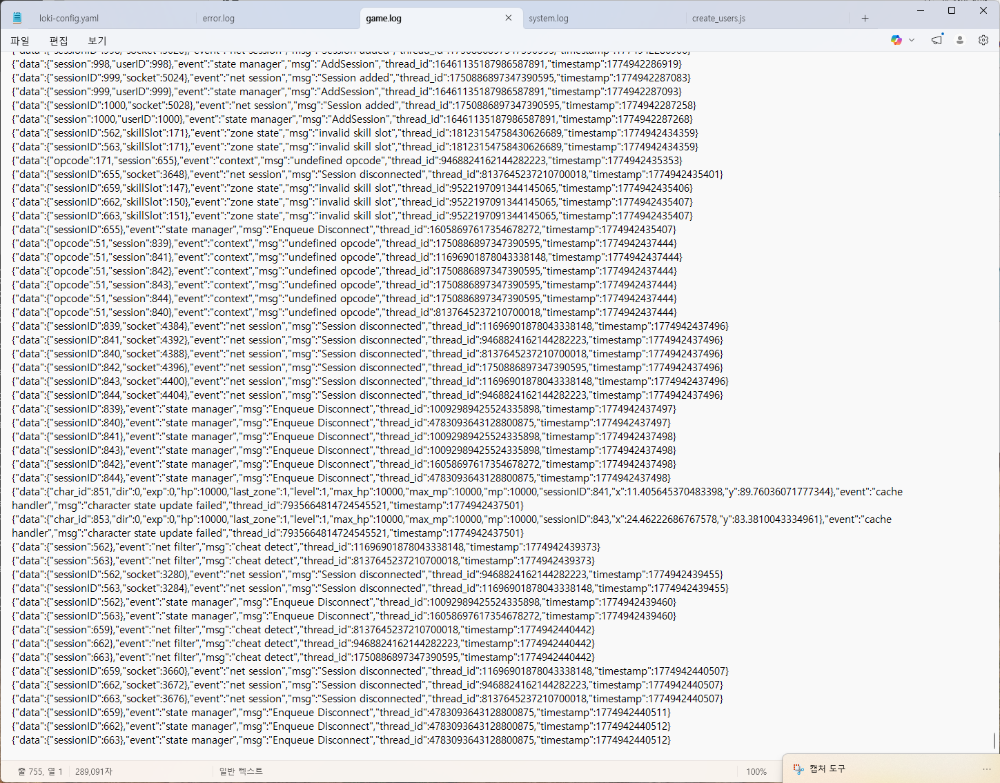
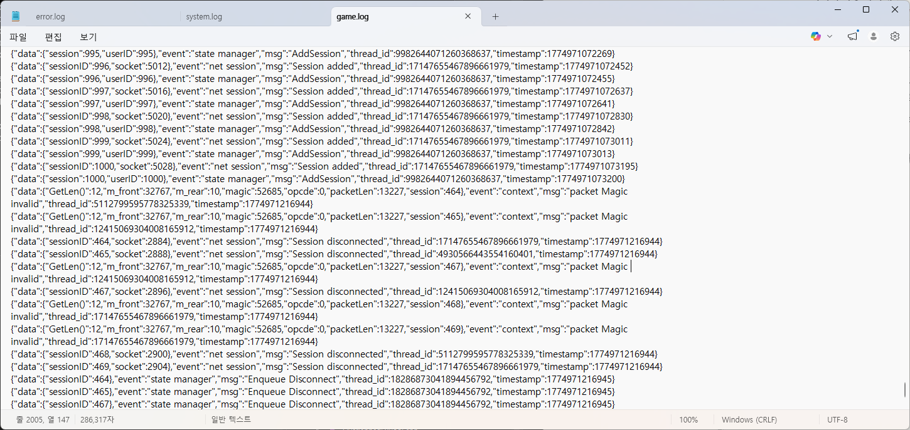
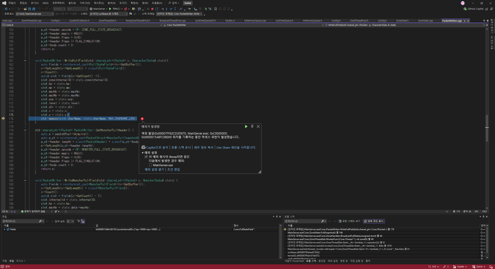

# Dummy Test Debug

## 1. 개요
더미 클라이언트 테스트 중 발생한 비정상적인 연결 끊김 현상에 대한 원인 분석과 해결 과정을 설명하는 문서이다.  

## 2. 문제 상황
더미 클라이언트로 부하 테스트 중 일부 TCP 연결이 간헐적으로 끊어지는 현상이 관측되었다.   
연결끊김 현상은 여러가지 패턴으로 발생하였다.  

## 3. 원인 분석

### 3.1. 패킷 파싱 에러

패킷 헤더 파싱 과정에서 비정상적인 opcode 값이 읽히고, zone 내부 로직에서 비정상적인 skill slot 값이 읽히는 현상이 관측되었다.  

정확한 발생 지점을 추적하기 위해 패킷 파싱 실패 지점에 로그를 추가하였다.   
로그 분석 결과 front = 32767, rear = 10인 상태에서 packetLen 등 파싱 결과가 비정상적으로 나타나는 것을 확인하였다.  
32767은 RingBuffer의 마지막 인덱스로, wrap-around가 발생하는 경계 지점이다.

```diff
uint16_t RingBuffer::HasSpace() const
{
	if (m_tail == m_head)
-		return m_last_op == RELEASE ? RECV_BUFFER_SIZE : 0;
+		return m_last_op == RELEASE ? std::min<uint16_t>(RECV_BUFFER_SIZE, RING_BUFFER_SIZE - m_tail) : 0;
	if (m_tail < m_head)
		return std::min<uint16_t>(static_cast<uint16_t>(RECV_BUFFER_SIZE), static_cast<uint16_t>(m_head - m_tail));
	return std::min<uint16_t>(static_cast<uint16_t>(RECV_BUFFER_SIZE), static_cast<uint16_t>(RING_BUFFER_SIZE - m_tail));
}
```
원인은 HasSpace()에서 m_head == m_tail(버퍼 전체 반납 상태)일 때 tail의 위치를 고려하지 않고 무조건 RECV_BUFFER_SIZE를 반환한 것이었다.  
tail이 버퍼 끝 근처에 위치한 경우 실제 연속 공간보다 더 많은 공간이 있다고 반환하여 wrap-around 경계를 넘어 write가 발생하였다.  
마지막 return 구문과 동일하게 tail에서 버퍼 끝까지의 실제 연속 공간만 반환하도록 수정하였다.  

+  
RING_BUFFER_SIZE를 32768로 확장 이후에, int16_t로 head/tail을 관리하던 부분에서 32767 + 1 & MASK 연산 시 signed overflow가 발생하는 문제도 발견되었다.
관련 타입을 전부 uint16_t로 교체하여 해결하였다.

### 3.2 Pointer Access Violation

0xC0000005(ACCESS_VIOLATION) 코드와 함께 서버가 비정상 종료되었다.  
디버그 모드로 실행하여 콜스택을 확인한 결과, 패킷에 Write하는 과정 중 fullPacket 필드에 접근할 때 메모리 접근 위반이 발생한 것을 확인하였다.  

파라미터 값은 정상이었으므로 버퍼 오버플로우를 의심하였다.  
확인 결과 fullPacket 필드 하나의 크기가 72바이트이고 패킷 버퍼 크기가 4096바이트로 설정되어 있어,   
수용 가능한 최대 인원이 4096 / 72 ≈ 56명에 불과하였다. 테스트 규모가 커지면서 이 한계를 초과한 것이 원인이었다.   
버퍼 크기를 충분히 늘려 해결하였다.


## 4. Note
- 두 버그 모두 테스트 규모가 커지기 전까지는 드러나지 않았던 edge case였다.  
RingBuffer의 wrap-around 경계 조건과 고정 크기 버퍼의 용량 한계는 단위 테스트로 사전에 검출 가능한 문제였다.   
이후 유사한 edge case에 대해서는 부하 테스트 이전에 단위 테스트를 먼저 작성하는 방향으로 개선할 필요가 있다.  

