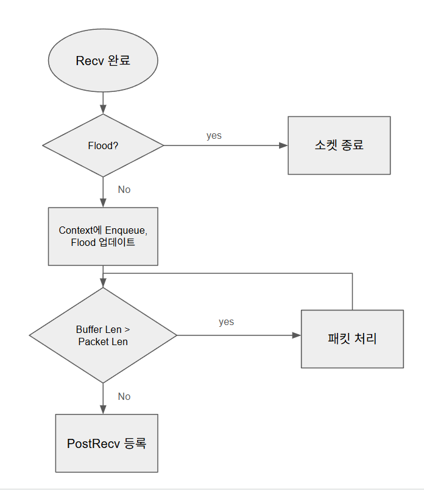
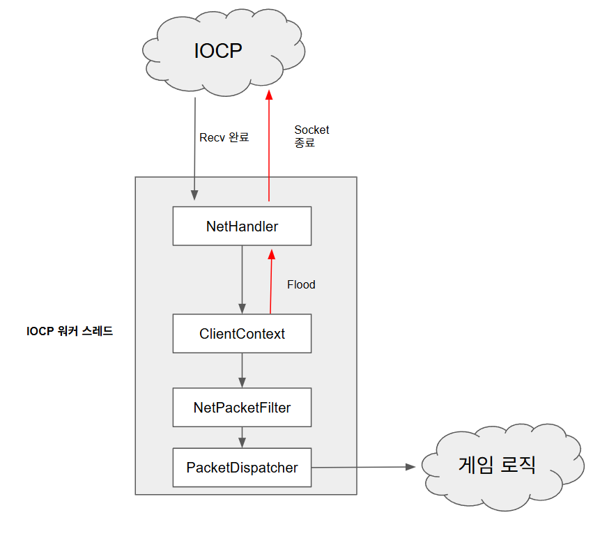

# Flood 탐지  

## 1.목적
과도한 트래픽 (m_bytes > BYTE_THRESHOLD): 정상적인 패킷 형태를 띠고 있지만, 너무 많은 양의 데이터를 보내 대역폭을 점유하려는 시도      
Tiny 패킷 (m_bytes < MIN_BYTE_PER_WINDOW): 데이터 양은 적지만, 수천 번의 수신 이벤트를 발생시켜 서버의 CPU(Worker Thread)를 고갈시키려는 시도

L4 스위치 (Outer Layer): 비정상 IP 및 Gbps 단위의 대규모 대역폭 공격 차단.   
-> PC방 같이 공유IP를 사용하는 환경이 있어 엄격한 기준을 적용시키지 못함.
FloodDetector (Inner Layer): 세션 단위 정밀 차단 및 Tiny Packet을 이용한 CPU 고갈 공격 대응.

## 2. 요구사항
1. 즉각적인 차단: 다음 수신 작업이 추가적으로 발생하지 않도록 차단해야한다.
2. 저비용 연산 (Hot Path): 매 수신마다 호출되는 핵심 경로이므로, std::now() 등 무거운 연산을 지양한다.


> iocp 수신완료 처리 work flow 


> IOCP 워커스레드 내부 동작 구조

### 왜 NetHandler에서 Flood를 처리해야하는가?  
*ClientContext는 TCP 스트림을 패킷 단위로 잘라내는 로직을 담당
1. 호출 스택 오염  
AbortSocket() 호출 시 ClientContext의 종료 처리 메서드를 수행하게 됨.
따라서 ClientContext 이후 로직에서 AbortSockett()을 호출하게 된다면,   
호출스택 상위에 ClientContext를 남겨둔 채 해당 인스턴스를 종료 상태로 만듦.  
이는 코드의 실행 흐름을 예측하기 어렵게 만드는 주요 원인이 됩.   
-> 객체 지향 설계 관점에서도 제어권을 하위 레이어에 부여하는건 위험  
-> 상태값을 가지지 않고 전달자 역할만 하는 NetHandler에서 제어하는 것은 안전한 설계
2. DoS 방어의 효율성  
가장 앞단인 NetHandler에서 즉시 차단하는 것은 시스템 자원을 보호하는 가장 효과적인 전략

## 3. 구현
### sliding window 방식  
* 개념 
	* 단위 시간당 수신 바이트의 정밀한 측정을 위해 Ring Queue와 누적합을 활용함.  
* 특징 
	* 누적합을 통해 구간합 연산 단순화.
	* Q_SIZE를 2의 거듭제곱으로 설정하고 비트 연산을 사용하여 인덱스 관리 효율을 높임.
* 한계
	* 매 수신마다 std::now()를 호출
	* Ring Queue 및 타임스탬프 관리를 위한 로직 복잡도 증가
	* 평균화 연산 특성상 순간적인 트래픽 변화 대응이 늦음
	* tiny packet 공격을 판단할 수 없다. -> 수신 간격이 큰 경우 매우 작은값으로 측정됨

```cpp  
constexpr const uint8_t Q_SIZE = 16; // 2의 거듭제곱
static_assert((Q_SIZE != 0) && ((Q_SIZE& (Q_SIZE - 1)) == 0), "Q_SIZE must be a power of 2!");
constexpr const double THRESHOLD = 4096; // bps 제한
class TrafficFloodDetector {
	std::vector<uint64_t> m_byte; // 누적합, ring queue
	std::vector<std::chrono::steady_clock::time_point> m_timeStamp; // ring queue
	uint8_t m_idx;
	uint8_t mask;
	public:
		TrafficFloodDetector()
			: m_byte(Q_SIZE, 0)
			, m_timeStamp(Q_SIZE, std::chrono::steady_clock::now())
			, mask(Q_SIZE - 1)
		{ }
		bool ByteReceived(uint32_t byte) {
			auto before = m_idx;
			m_idx = (m_idx + 1) & mask;
			auto next = (m_idx + 1) & mask; // 가장 오래된 데이터, 측정 기준
			m_timeStamp[m_idx] = std::chrono::steady_clock::now();
			m_byte[m_idx] = m_byte[before] + byte;
			auto byteSum = m_byte[m_idx] - m_byte[next];
			auto duration = m_timeStamp[m_idx] - m_timeStamp[next];
			auto sec = duration_cast<std::chrono::seconds>(duration).count();
			auto bps = byteSum / (double)sec;
			return bps < THRESHOLD;
		}
};
```  

### Fixed window 방식
* 개념 
	* 특정 시간 구간(Window)을 설정하고, 해당 구간 내 수신 합계만 체크하여 로직을 단순화함
* 특징 
	* 변수 두개만 사용하여 메모리 사용량이 적음
* 한계
	* 여전히 std::now() 연산이 필요함
	* tiny packet 공격을 판단할 수 없다. -> 새 윈도우에서 첫 패킷은 매우 작은 값으로 측정됨

```cpp
	class TrafficFloodDetector {
		std::chrono::steady_clock::time_point m_windowStart;
		uint32_t m_bytesInWindow;

	public:
		TrafficFloodDetector()
			: m_windowStart(std::chrono::steady_clock::now())
			, m_bytesInWindow(0)
		{ }
		bool ByteReceived(uint32_t byte) {
			auto now = std::chrono::steady_clock::now();

			if (now - m_windowStart > WINDOW) {
				m_windowStart = now;
				m_bytesInWindow = byte;
			}
			else {
				m_bytesInWindow += byte;
			}
			return m_bytesInWindow > BYTE_THRESHOLD;
		}
	}; 
```

### Count 기반 Fixed Window 방식(최종 선택)
* 개념 
	* 시간 기준을 제거하고, 수신 횟수(RECV_WINDOW)를 기준으로 트래픽을 근사 측정함.
* 특징 
	* 변수 두개만 사용하여 메모리 사용량이 적음
	* std::now() 같은 무거운 연산이 없어서 Hot path에 적용 가능
	* 임계 횟수 도달 시점에 즉시 판정하여 신속한 차단 가능.
	* 과도한 트래은 물론, 작은 패킷을 쏟아부어 CPU 자원을 고갈시키는   
	  Tiny Packet 공격까지 방어 가능(패킷 헤더 크기 기반 최소 바이트 설정).  
```cpp
	class TrafficFloodDetector {
		uint32_t m_bytes = 0;
		uint32_t m_recvCount = 0;

	public:
		bool ByteReceived(uint32_t byte) {
			m_recvCount++;
			m_bytes += byte;

			if (m_recvCount >= RECV_WINDOW) {
			// 1. 과도한 트래픽
				if (m_bytes > BYTE_THRESHOLD) return true;
			// 2. 비정상적으로 작은 조각 (Tiny Packets / CPU Exhaustion)
				if (m_bytes < MIN_BYTE_PER_WINDOW) return true;
				m_recvCount = 0;
				m_bytes = 0;
			}
			return false;
		}
	};
```

[TrafficFloodDetector.h](NetLibrary/TrafficFloodDetector.h)

### EMWA 
* 개념
	* 지수 가중 이동 평균을 이용하여 최근 데이터에 높은 가중치를 부여하여 트래픽 변화를 유연하게 대응하는 방식.
* 미도입 사유
	* 수신 버퍼 크기가 이미 제한적인 환경에서는 Count 기반 방식만으로도 의도한 탐지 목적을 충분히 달성함.
	* EWMA는 소수점 연산이 포함되어 Count 기반 방식보다 CPU 자원을 더 소모함.
	* 실시간 방어 로직에서는 수치가 명확히 떨어지는 Count 방식이 유지보수 및 임계치 설정에 유리함.
	* 가중치 때문에 Tiny 패킷 공격 방어 설계가 어려움.
