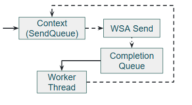

# IOCP Send Pipeline

## 1. 개요
IOCP 환경에서 Send 처리는 Recv와 달리 여러 스레드에서 동시에 발생할 수 있다. 이를 해결하기 위해 Send Queue 기반의 파이프라인을 설계하였다.  
또한 AOI Cell 단위로 생성되는 대량의 패킷을 효율적으로 처리해야 하는 요구사항이 존재한다.  

## 2. 목적

>IOCP Send 처리 흐름

다음과 같은 요구사항을 충족해야 한다.  

1. __Chunk 패킷 처리__  
AOI 처리에서 Cell 단위로 패킷을 생성한다. 클라이언트별로 개별 패킷을 처리하기에는 비효율적이기 때문에,  
Cell 단위 Chunk 패킷을 묶어 WSASend를 일괄 처리할 수 있는 구조가 필요하다.  

2. __WSASend 중복 방지__  
Recv는 Completion 시 다음 WSARecv를 Chaining하기 때문에 한 번에 하나씩만 호출되는 구조이다.  
반면 Send는 여러 스레드에서 동시에 발생할 수 있다.  
송신 큐를 Overlapped 구조체로 관리하여 클라이언트별 동시 Overlapped 등록 수를 1개로 제한해야 한다.
```
"WSASend should not be called on the same stream-oriented socket concurrently from different threads, 
because some Winsock providers may split a large send request into multiple transmissions, 
and this may lead to unintended data interleaving from multiple concurrent send requests on the same stream-oriented socket."
- MSDN WSASend 문서
```


3. __Partial Send 처리__  
WSASend는 데이터를 직접 전송하는 것이 아니라 커널 TCP 송신 버퍼에 적재한다.  
송신 버퍼가 가득 찬 경우 요청한 크기보다 적은 바이트만 적재되며,  
1. Completion에서 transferred bytes를 확인하여 미전송 데이터를 재전송 처리해야 한다.

## 3. 구현
### 3.1 Chunk 단위 일괄 처리
Cell 단위 패킷 chunk를 하나의 Overlapped 구조체에 묶어 WSASend를 단일 호출로 처리한다.
```cpp
void IOCP::SendDataChunks(uint64_t sessionID, std::shared_ptr<Core::IPacket> packet, std::vector<std::shared_ptr<Core::IPacket>>& packetChunks)
{
    ~~~
    for (auto& chunk : packetChunks)
    {
        pOverlappedEx->wsaBuf.emplace_back(WSABUF{ chunk->GetLength(), reinterpret_cast<char*>(chunk->GetBuffer()) });
    }
    EnqueueSendResult status = sessionManager->EnqueueSend(clientSocket, pOverlappedEx);
    if  (status == EnqueueSendResult::Ready) {
        DoWSASend(pOverlappedEx);
    }
    ~~~
}
```
### 3.2 Send Queue와 WSASend 중복 방지
Send 완료 시 큐에 다음 항목이 있으면 이어서 WSASend를 호출하는 Completion 체인 구조로 동작한다.
```cpp
case IOOperation::SEND: {
    pOverlappedEx->sentBytes += bytesTransferred;
    if (pOverlappedEx->sentBytes < pOverlappedEx->totalBytes) {
        ResumeSend(pOverlappedEx);
    } else {
        auto next = sessionManager->DequeueSend(clientSocket);
        if (next)
            DoWSASend(next);
    }
    break;
}
```
### 3.3 Partial Send 재전송
Completion에서 sentBytes와 totalBytes를 비교하여 미전송 데이터가 있으면 이어서 전송한다.
```cpp

case IOOperation::SEND: {
~~~
    pOverlappedEx->sentBytes += bytesTransferred;
    if (pOverlappedEx->sentBytes < pOverlappedEx->totalBytes) {
        ResumeSend(pOverlappedEx);
    }
~~~
}

void IOCP::DoWSASend(STOverlappedEx* pOverlappedEx) {
    // 최초의 Send에서만 호출
~~~
    pOverlappedEx->totalBytes = 0;
    pOverlappedEx->sentBytes = 0;
~~~
}
```
## 4. 참고
커밋
- [partial send 처리](https://github.com/JoEunil/MMORPG/commit/8a2caf6204181bf8e88b869c94e3610f21a9b309)
- [송신큐](https://github.com/JoEunil/MMORPG/commit/43ce6a908d53a8765d73030f7a349686bc5a0102)