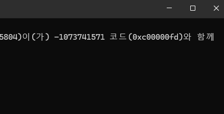

# Lock-free Queue
## 1. 개요 
Lock-free Queue의 개념과 구현과정을 설명한 문서이다. 

## 2. Lock-Free Queue 개념
Lock-free Queue란 두 개 이상의 스레드가 락을 사용하지 않고 공유 자원인 큐에 접근할 수 있도록 설계된 큐를 의미한다.  
뮤텍스 기반 큐와 달리, 특정 스레드의 지연이나 중단이 전체 시스템의 진행을 막지 않는다는 장점이 있다.

본 문서에서는 Lock-free Queue를 직접 구현해보며 겪은 시행착오와,  
SPSC(Single Producer Single Consumer)와 MPMC(Multi Producer Multi Consumer) 큐의 구조적 차이,  
그리고 Dmitry Vyukov의 MPMC 큐 설계를 정리한다.

## 3. 시행착오: CAS 기반 Ring Queue 시도

CAS(Compare-And-Swap)와 memory_order에 대한 기본적인 이해를 바탕으로  
단순한 ring buffer 구조에 CAS를 적용하면 Lock-free 큐를 구현할 수 있을 것이라 가정했다.  

```cpp
	template<typename T, size_t QSize>
	class Queue{
		std::array<Cell<T>, QSize> m_queue;
		std::atomic<uint32_t> m_head, m_tail; // head는 pop할 때 번호표 발급, tail은 push할 때 번호표 발급

			T* pop() {
				auto expected = m_head;
				while (m_head.compare_exchange_weak(expected, (expected + 1) % m_QSize, std::memory_order_acq_rel, std::memory_order_relaxed) {
					// strong은 비용이 커서, 이렇게 루프로 체크하는 곳에는 weak 사용하는것이 효율적
					expected = (expected +1)%QSize;
				}
					if (expected == m_tail) // empty
						return nullptr;
					auto res = m_queue[expected].data;
					return res;
			}
			
			bool push(T* data) {
				auto expected = m_tail;
				while (m_tail.compare_exchange_weak(expected, (expected + 1) % m_QSize, std::memory_order_acq_rel, std::memory_order_relaxed) {
					expected = (expected + 1) % QSize;
				if ((expected +1)%QSize == m_head) //full
						return false;
				}
				return true;
			}
		}
```

ring queue를 사용하고, head와 tail 사이에 항상 한 칸을 비워두는 방식을 사용하면    
last_op 없이도 CAS만으로 race condition을 방지할 수 있을 것이라 예상했다.

그러나 실제로는 다음과 같은 문제가 발생했다.  
- push에서는 full 체크
- pop에서는 empty 체크

이 두 조건을 단일 CAS 연산으로 묶을 수 없었고,    
결과적으로 race condition을 완전히 제거할 수 없었다.

## 4. SPSC Queue: CAS 없이 가능한 이유
SPSC(Single Producer Single Consumer) 환경에서는    
producer와 consumer가 각각 서로 다른 변수를 독점적으로 수정한다.
- producer → tail만 수정  
- consumer → head만 수정  

이 경우 write-write 경쟁이 발생하지 않으며, 필요한 것은 올바른 memory_order 설정뿐이다.  

```cpp
// SPSC
		T* pop() {
				if (m_head == m_tail) // empty
					return nullptr;
				auto res = m_queue[m_head].data;
				m_head = (m_head+1)%QSize;
				return res;
		}
		
		bool push(T* data) {
				if ((m_tail+1)%QSize == m_head) //full
					return false;
			m_queue[m_tail] = data;
			m_tail = (m_tail+1)%QSize;
			return true;
		}
```

producer와 consumer가 각각 하나의 스레드이기 때문에  
race condition이 발생할 수 있는 지점은 empty / full 체크뿐이다.  
- pop에서 m_head != m_tail인 경우, producer에 의해 다시 empty 상태가 되는 것은 불가능하다.
- empty 상태에서 producer가 push하는 경우는 retry 로직으로 자연스럽게 해결된다.
- push에서도 full이 아닌 상태에서 consumer에 의해 다시 full이 되는 상황은 발생하지 않는다.

따라서 SPSC 환경에서는 CAS 없이도 Lock-free 큐를 안전하게 구현할 수 있다.

## 5. MPSC / SPMC / MPMC의 어려움

Multiple Producer 혹은 Multiple Consumer가 존재하는 환경에서는 상황이 완전히 달라진다.  
- 여러 producer가 tail을 경쟁  
- 여러 consumer가 head를 경쟁  
- slot 자체의 상태 또한 경쟁 대상이 됨

이로 인해 단순한 head / tail CAS만으로는 큐의 Race condition을 해결할 수 없다.  

## 6. Dmitry Vyukov의 MPMC Queue
MPMC Lock-free 큐 구현에서 가장 널리 알려진 해법은  
Dmitry Vyukov가 제시한 bounded MPMC 큐이다.  

핵심 아이디어는 다음과 같다.  
> 각 slot(Cell)에 sequence 번호(seq)를 부여하여   
slot의 상태를 단일 atomic 값으로 표현한다.  

__Slot 상태 정의__

**producer 기준**  
`diff = seq - pos`  
- seq == pos  → 슬롯이 비어 있음 push 가능  
- seq < pos   → 큐가 가득 참 (이 슬롯이 아직 consumer한테 회수 안됨), push 불가  
- seq > pos   → 다른 producer가 이미 이 슬롯을 선점함, tail 다시 읽고 재시도  

**consumer 기준**  
`diff = seq - (pos + 1)`  
seq == pos + 1 → 데이터 준비됨, pop 가능
seq < pos + 1 → 큐가 비어있음, pop 불가
seq > pos + 1 → 다른 consumer가 이미 이 슬롯을 선점함, head 다시 읽고 재시도

```cpp
	struct Cell{
		std::atomic<uint32_t> seq;
		T* data;
	};
```

Producer와 Consumer는 seq와 자신의 index(head / tail)의 차이를 기준으로
push / pop 가능 여부를 판단한다.  

이 방식의 장점은 다음과 같다.  
- slot의 상태가 단일 atomic 값으로 완전히 표현됨
- multi-variable invariant 제거
- ABA 문제를 구조적으로 회피 (seq는 non-decreasing)
- CAS 하나로 slot 상태 전이를 안전하게 제어 가능

Vyukov의 구현은 논문이 아닌 블로그로 공개되었으며, 현재는 아래 저장소에서 확인할 수 있다.
https://github.com/couchbase/phosphor/blob/master/thirdparty/dvyukov/include/dvyukov/mpmc_bounded_queue.h

원문 설명 (블로그, 현재 접근 불가):   
http://www.1024cores.net/home/lock-free-algorithms/queues/bounded-mpmc-queue

## 7. 구현 코드
[BaseLib/LockFreeQueue](BaseLib/LockFreeQueue.h) — value / shared_ptr / unique_ptr 통합 버전

기존에는 원소 타입별로 `LockFreeQueue`(value) / `LockFreeQueueSP`(shared_ptr) / `LockFreeQueueUP`(unique_ptr) 3개로 나뉘어 있었다.
코어 알고리즘(seq 기반 슬롯 상태 + CAS)은 세 버전이 완전히 동일했고, 갈라진 부분은 원소를 넣고 빼는 API뿐이었다.
갈라진 근본 원인은 서로 양립하지 않는 두 요구였다.
- **값 타입은 nullptr이 없다** → 반환 기반 `T pop()`을 못 쓰고 out 파라미터가 강제됨.
- **move-only(unique_ptr)는 full일 때 버리면 안 된다** → push 실패 시 원본을 돌려줄 방법이 필요함.

아래 전제로 하나의 템플릿으로 통합했다.
- **T는 nothrow-move-assignable** 이어야 한다. (`static_assert`로 강제)
- **push는 consume-on-success** — 슬롯 확보에 성공할 때만 `item`을 move해 간다.
  - `bool push(T& item)` : 실패(full) 시 `item`을 건드리지 않으므로 move-only도 유실 없이 재시도 가능.
  - `bool push(T&& item)` : 임시/rvalue 편의 오버로드.
- **pop은 out 파라미터로 move-out** — `bool pop(T& out)`.
  - move-out으로 슬롯이 자동으로 비므로(unique_ptr/shared_ptr ref 해제) shared_ptr용 수동 clear가 불필요.
  - nullptr 센티넬이 필요 없어 값 타입도 그대로 사용 가능.

즉 반환 기반(nullptr 센티넬) API 대신 **참조 기반(consume-on-success) API**로 통일한 것이 통합의 핵심이다.  
이렇게 하면 "실패 시 원본 보존(unique_ptr)"과 "센티넬 없는 값 타입"을 하나의 시그니처로 동시에 만족시킬 수 있다.

## 8. 주의사항 
- 큐 크기는 모듈러 연산 최적화를 위해 2의 거듭제곱으로 사용한다.
- std::array를 사용하며, 큐 크기는 컴파일 타임에 결정되도록 템플릿 인자로 전달한다.
- push는 큐가 가득 찬 경우 false를 반환하므로, 중요한 데이터의 경우 back-off 정책이 필요하다.
- LockFree 큐는 empty(), size() 메서드를 제공하지 않는다.
	- size 계산 자체가 race condition을 유발할 수 있으며,
	- consumer 쪽에서도 적절한 wait / retry 정책이 필요하다
  

- 테스트 환경에서 위와 같이 스택오버플로우(0xc00000FD)가 발생한다.
- LockFree큐에서 array를 사용해서 stack overflow가 발생한 것이다.
- C스타일 배열을 unique_ptr로 감싸서 heap 메모리를 사용하면 해결된다.
- 또한, Lock-Free 큐의 본질은 여러 스레드가 공유하는 자원을 안전하게 관리하는 것이므로, 
  큐를 heap에 올려서 안정적으로 공유 메모리를 사용하는 것이 목적과 부합한다.

## 9. 단위 테스트  
[LockFreeQueueDebug](LockFreeQueueDebug.md)
