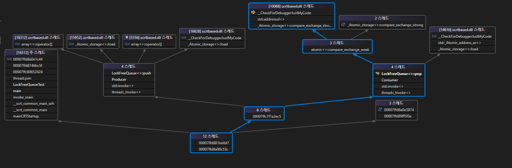
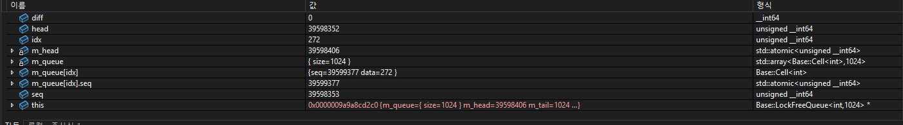
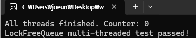

## 개요
[BaseLib/LockFreeQueue](BaseLib/LockFreeQueue.h)는 Vyukov의 MPMC Lock-Free Queue를 참고하여 구현된 다중 생산자/소비자(MPMC) 큐이다.
이 문서는 Lock-Free Queue에 대한 테스트및 디버깅을 정리한다.

## 테스트 시나리오
[LockFreeQueue unit test 코드](MainServer/UnitTest.h)
- 큐 크기: 1024
- producer 스레드: 4개
- consumer 스레드: 4개
- atomic counter 변수: 1개 (큐 size 추적)
- push 횟수: 스레드당 10000회
- consumer 스레드 종료 조건: counter == 0
- back-off 정책: yield 호출

## 예상 결과
- 큐가 full일 경우, Producer는 yield를 수행하며 Consumer가 pop을 수행.
- Consumer가 먼저 큐를 비워 counter == 0이 되면 종료 조건 충족.
- 모든 push/pop 완료 후 counter == 0

## 테스트 결과
유닛테스트 통과 실패.


> 스레드 상태    
producer와 consumer 스레드 모두 join 되지 않고 계속 돌아가는 모습을 확인할 수 있다.


> producer 스레드 상태 

```cpp
bool push(T& data) {
	while (true)
	{
 		auto tail = m_tail.load(); // 관측된 지점
	}
}
```
- Producer 스레드는 모두 저 지점에서 관측 되었다.
- tail 값 관측: 1024 -> 큐가 full 상태


> Consumer 스레드 상태
- head와 seq 값이 비정상적으로 증가하는 형태 관측
```cpp
bool pop(T& out) {
	while (true)
	{
	...
		if (diff == 0) {
			if (m_head.compare_exchange_weak(head, head + 1)) { // 관측된 지점, 스레드 3개
				auto res = m_queue[idx].data;
				m_queue[idx].seq.store(head + QSize + 1, std::memory_order_release);
				out = res;// 관측된 지점, 스레드 1개
				return true;
			}
		}
	}
}
```
- 일부 Consumer 스레드는 CAS 루프에 걸려있고, 하나만 정상적으로 pop 수행

## 원인 분석
Vyukov 코드와 비교해보니 pop에서 seq 갱신이 잘못됨

```cpp
	m_queue[idx].seq.store(tail + 1, std::memory_order_release); 
	// push에서 seq 갱신
	m_queue[idx].seq.store(head + QSize + 1, std::memory_order_release); // 잘못된 지점.
	// pop에서 seq 갱신
```
- push seq 갱신: tail + 1 -> 정상
- pop seq 갱신: head + QSize + 1 -> 문제

__seq 역할__
1. push 시
	- 빈 슬롯 확인: diff = seq - tail == 0
	- 점유 후 갱신: seq = tail + 1 -> 다음 pop 접근 시 읽기 가능 상태로 만듦
2. pop 시
	- 읽기 가능 확인: diff = seq - (head + 1) == 0
	- 읽기 후 갱신: seq = head + QSize -> 다음 push 접근 시 쓰기 가능 상태로 만듦

	
__문제 상황 예시 (큐 크기 1024)__
1. 큐 초기 상태: tail = 0, head = 0, seq[i] = i
1. 1번 push 수행: tail = 0 0 -> seq[0] = tail + 1 = 1
1. 큐 full 후 1025번째 push:
	1. tail = 1024, idx = 0
	1. seq[0] = 1 -> diff = seq - tail = 1 - 1024 < 0 -> push 실패 -> back-off yield 수행
1. 첫 번째 pop 수행:
	1. head = 0, idx = 0
	1. seq[0] = 1 -> diff = seq - (head + 1) = 0 → CAS 성공
	1. seq 갱신: 잘못된 경우 head + QSize + 1 = 1025
	1. seq가 예상보다 커서 다음 push/compare 계산이 꼬임 → Consumer 루프 이상 동작

## 해결

```cpp
	m_queue[idx].seq.store(head + QSize, std::memory_order_release); 
```
pop에서 seq 갱신을 head + QSize로 변경  


> Unit test 통과
단위 테스트 정상 통과 확인

## 결과
- Unit test 통과
- Back-pressure 상황에서도 안정적 동작 확인
- seq 계산 오류로 인한 consumer 루프 이상 현상 해결

## Note
- seq는 슬롯의 상태와 순서를 동시에 나타내는 값
- 잘못된 seq 갱신 시 CAS 실패 및 loop 지속 현상이 나타남