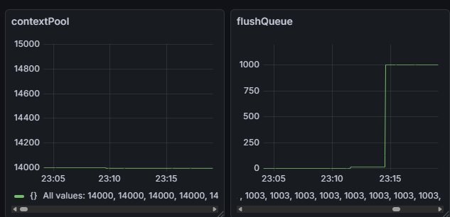

## 개요
[모니터링에서 발견한 버그 수정](#ff7665c) 
커밋에서 발견한 memory order 관련 문제이다.

*[ClientContextPool](NetLibrary/ClientContextPool.h)은 클라이언트 별로 수신 버퍼를 관리하는 ClientContext의 객체 풀이다.  
flushQueue는 ClientContext 객체 반납 과정에서 아직 작업이 남은 context를 임시 큐에 넣고 나중에 flush 되도록 만든 것이다.

## 문제 상황

> contextPool과 flushQueue

dummy client로 테스트하던 중 클라이언트 종료 시 flushQueue가 비워지지 않는 것을 관측했다.
flush 조건을 만족한 상태이고, 새로운 클라이언트를 접속시켜 flush가 실행되도록 하였음에도 flush가 수행되지 않았다.

## 원인 분석
__Disconnect()__
```cpp
m_connected.store(false, relaxed);
if (!m_connected.load(relaxed) && m_workingCnt.load(relaxed))
```

__ReleaseBuffer()__
```cpp
m_workingCnt.fetch_sub(1, relaxed);
if (!m_connected.load(relaxed) && m_workingCnt.load(relaxed) == 0)
```
[ClientContext](NetLibrary/ClientContext.h)에서 연결 종료를 입력받는 Disconnect 메서드와   
Core 로직에서 사용 완료한 버퍼를 반환하는 ReleaseBuffer메서드이다.  
PacketView를 통해 수신 버퍼를 복사하지 않고 버퍼 그대로 참조하여 사용하도록 만들었기 때문에,   
Disconnect시 바로 자원을 정리하는것이 위험하다고 생각해서, workingCnt를 두어 모든 작업이 끝난후 자원이 정리되도록 설계하였다.

m_connected와 m_workingCnt 둘다 atomic 변수이고, 어떤 자원을 lock하는 개념이 아니여서 memory_order_relaxed를 사용하였다.

ReleaseBuffer()의 fetch_sub()보다 m_connected.load()가 먼저 실행될 수 있고
이로 인해 조건문이 잘못 평가되는 race condition이 발생할 수 있다.

## 해결
__Disconnect()__
```cpp
m_connected.store(false, release);
if (!m_connected.load(acquire) && m_workingCnt.load(acquire))
```

__ReleaseBuffer()__
```cpp
m_workingCnt.fetch_sub(1, acq_rel_);
if (!m_connected.load(acquire) && m_workingCnt.load(acquire) == 0)
```
위와 같이 acquire-release 관계를 형성하도록 memory_order를 수정한 후
flush가 정상적으로 수행되었다.  
(relaxed에서는 두 atomic 간의 순서·가시성이 보장되지 않아 조건 평가가 뒤틀릴 수 있었음)

## Note
- 단순 counter나 종료 신호 같은 flag라도 두개 이상의 atomic 변수를 논리적으로 연결된 상태로 사용할 때에는  
memory_order를 잘 설정해야한다.
	- 한 변수 변경 → 다른 변수가 그 변경을 기준으로 의존 
	- 이런 경우 반드시 acquire/release 또는 seq_cst가 필요.
> x64의 강한 메모리 모델은 하드웨어 레벨 재배치는 줄여주지만,  
컴파일러 레벨 재배치를 막지 않는다.  
또한 Debug 빌드도 atomic ordering을 보장하지 않는다.

## 관련 문서
[커밋](#ff7665c)   
ClientContext: [ClientContext 설명 문서](ClientContext.md)  
ClientContext: [ClientContext.h](NetLibrary/ClientContext.h)  
ClientContextPool: [ClientContextPool.h](NetLibrary/ClientContextPool.h)  
