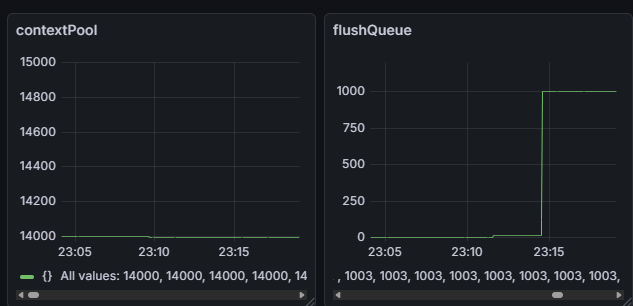

# Memory order Debug

## 1. 개요
[모니터링에서 발견한 버그 수정](https://github.com/JoEunil/MMORPG/commit/16247c033861497bd2840bb25f22b093a70e5370) 커밋에서 발견한 memory order 관련 문제를 해결하는 과정을 설명한다.

## 2. 문제 상황

> contextPool과 flushQueue

dummy client로 테스트하던 중 클라이언트 종료 시 flushQueue가 비워지지 않는 것을 관측했다.
flush 조건을 만족한 상태이고, 새로운 클라이언트를 접속시켜 flush가 실행되도록 하였음에도 flush가 수행되지 않았다.

*[ClientContextPool](NetLibrary/ClientContextPool.h)은 클라이언트 별로 수신 버퍼를 관리하는 ClientContext의 객체 풀이다.  
*flushQueue는 ClientContext 객체 반납 과정에서 아직 작업이 남은 context를 임시 큐에 넣고 나중에 flush 되도록 만든 것이다.

## 3. 원인 분석
__Disconnect()__
```cpp
m_connected.store(false, relaxed);
if (!m_connected.load(relaxed) && m_workingCnt.load(relaxed))
```

__ReleaseBuffer()__
```cpp
m_workingCnt.fetch_sub(1, relaxed);
if (!m_connected.load(relaxed) && m_workingCnt.load(relaxed) == 0)
```
[ClientContext](ClientContext.md)에서 연결 종료를 입력받는 Disconnect 메서드와   
Core 로직에서 사용 완료한 버퍼를 반환하는 ReleaseBuffer메서드이다.  
PacketView를 통해 수신 버퍼를 복사하지 않고 버퍼 그대로 참조하여 사용하도록 만들었기 때문에,   
Disconnect시 바로 자원을 정리하는것이 위험하다고 생각해서, workingCnt를 두어 모든 작업이 끝난후 자원이 정리되도록 설계하였다.

m_connected와 m_workingCnt 둘다 atomic 변수이고, 어떤 자원을 lock하는 개념이 아니여서 memory_order_relaxed를 사용하였다.

ReleaseBuffer()의 fetch_sub()보다 m_connected.load()가 먼저 실행될 수 있고
이로 인해 조건문이 잘못 평가되는 race condition이 발생할 수 있다.

## 4. 1차 해결 (잘못된 방법)
__Disconnect()__
```cpp
m_connected.store(false, release);
if (!m_connected.load(acquire) && m_workingCnt.load(acquire))
```

__ReleaseBuffer()__
```cpp
m_workingCnt.fetch_sub(1, acq_rel);
if (!m_connected.load(acquire) && m_workingCnt.load(acquire) == 0)
```
각 atomic 변수의 원자성은 relaxed로도 보장되지만, 두 스레드가 서로 다른 변수를 통해 상대방의 상태를 관측해야 하므로, release-acquire 쌍을 적용해 두 atomic 사이에도 happens-before가 형성될 것이라 판단했다.  
acquire/release 시멘틱을 적용한 결과 정상적으로 동작하였다.  

## 5. 2차 해결
```cpp
Disconnect()
m_connected.store(false, seq_cst);
if (!m_connected.load(seq_cst) && m_workingCnt.load(seq_cst))

ReleaseBuffer()
m_workingCnt.fetch_sub(1, seq_cst);
if (!m_connected.load(seq_cst) && m_workingCnt.load(seq_cst) == 0)
```
1차 해결에서 잘못 판단한 지점은, acquire/release 시멘틱이 해당 atomic 변수 앞뒤의 모든 메모리 접근에 대해 happens-before를 형성한다고 생각한 것이다.  
하지만 acquire/release가 형성하는 happens-before는 "그 atomic이 보호하는 임계영역(주로 비원자적 데이터)"에 한정되며, m_connected와 m_workingCnt처럼 독립적으로 동작하는 두 atomic 사이에는 적용되지 않는다.  

즉 이 구조는 서로 다른 두 atomic을 교차로 store-then-load 하는 고전적인 SB 리트머스 테스트 패턴이며, 이런 패턴에서 StoreLoad 재배치를 완전히 막으려면 acquire/release가 아니라 seq_cst가 필요하다.  
1차 해결이 우연히 테스트를 통과한 건 fetch_sub이 RMW 연산이라 x86에서 LOCK 접두로 풀 펜스가 걸린 부수 효과였을 뿐, 표준이 보장하는 해결은 아니었다.    

## 6. Note
- relaxed는 atomic 변수의 원자성을 보장하지만, 스레드 간 순서는 보장하지 않는다.
  - store가 store buffer에 머무는 동안 뒤따르는 load가 먼저 실행될 수 있다.
    (x86에서 이를 막으려면 seq_cst store가 `XCHG`/`MFENCE`로 컴파일되어야 한다)
  - x64 TSO + Debug 빌드 환경에서 명령 재배치가 없었음에도 버그가 발생한 원인이다.

- fetch_add 기반 ID 발급은 relaxed여도 중복이 발생하지 않는다.
  - fetch_add는 read-modify-write 연산으로 캐시 라인을 독점하기 때문에,
    발급 스레드들끼리는 항상 최신값 기반으로 연산이 수행된다.
  - 단순 load로 관측하는 스레드가 없으므로 stale read 자체가 발생하지 않는다.

- 반면 m_connected + m_workingCnt처럼 독립적인 두 atomic을 교차로 확인해 조건을 판단하는 구조는,   
  하나의 atomic이 다른 데이터를 보호하는 관계가 아니라 고전적인 SB 리트머스 테스트 패턴 그 자체다.
  - acquire/release는 서로 다른 두 변수에 걸친 StoreLoad 재배치까지는
    막아주지 않으며, 완전한 방지에는 seq_cst가 필요하다.
  - 1차 해결(acquire-release)이 통과한 건 fetch_sub의 RMW 특성상 x86에서
    LOCK 접두로 우연히 풀 펜스가 걸린 결과였다.
 
- Windows(MSVC/x86-64) 빌드 기준, seq_cst 전환의 실제 비용 차이는 store 연산에서만 발생한다. 

## 7. 참고
- [ClientContext 설명 문서](ClientContext.md)  
- [ClientContext.h](NetLibrary/ClientContext.h)  
- [ClientContextPool.h](NetLibrary/ClientContextPool.h)  
