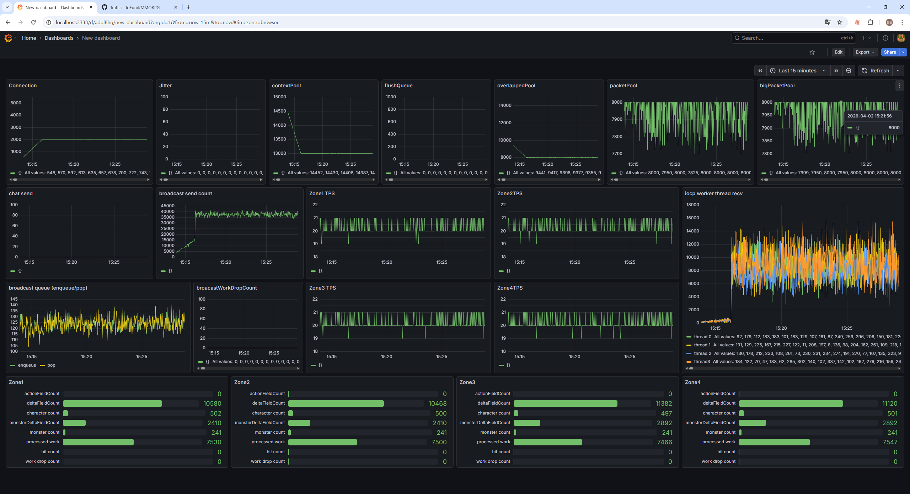

# Monitoring 시스템 구현

## 1. 개요
이 문서는 모니터링 시스템의 구조와 지표 수집 방법에 대해 설명한다.

## 2. 목적
[구조화 로그](StructuredLogging.md)를 활용하여 TPS, 접속자 수, 지연 시간 등 핵심 성능 지표를 실시간으로 추적하고,
그 데이터를 통해 적절한 자원 할당과 병목 구간 파악을 수행하여 안정적인 서버 운영을 가능하게 한다.

- 에러 로그와 같은 일반 로그가 아닌, 서버 성능 지표 자체를 위한 별도의 로그를 대상으로 한다.
 

## 3. 로그 처리 과정
모니터링을 위한 성능 지표는 일반 로그와 분리하여 다음과 같은 흐름으로 처리된다.

1. 애플리케이션 레벨 수집기
- 서버 내부에 성능 지표 수집기(collector)를 두고  
  전용 스레드가 주기적으로 TPS, 세션 수, 큐 길이 등을 구조화 로그 형태로 기록한다.
- 로그는 사전에 정의된 로컬 경로에 저장된다.  
2. Promtail 수집기
- 로컬 파일 시스템의 변경을 감지하고 새로추가된 로그를 읽는다.
- 해당 로그를 Loki로 전송한다.
3. Loki (로그 저장소)
- 전송된 구조화 로그를 시계열 기반으로 저장한다.
- Label 기반 검색 및 필터링 기능을 제공한다.
4. Grafana 시각화
- Loki에 대해 쿼리를 수행하여 원하는 지표를 가져온다.
- 대시보드에서 실시간 그래프를 구성한다.

## 4. 모니터링 지표

> Grafana 대시보드

Connection - 현재 연결 수를 나타낸다.   
Jitter - Ping 처리 과정에서 RTT가 200ms 이상으로 측정된 수. 엄밀히는 high_latency_count에 해당하며, 네트워크 지연 스파이크 발생 빈도를 추적하는 서버 성능 지표로 활용한다.
contextPool, overlappedExPool, packetPool. bigPacketPool - 객체풀의 갯수를 측정한다. 서버 병목 발생시 이 부분에서 고갈이 나타난다. 부하 발생시에도 버틸 수 있도록 테스트를 통해 적절한 수치를 설정해야한다.  
flushQueue - 종료된 context에서 내부 작업까지 완료되고 반납을 대기하는 큐.   
chat send - 채팅 패킷 발생 수 추적. 각각의 전송대상수를 반영하여 기록.   
broadcast send count - broadcast 스레드에서 패킷의 전송대상수를 반영하여 기록.   
zone TPS - 각 zone의 TPS 추적
iocp worker thread recv - 각 IOCP 워커 스레드의 recv 완료 작업 처리수를 기록, 분산 처리가 잘 이루어지는 지 확인 가능.  
broadcast queue - broadcast는 lock-free 작업큐를 사용하기 때문에 작업 발생량과 처리량을 추적하기위해, push, pop count를 추적한다.
broadcast work drop count - lock-free 작업큐에서 queue가 가득차 push에 실패하는 횟수를 추적한다. (broadcast queue에서 실제로 drop이 발생했는지 추적하기 위해 추가한 지표)

zone 내부 지표
- actionFieldCount: action(스킬 이펙트) 전송대상 수 
- deltafiedlcount: delta 업데이트 필드 수 
- character count: zone 내부 캐릭터 수 
- monster delta field coun: 몬스터 delta 업데이트 필드 수 
- monster count: zone 내부 몬스터 수
- processed work: zone에서 처리한 입력(packet) 수
- hit count: skill 처리 중 hit 판정 발생 횟수
- work drop count:lock-free 작업 큐 push 실패 횟수 

## 5. TPS 측정 방식
게임 서버의 Zone Thread는 시간 기반 로직 처리가 핵심이며, 일정한 TPS를 유지하는 것이 매우 중요하다.  
시간 기반 처리 요소:
- 스킬 스케줄링
- 쿨타임 감소
- HP/MP 등 자원 회복 로직
- 버프/디버프 지속 시간 처리
- AI Tick 등

 
서버 TPS가 떨어지면:
- 스킬 반응이 느려지고,
- 쿨타임이 비정상적으로 작동하며,
- 몬스터 AI가 느려지거나 틱이 밀리는 현상이 발생한다.

따라서 TPS는 Zone Thread의 건강 상태를 나타내는 핵심 지표이며
다음과 같은 방식으로 측정한다.
- zone thread에서 collector에 매 틱 counter 메서드를 수행한다.
- collector에서 1초에 한번씩 수집된 counter를 로그로 남기고 0으로 초기화한다.
	- 현재까지 집계된 Tick Count(TPS 값)를 로그로 기록한다.
	- 기록 후 Counter 값을 0으로 초기화한다.
	- 이후 1초 동안 Sleep하여 다음 측정을 대기한다.
	
__정확도 및 오차__
- Collector가 로그 기록 후 1초 Sleep을 수행하기 때문에,
  실제 1초 기준과 완전히 일치하지 않아 소폭의 오차가 발생한다.
- 이에 따라 TPS 값은 보통 19 ~ 21 범위에서 측정된다.

## 6. 참고
- [NetPerfCollector](NetLibrary/NetPerfCollector.h)  
- [CorePerfCollector](CoreLib/CorePerfCollector.h)  
- [Logger.h](ExternalLib/Logger.h)  
- [JsonUtility.h](ExternalLib/JsonUtility.h)  
