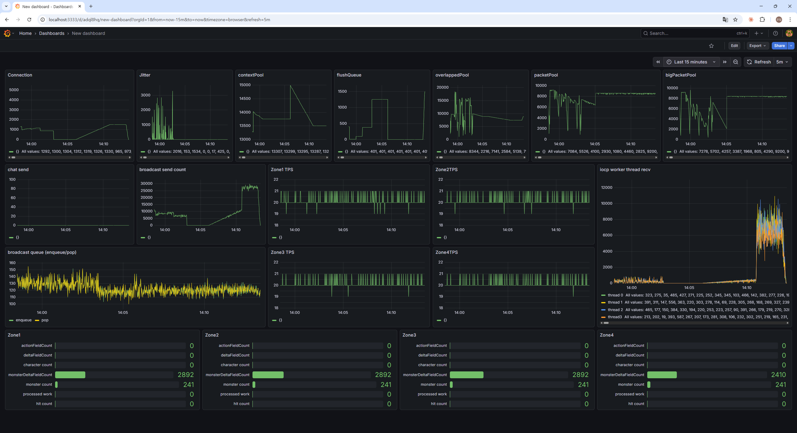

# ObjectPool 리팩토링

## 1. 문제상황
```cpp
        void Increase(uint16_t currentSize) {
            while (currentSize++ < target) {
                objects.emplace_back(new T);
            }
        }
        void Decrease(uint16_t currentSize) {
            while (currentSize-- > target) {
                delete objects.back();
                objects.pop_back();
            }
        }
```

ObjectPool에 동적으로 크기를 조절하기 위해, target size와 크기조정의 기준이 되는 min, max size를 사용하였다.  
문제는 resize 로직이 loop 내에서 개별로 `new`/`delete`를 호출하는 구조라는 점이다.  
시스템 콜이 반복적으로 발생해 성능 저하가 발생할 수 있다.

## 2. 수정사항
- 각 객체풀의 내부에서 Base::ObjectPool를 멤버로 사용하는 구조로 변경하여 변경지점을 줄인다.  
- Base::ObjectPool의 구조적 결함을 개선한다. 

## 3. ObjectPool 변경 후보

### 3.1 블록단위 할당 + free list
개별 객체를 하나씩 new/delete하는 대신, 미리 고정 크기의 블록(예: 64개 단위)을 한 번에 할당해두고, 반환된 객체는 free list로 연결해 재사용하는 방식이다.
핵심 아이디어:

할당: free list에서 꺼냄 → O(1), 시스템 콜 없음
반환: free list 앞에 연결 → O(1)
풀이 고갈되면 블록 단위로 추가 확장

장점:
resize 시 루프 내 개별 new/delete 제거 → 시스템 콜 횟수 대폭 감소
메모리 지역성 향상 (같은 블록 내 객체들이 연속된 주소)
감소 정책도 블록 단위로 한 번에 처리 가능

단점:
구현 복잡도 증가 (블록 생애주기 관리 필요)
블록 내 일부만 사용 중일 때 해제 불가 → 단편화 가능성


### 3.2 블록단위 할당 + 감소 정책 제거
3.1에서 감소 로직만 뺀 형태. 한 번 확장된 풀은 줄어들지 않는다.
장점: 구현 단순, 재할당 오버헤드 없음
단점: 스파이크 시 부풀어오른 풀이 줄어들지 않아 장기 운영 시 메모리 점유 지속

### 3.3 고정 크기 객체 풀 사용. 
이미 Base::FixedObjectPool로 구현되어 있다. 풀 크기를 설계 시점에 확정하고, 런타임 resize를 하지 않는다.  
고갈 시에는 확장하지 않고 Drop으로 대응한다.

### 3.4 그 외 memory 관련 최적화 기법
Slab allocator:
동일한 크기의 객체를 슬랩(slab) 단위로 캐싱해두는 기법. 객체 생성/소멸 비용을 줄이고 메모리 단편화를 억제한다.

jemalloc / tcmalloc:
기본 malloc을 대체하는 고성능 메모리 할당기. 스레드별 캐시, 크비용 자체를 낮춘다. 기 클래스 분리 등으로 개별 `new`/`delete` 
단, 이는 할당기 최적화이지 풀 구조 문제를 해결하는 게 아니다.  
루프 내 개별 `new`/`delete`라는 근본 구조가 남아있으면 효과가 제한적이다.  
> 링크 단계에서 적용하는 방식으로, 코드 변경 없이 적용 가능하다.  


## 4. 설계 결정 및 트레이드오프
### 4.1 객체풀 구조 변경

> 1500명 더미 테스트에 실패한 결과이다.  
오른쪽 상단 지표에서 packetPool이 고갈되고 재할당 되는것을 확인할 수 있다.  

변경 후보를 검토하면서, 게임 서버에서 ObjectPool을 동적으로 조정하는 구조가 정말 필요한지 먼저 고민했다.  
이전 부하 테스트에서 IO 병목이 Pool 고갈로 이어지는 현상을 관측한 적이 있다. 이 경험을 토대로 볼 때, 동적 조정 구조는 병목 상황에서 추가 할당을 유발해 지연을 전이시키고, 최악의 경우 서버를 freeze시킬 수 있다고 판단했다.  

따라서 더 적합한 방식은 다음과 같다고 보았다. 
- ObjectPool을 미리 peak 상황에 맞춰 확장해두고, 그럼에도 고갈되는 상황이 발생하면 해당 작업을 Drop시킨다. 
- 이후 다음 패치에서 풀 크기를 조정하거나, 고갈을 야기한 지점 자체를 수정한다. 

런타임에 무리하게 대응하기보다, 한계 초과분은 버리고 운영 단계에서 풀어가는 쪽이 게임 서버에 맞는 방식이라고 생각한다.  
이 결정에 따라 `Base::ObjectPool`을 삭제하고 `Base::FixedObjectPool`을 사용하도록 변경한다.

### 4.2 생성자 인자 지원

```cpp
class PacketPool : public Core::IPacketPool {
    std::vector<Packet*> m_packets;
``` 
위와 같은 패킷 풀 구조에서 `Base::ObjectPool`을 멤버로 사용하지 않은 이유는 `Packet`의 기본 생성자를 사용하지 않기 때문이다.   
따라서 FixedObjectPool에서 Type에 대해 생성자 인자를 전달 할 수 있도록 template 생성자와 placement new를 통해 처리하였다.  

```cpp
template<typename... Args>
explicit FixedObjectPool(const Args&... args)
    : m_storage(std::make_unique<Slot[]>(Size)) {
    freeList.reserve(Size);
    for (size_t i = 0; i < Size; i++)
        freeList.push_back(::new (&m_storage[i]) T(args...)); // 주소에 생성자 호출 placement new
}
```

PacketPool, OverlappedExPool, MessagePool의 멤버로 FixedObjectPool을 사용하도록 변경하였다.  
변경 결과 각 객체풀은 FixedObjectPool의 래퍼 형태로 단순화 되었고, 추후 변경이 용이한 구조가 되었다.  

### 4.3 실패 처리

객체풀을 동적으로 조정하지 않기 때문에, 메서드 호출 부분에서 실패 처리를 추가하였다. 

```cpp
for (int retry = 0; retry < MAX_RETRY && !msg; retry++) {
    msg = messagePool->Acquire();
    if (!msg)
        std::this_thread::yield();
}

if (!msg) {
    std::vector<std::byte> binary(sizeof(CharacterState));
    std::memcpy(binary.data(), &temp, sizeof(CharacterState));
    Core::errorLogger->LogError("state manager", "failed to acquire message for disconnect", "sessionID", session, "character state", binary);
    continue;
}
```

StateManager에서 클라이언트 Disconnect 처리에서 실패하는 경우 단순히 Drop으로 처리하면, 캐릭터의 상태 정보가 날라가기 때문에, 재시도 루프와 로그를 추가하였다.   
busy spin 되지 않도록 yield 호출하였고, 재시도 횟수를 제한하였다.  

## 5. 참고
[FixedObjectPool](BaseLib/FixedObjectPool.h)  
