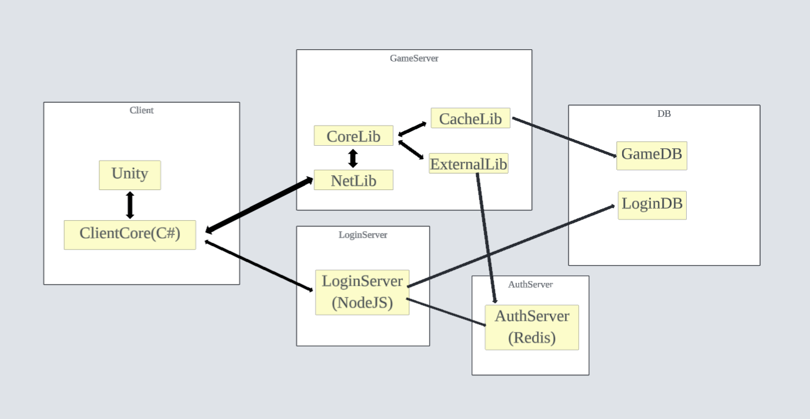

 # MMORPG GAME PROJECT

## 목차
1. [프로젝트 개요](#프로젝트-개요)
2. [기술 스택](#기술-스택)
3. [아키텍처 다이어그램](#아키텍처-다이어그램)
4. [스레드 모델](#스레드-모델)
5. [핵심 기술 요약](#핵심-기술-요약)
6. [부하 테스트 및 I/O 병목 분석](#부하-테스트-및-io-병목-분석)  
7. [리팩토링](#리팩토링)
8. [트러블 슈팅](#트러블-슈팅)
9. [추후 개선 사항](#추후-개선-사항)
10. [빌드, 실행 방법](#빌드-실행-방법)
11. [기술 문서 목록](#기술-문서-목록)

## 프로젝트 개요

__목적__
- MMORPG 서버 구현을 통해 서버 관점에서 요구되는 기술과 개념을 이해한다.  
- 서버 운영과 관련된 핵심 기술을 직접 경험하고 습득한다.  
- 실제로 동작 가능한 형태의 서버를 구현하고, 테스트를 통해 기능을 검증한다.

__목표__
- 클라이언트 로그인부터 사용자 접속 종료 및 재접속 로직까지, __End-to-End 데이터 파이프라인__ 을 설계하고 구현한다.  
- 프로젝트 전반에 걸친 서버 구조와 동작 흐름을 직접 설계한다.
- 채팅, 몬스터, 스킬 등 기본 콘텐츠를 구현하고 클라이언트와의 연동을 검증한다
- 더미 클라이언트를 활용해 처리 성능을 확인한다.


## 기술 스택

__클라이언트__
- 게임 클라이언트: Unity
- 클라이언트 라이브러리: .Net Standard 20 (Unity 연동 목적) 
- 더미 클라이언트, Winform: .Net 8.0 

__서버__
- 게임 서버: C++20  
- DB: Mysql  
- 로그인 서버: Node.js  
- 인증 서버: Redis 

__로그, 모니터링__
- 비동기 로그, 구조화 로그: spdlog, nlohman(json)
- 로그 저장소: promtail, loki
- 모니터링: grafana 

## 아키텍처 다이어그램


프로젝트는 클라이언트·서버·공용 라이브러리로 명확히 분리된 구조를 가진다.

클라이언트는 .NET 기반의 ClientCore 라이브러리에서 네트워크 로직을 처리하고, UI는 WinForms 테스트 후 Unity View로 대체할 수 있도록 MVVM 패턴을 적용했다.

서버는 기능별로 모듈화되어 있으며,

- __NetLibrary__ 는 네트워크 IO 및 네트워크 세션, 핑 처리,
- __CoreLib__ 는 게임 로직,
- __CacheLib__ 는 DB I/O와 메모리 캐시,
- __ExternalLib__ 는 로그 처리 및 Redis 기반 세션 인증을 담당한다.

외부 모듈로는  spdlog, hiredis, libevent, nlohmann(json), Mysql Connector C++를 사용하며, DB는 로그인 DB와 게임 DB로 분리하여 운영한다.
또한 인증 서버는 Redis에 임시 세션을 저장해 게임 서버 진입을 검증하고, 로그인 서버는 로그인 토큰을 발급해 인증 서버에 세션을 등록하는 역할을 수행한다.

## 스레드 모델

스레드별 작업 성격에 따른 분류   

__MaineServer__   
- main thread

__NetLibrary__  
- ping thread  
- net timer  
- perf collector -  IO-bound  
- iocp worker pool - CPU-bound  

__CoreLib__    
- ZoneThreadSet - CPU-bound  
- NoneZoneThreadPool  
- perf collector - IO-bound    
- chat thread - CPU-bound (작업량 증가 시)  
- broadcast thread pool - CPU-bound (작업량 증가 시)  

__CacheLib__  
- flush dispatcher  
- cache flush: IO-bound (DB)    

__ExternalLib__  
- session thread: IO-bound (event 루프 기반)  

표시되지 않은 스레드들은 작업 빈도와 CPU 소모가 낮기 때문에  
CPU-bound 또는 IO-bound로 분류하기 어렵다.  

또한 WSA Send / WSA Recv는 비동기 IO 모델을 사용하기 때문에,  
스레드가 IO 완료를 기다리지 않는다.  
따라서 해당 작업을 IO-bound로 분류할 수 없다.  

## 핵심 기술 요약 

고성능 비동기 IO 모델인 IOCP를 기반으로, Lock-free 자료구조와 멀티스레드 최적화를 통해 대용량 트래픽을 처리하는 서버 아키텍처를 설계하고 구현.

### 1. 소켓과 패킷 수신 처리 구조
- __수신 및 전파__ : IOCP 비동기 수신 → ClientContext의 RingBuffer를 통한 패킷 조립 → PacketView를 활용한 제로 카피 지향 로직 전파.
	- [IOCP](IOCP&epoll.md) : IOCP와 epoll 비교
	- [ClientContext](ClientContext.md): TCP 수신 버퍼 처리구조, Ring buffer와 Context 누적버퍼 처리 방법


### 2. 멀티스레드 동기화 및 성능 최적화
- [memory_order.md](memory_order.md):멀티스레드 환경의 메모리 재배치 문제를 방지하고 성능을 최적화하기 위해, Acquire-Release 시맨틱의 동작 원리를 분석하고 이를 SpinLock 설계에 적용한 과정을 정리.
- [LockFreeQueue.md](LockFreeQueue.md): Lock 경합을 방지하기 위해 atomic 변수와 CAS(Compare-And-Swap) 함수를 통해 구현한 __Vyukov's Lock-free Queue__ 구현 및 검증.
- [TripleBuffer](TripleBuffer.md) : 로직 스레드와 네트워크 스레드 간의 간섭을 최소화하여 데이터 일관성 유지.

### 3. 네트워크 안정성
- [Ping](PingLoop.md) : Ping 루프를 통해 좀비 세션 탐지 및 순환 참조 없는 안전한 세션 종료 로직 구현.
- [Flood Detection](https://www.google.com/search?q=FloodDetect.md): 어플리케이션 레벨에서의 대역폭 공격 방어를 위해 패킷 유입량을 감시하고 차단하는 탐지 로직 적용.  
- [Tick](Tick.md) & [Snapshot](Snapshot.md) : 클라이언트와 서버 간의 틱 기반 동기화 및 패킷 크기 최적화를 위한 스냅샷 전략 수립.

### 4. 콘텐츠 구현 및 모니터링
- [Monster](Monster.md) & [Skill](Skill.md) : 간단한 AI 및 상호작용 로직을 통해 구조적 위험성 분석. AOI(Area of Interest) 및 Cell 분할 필요성 도출.
- [StructuredLogging](StructuredLogging.md) : 서버 내부 상태와 테스트 결과를 시각화하고 추적하기 위해 로그를 구조화하여 분류 및 적용.


## 부하 테스트 및 I/O 병목 분석

모니터링 시스템은 Grafana + Loki + Promtail 조합으로 구축하여 서버 메트릭을 실시간으로 시각화하였다. (자세한 내용은 [모니터링](Monitoring.md) 참고)  
다중 접속 환경에서의 서버 안정성을 검증하기 위해 더미 클라이언트를 활용한 단계별 부하 테스트를 진행하였다.
- 100명 테스트 (성공): AOI(Area of Interest) 효율 및 메모리 풀 안정성 검증 완료.
	- 모니터링 지표 분석 중 이동 입력 설계(방향/속도 기반)의 치명적인 결함을 데이터로 확인하였다.
- 1,000명 테스트 (실패): 단일 장비의 리소스 경합으로 인한 커널 레벨 소켓 종료 현상 발생.

[주요 분석 포인트]  
왜 1,000명 테스트에서 소켓이 강제 종료되었는가?   
왜 이동 입력이 전부 처리되지 않았는가?  

[더미 테스트](DummyTest.md)에서 자세한 내용 확인

## 리팩토링
기능 구현 과정에서 직면한 구조적 한계와 병목 지점을 분석하고, 명확한 근거와 필요성에 따라 진행한 리팩토링 기록입니다.  

[채팅 기능 리팩토링](ChatRefactor.md)    
- 필요성: 채팅 트래픽이 메인 게임 로직(Zone Tick)의 성능에 영향을 미칠 수 있는 것을 인지. 핵심 로직의 안정성을 위해 채팅 로직 레이어 분리 결정.
기존 채팅 기능이 단순히 전송 대상(Zone) 공유를 위해 Zone 로직내에 통합시켜놨다. 
- 내용: 채팅 전용 스레드/레이어 분리 및 추가 기능(Global Chat, 귓속말) 구현 

[ClientContext 리팩토링: God Object](ClientContext.md)  
- 필요성: 하나의 객체가 너무 많은 상태를 관리하여 복잡성이 높고, 버그 추적에 어려움 경험
- 내용: 기능을 쪼개어 ClientContext를 수신 버퍼 관리 전용으로 경량화, SRP

[Ping 리팩토링](PingRefactor.md)  
- 필요성: CoreLib에서 소켓을 직접 제어할 수 없어서 비정상 종료 소켓을 강제로 끊으 수 없는 구조
- 내용: NetLib로 Ping 루프를 이관하여, 비정상 종료 or Ping 응답 실패 누적된 소켓 강제 종료.

[AOI 적용](AOI.md)  
- 필요성: 스킬 판정 시 모든 대상을 조회하는 방식이 유저 수 증가에 따른 성능 하락이 될 수 있음을 인지
- 내용: 격자형 Cell 구조 도입 및 다중 Cell의 패킷 조각(Chunk)을 효율적으로 병합 전송하는 Overlapped 구조체 개선 병행.

## 트러블 슈팅

- [LockFreeQueue 디버그](LockFreeQueueDebug.md)  
  Lock Free Queue 설계 오류로 인한 교착 상태를 호출 스택 분석을 통해 처리

- [ContextPool memory_order 디버그](MemoryOrderDebug.md)  
  느슨한 메모리 순서(memory_order_relaxed) 사용 시 발생하는 가시성 문제를 분석하고, 적절한 메모리 순서 (acquire / release) 적용 

- [SessionManager 데드락](SessionManagerDeadLock.md)  
  순환 참조로 인해 발생한 데드락 원인 추적, 구조 개선.

## 추후 개선 사항

- 현재 Zone 전환 로직에서 모든 작업에 mutex 잠금을 사용 → Zone별 lock-free 작업 큐 도입으로 mutex 제거
- 서버 성능 모니터링을 위해 메트릭 수집기 추가 필요
- 스킬, 몬스터 데이터는 데이터 드리븐으로 변경. 지금은 하드코딩으로 처리하는 상태.
- 몬스터 AI 처리 상태머신 기반으로 전환.
- 방향 + 속도를 입력 받는것이 아닌 유저가 이동후 최종 좌표를 서버에 전송하는 방식으로 변경해야 한다.
- 현재 동기 방식의 MySQL Connector/C++를 사용 중이며, 이는 쿼리 실행 시 워커 스레드의 블로킹을 유발한다. 이를 MariaDB Non-blocking C API로 교체할 필요가 있다.

## 빌드, 실행 방법
### 1. 개발 환경
Client Engine: Unity 6.0  
IDE: Visual Studio Community 2022  
OS: Windows 11 (x64), 25H2
DB/Store: MySQL8.4.0, Redis 3.0.504

Game Server: C++ 20, Windows SDK 10.0 
Client Core: .Net Standard 2.0
DummyClient: .Net 8.0
Login: NodeJs 22.14.0

### 2. 외부 모듈
프로젝트에 필요한 모든 외부 라이브러리는 /External 경로에 포함되어 있다.  
솔루션 파일을 열어 즉시 빌드가 가능하도록 의존성이 설정되어 있으며, 라이브러리 바이너리도 프로젝트에 포함되어있다.   

포함 모듈: hiredis, spdlog, MySQL Connector/C++, nlohmann/json
- Nuget 패키지: Newtonsoft.Json, libevent2

- x32 또는 Windows 8 이하 환경에서 빌드 시, 해당 타겟에 맞는 라이브러리 바이너리를 /External 경로에 재배치해야 한다.
- Linux 및 macOS 환경에서의 빌드는 지원하지 않는다.

### 3. 외부 인프라 설정
DB  
- 스크립트 실행: Resources/DB/init.sql 
	- 로그인 DB, 게임 DB 생성
- Host: localhost
- ID/PW: root / 1234 

인증서버  
- Program Files\redis-server.exe 실행
- Host: 127.0.0.1
- Port: 6379

로그인서버  
- Node.js로 실행하거나 vs에서 실행 
- localhost, 포트 3000

게임 서버  
1. Mainserver 빌드 후 실행
1. 또는 Resources/Release/MainServer.exe 실행
	1. 실행파일 직접 사용 시 로그 경로 변경됨
	1. Resources/monitoring/promtail-config.yaml에서 path를 Resources/Release/logs/~~.log로 변경


### 4. 모니터링 설정
1. grafana, loki, promtail 설치.  
	1. grafana: https://grafana.com/grafana/download?edition=oss&platform=windows
	1. loki, promtail: https://github.com/grafana/loki/releases (assets에서 loki, promtail 찾아서 설치)
	
1. Resources/monitoring 폴더의 loki-config.yaml과 promtail-config.yaml 수정
	1. 파일 저장 경로를 로컬 환경에 맞게 수정
1. loki.bat, promtail.bat 순서대로 실행.
	1. bat, yaml을 각각 loki, promtail 실행파일과 같은 경로로 설정
1. Resources/grafana.db를 아래 위치에 덮어쓰기
	1. C:\Program Files\GrafanaLabs\grafana\data
1. Grafana 실행
	- ID/PW: admin / admin

### 5. 계정 생성, 캐릭터 생성
- 로그인 서버, DB 실행중인 상태에서   
   ```node Resources/monitoring/create_user.js ```

- 캐릭터 생성 sql 실행
  ```Resources/DB/createCharacter.sql 실행```

### 6. 클라이언트 테스트
Dummy Client 
- DummyClients/Program.cs에서 접속자 수 설정 후 DummyClients 실행

Unity Client
- Resources/UnityClient/UnityClient.exe

기본 테스트 계정
- ID: test_1 ~ test_5000
- PW: 12345


## 기술 문서 목록

### 개념
- [memory_order](memory_order.md)
- [LockFreeQueue](LockFreeQueue.md)
- [IOCP와 epoll](IOCP&epoll.md)
- [로그 구조화](StructuredLogging.md)
- [TripleBuffer](TripleBuffer.md)

### 컨텐츠 설계
- [Skill](Skill.md) 
- [Monster](Monster.md) 

### 시스템 설계
- [네트워크 Flood 탐지](FloodDetect.md) 
- [Ping 처리](PingLoop.md) 
- [ClientContext](ClientContext.md) 
- [서버 클라이언트 동기화 처리 전략(Snapshot)](Snapshot.md) 
- [서버, 클라이언트 틱 처리](Tick.md) 

### 리팩토링
- [채팅 기능 리팩토링](ChatRefactor.md)
- [ClientContext 리팩토링: God Object](ClientContextRefactor.md)
- [Ping 리팩토링](PingRefactor.md)
- [AOI 적용](AOI.md)

### 트러블 슈팅
- [SessionManager 데드락](SessionManagerDeadLock.md)
- [LockFreeQueue 디버그](LockFreeQueueDebug.md)
- [ContextPool memory_order 디버그](MemoryOrderDebug.md)

### 테스트
- [모니터링](Monitoring.md) 
- [더미 클라이언트 테스트](DummyTest.md) 
