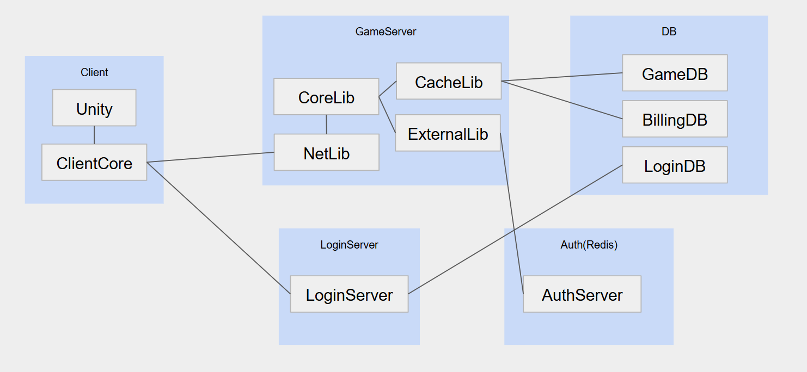
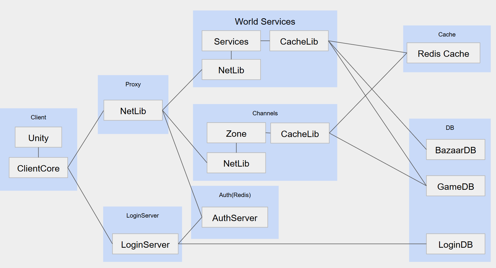

# MMORPG GAME PROJECT

C++ 기반 TCP Stateful MMORPG 게임 서버 — 개인 프로젝트 (개발 기간 약 1년)

📑 [C++ MMORPG Game Server 포트폴리오 PPT](https://docs.google.com/presentation/d/1Sz7WlzlE4qYqyXO43ad0i0CYAFvzJMR2/edit?usp=sharing&ouid=104250523129405797740&rtpof=true&sd=true)

<details>
<summary> 목차 </summary>  
  
1. [프로젝트 개요](#프로젝트-개요)
2. [기술 스택](#기술-스택)
3. [아키텍처](#아키텍처)
4. [핵심 기술 요약](#핵심-기술-요약)
5. [테스트](#테스트)
6. [리팩토링](#리팩토링)
7. [트러블 슈팅](#트러블-슈팅)
8. [추후 개선 사항](#추후-개선-사항)
9. [빌드, 실행 방법](#빌드-실행-방법)
10. [기술 문서 목록](#기술-문서-목록)
</details>  

## 프로젝트 개요

게임 서버의 핵심 문제인 **대규모 동시 접속 처리**와 **실시간 동기화**를 직접 해결하는 것을 목표로 시작한 프로젝트다.

- **동시성**: IOCP 비동기 IO 기반으로 **단일 PC 환경에서 5,000명 동시 접속**을 검증했다 (Lock-Free Queue, Zone Tick 기반 멀티스레드 아키텍처)
- **안정성**: WAL 기반 In-Process Write-Back Cache로 장애 시 Dirty 데이터 복구를 보장하고, **ASan으로 메모리 안전성(누수·오류 없음)을 검증**했다
- **정합성**: 거래소 시스템에서 Saga·Outbox/Inbox 패턴으로 cross-DB 정합성을, **Crash 후 배송 exactly-once(유실·중복 없음)를 테스트로 검증**했다

**구현 콘텐츠**: 캐릭터 이동 / 스킬 / 몬스터 / 아이템 거래소 / 인벤토리 / 채팅

**검증**
- 핵심 컴포넌트 Google Test 단위 테스트
  (LockFreeQueue, TripleBuffer, RingBuffer, RingQueue, FixedObjectPool, PacketView, NetTimer, WAL — 동시성 테스트 포함)
- Cache / 거래소 통합 테스트 (DB fetch, LRU eviction, WAL Crash 복구, 거래소 Crash 시나리오, 동시 구매 경합)
- Unity 클라이언트 연동 및 기본 기능 테스트
- 더미 클라이언트 부하 테스트
  → i3-12100F(4C/8T)에서 2,000명 → CPU 업그레이드·최적화 후 i5-14400F(6P+4E, 16T) 단일 PC 환경에서 5,000명 동시 접속 달성
- 종료 안정성 및 메모리 검증 (Graceful Shutdown, AddressSanitizer)

[](https://youtu.be/2q2kZwI3uSQ)
> ▶ 2,000명 동시 접속 Unity 클라이언트 테스트 영상

## 기술 스택

__게임 서버 (C++)__
- 네트워크: IOCP 비동기 IO, 커스텀 바이너리 프로토콜, RingBuffer 패킷 조립
- 동시성: Vyukov's Lock-free Queue, Triple Buffer, Sharded Mutex
- 캐시:In-Process Write-Back Cache (Shard, LRU eviction, WAL 기반 장애 복구, ACID 설계)
- 게임 로직: Zone Tick, Cell 기반 AOI, Snapshot Delta 동기화
- 안정성: Ping 좀비 세션 탐지, Flood Detection

__인프라__
- DB: MySQL
- 세션 저장소: Redis (In-Memory DB, TTL 기반 세션 관리)
- 로그인: Node.js
- 모니터링: Grafana + Loki + Promtail

__클라이언트__
- 게임 클라이언트: Unity
- 더미 클라이언트: .NET 8.0 (부하 테스트용)
- 클라이언트 라이브러리: .NET Standard 2.0 (Unity 연동)

__외부 라이브러리__
- spdlog, hiredis, libevent, nlohmann/json, MySQL Connector C++, Google Test

## 아키텍처



서버는 기능별로 4개 모듈로 분리된 구조를 가진다.

| 모듈 | 역할 |
|---|---|
| NetLibrary | IOCP 비동기 IO, 세션 관리, Ping |
| CoreLib | 게임 로직 |
| CacheLib | In-Process 캐시, DB I/O |
| ExternalLib | 구조화 로그, Redis 세션 인증 |

- DB는 로그인 DB / 게임 DB / 거래소 DB로 분리 운영한다.
- 클라이언트는 MVVM 패턴으로 WinForms(더미) / Unity(게임) View를 교체 가능하도록 설계했다.
- 단일 서버 내에서도 작업 특성에 따라 **Zone**(시뮬레이션) / **Non-Zone**(비시뮬레이션) 두 영역으로 논리적으로 분리해 처리한다.
  - Zone: tick 기반 동기 처리 — 이동, 전투, 몬스터 AI 동기화
  - Non-Zone: 요청-응답 패턴 — 인벤토리, 채팅, 인증 같은 비실시간 작업

<details>
  <summary><b>분산 아키텍처로의 확장 설계</b></summary>

현재는 단일 GameServer 내부에서 Zone / Non-Zone을 논리적으로만 분리해 운영하지만, 단일 프로세스 내에서 처리된다.     
서비스별로 부하 패턴이 다르기 때문에, 하나의 프로세스에 몰아넣으면 서버 스펙과 스레드 수를 정하는 기준이 모호해진다.  
또한 프로세스가 비대해질수록 여러 서비스가 같은 커널 자원(스케줄러, 메모리 등)을 공유하게 되어 서비스 간 자원 경합이 발생하기 쉬워지므로, 물리적으로 분리하는 편이 자원 관리와 확장성 측면에서 유리하다.   
MMORPG 서버에서는 VM 단위로 이런 물리적 분리를 하는 것이 일반적이다.  
실서비스 수준의 MMO로 발전시킬 경우, 이 논리적 분리를 물리적 분리로 확장한 아래 구조로 재설계할 수 있다.
  

#### 1. GameServer 책임 분리와 Proxy 도입

기존 GameServer가 담당하던 책임을 도메인별 서버로 분리하고, 클라이언트는 단일 Proxy 엔드포인트에만 접속한다.
Proxy는 opcode 기반 routing table에 따라 적절한 도메인 서버로 패킷을 분배한다.

- __Zone (in Channel Server)__ : 실시간 시뮬레이션 (이동, 전투, 몬스터 AI)
- __World Services__ : Mailbox, Guild, Friend 등 비실시간 서비스

이 분리의 핵심 기준은 단순한 Zone/Non-Zone이 아니라 **현재 player의 실시간 상태에 영향을 주는지 여부**이다.
인벤토리 사용/장착 같은 비시뮬레이션 작업이라도 character state에 직접 영향을 주고 latency에 민감하면 Zone에서 처리하고,
채팅, 우편, 결제처럼 character 상태에 직접 영향이 없는 도메인은 별도 서비스로 분리한다.

#### 2. NetLib 추상화와 라이브러리 재구성

단일 서버에서는 NetLib가 GameServer 내부에 종속된 형태였지만, 분산 환경에서는 모든 내부 서버가 NetLib을 공통으로 사용해야 한다.
이를 위해 NetLib가 transport 책임만 담당하도록 분리하고, 그 위에 각 서버가 자신의 packet dispatcher와 핸들러를 등록하는 구조로 재구성한다.

- Proxy: routing 핸들러 (내부 서버로 forward)
- Zone Server: 게임 로직 핸들러
- World Services: 도메인별 핸들러

#### 3. Internal Header 기반 세션 식별

내부 서버는 클라이언트와 직접 1:1 socket 매핑을 갖지 않는다.
Proxy가 내부 서버로 forward할 때 internal header를 추가해 sessionId를 명시하고, 내부 서버는 sessionId 기반으로 컨텍스트를 관리한다.

#### 4. Redis 기반 데이터 동기화 및 캐시 전략

분산 환경에서는 서버 간 상태 공유를 위해 Redis를 read cache로 활용한다.
Redis는 authoritative source가 아닌 캐시 계층으로 사용되며, 일부 stale 데이터를 허용하는 __eventual consistency__ 모델을 따른다.  

실시간 게임 상태는 Channel Server가 authoritative하게 관리하며 strong consistency를 유지하고, World Services에서 사용하는 비실시간 데이터는 Redis를 통해 서버 간 공유된다.
데이터 변경은 각 도메인의 authoritative 서버에서 처리된 후 DB에 반영되며, Redis는 캐시로서 필요 시 갱신되거나 TTL 기반으로 동기화된다.

</details>

## 핵심 기술 요약

MMO 특성상 수천~수만 개의 동시 커넥션을 처리해야 하므로 IOCP 기반 비동기 IO를 채택해 소수의 워커 스레드로 대용량 트래픽을 처리한다.
Lock-Free 자료구조와 Zone 기반 멀티스레드 아키텍처로 동시성을 최적화했다.

### 1. 소켓과 패킷 수신/송신 처리 구조
- __수신 및 전파__: IOCP 비동기 수신 → ClientContext의 RingBuffer를 통한 패킷 조립 → PacketView를 활용한 제로 카피 지향 로직 전파
  - [IOCP](IOCP&epoll.md): IOCP와 epoll 비교
  - [ClientContext](ClientContext.md): TCP 수신 버퍼 처리 구조, RingBuffer와 Context 누적 버퍼 처리 방법
- __송신 처리__
  - [IOCP Send 파이프라인](IOCPSendPipeline.md): IOCP 송신 큐 처리 구조, Chunk 패킷 일괄 전송, Partial Send 처리

### 2. 멀티스레드 동기화 및 성능 최적화
- [memory_order](memory_order.md): 멀티스레드 환경의 메모리 재배치와 가시성 문제를 방지하고 성능을 최적화하기 위해, Acquire-Release 시맨틱의 동작 원리를 분석하고 이를 SpinLock 설계에 적용한 과정을 정리
- [LockFreeQueue](LockFreeQueue.md): **Vyukov's Bounded MPMC Lock-free Queue** 구현 및 검증
- [TripleBuffer](TripleBuffer.md): RCU + Triple Buffer 개념을 응용한 Lock-free 스냅샷 버퍼 구현. Zone 스레드(Writer)의 세션 스냅샷을 브로드캐스트 스레드풀(Reader)에 공유하는 용도로 사용하며, 설계 목표는 SPMC였으나 CAS 기반 상태 플래그 구조로 결과적으로 MPMC까지 지원. 잠금/최신 여부/Reader Count 상태를 Bit Packing으로 단일 atomic 변수에 압축 관리

### 3. 네트워크 안정성
- [Ping](PingLoop.md): Ping 루프를 통한 좀비 세션 탐지. IOCP 워커의 호출 스택과 분리된 전용 스레드에서 세션을 종료하는 안전한 종료 전략 적용
- [Flood Detection](FloodDetect.md): 단일 세션의 과도한 트래픽 유입과 Tiny Packet을 이용한 CPU 고갈 공격을 애플리케이션 레벨에서 탐지·차단. Hot Path 특성을 고려해 시간 연산이 없는 Count 기반 Fixed Window 방식 채택
- [Tick](Tick.md) & [Snapshot](Snapshot.md): 클라이언트와 서버 간의 틱 기반 동기화 및 패킷 크기 최적화를 위한 스냅샷 전략 수립. Windows 타이머 해상도(기본 15.6ms)가 틱 보정과 RTT 측정에 미치는 영향을 분석하고, `timeBeginPeriod`(최대 1ms)와 high-resolution waitable timer(100ns 단위 설정)의 비용 구조를 비교. 되감기(lag compensation) 도입 시점을 적용 기준으로 설정

### 4. 콘텐츠 구현 및 모니터링
- [Monster](Monster.md) & [Skill](Skill.md): 간단한 AI 및 상호작용 로직을 통해 구조적 위험성 분석. AOI(Area of Interest) 및 Cell 분할 필요성 도출
- [거래소 시스템](Bazaar.md): 서버 통합 거래소 구현. 데이터 특성 기반 저장 전략 분리 (Gold: Write-Back 캐시 / Item: 캐시 + 거래 배송은 Outbox/Inbox로 exactly-once / Diamond: DB 트랜잭션), Stored Procedure로 ACID 보장
- [거래소 시스템 테스트](BazaarTest.md): 기본 기능, Crash 시나리오, 동시 구매 경합, lock contention 관측 테스트 수행. CAS 기반 중복 구매 방지 및 Crash 후 배송의 exactly-once 수렴(유실·중복 없음) 검증
- [StructuredLogging](StructuredLogging.md): 서버 내부 상태와 테스트 결과를 시각화하고 추적하기 위해 로그를 구조화하여 분류 및 적용
- [Monitoring](Monitoring.md): Grafana + Loki + Promtail로 TPS, 접속자 수, 객체풀 등 핵심 지표를 실시간 추적. Jitter 지표를 RTT 절대값 임계치 대신 Jacobson/Karels EWMA(SRTT/RTTVAR) 기반으로 재설계해, 클라이언트별 네트워크 환경 차이로 인한 오탐을 제거

### 5. 캐시 및 DB 설계

접근 빈도가 높은 인벤토리 데이터를 대상으로 In-Process 메모리 캐시를 직접 구현했다.
Write-Back 전략으로 DB IO를 줄이고, WAL(Write-Ahead Log)을 통해 Flush 이전 장애에서도 Dirty 데이터를 복구할 수 있도록 설계했다. 
또한 거래소가 Cache - DB 경계를 넘는 부분은 **Saga(등록)·Outbox/Inbox(배송)** 로 cross-DB 정합성을 보장하고, 아이템·재화의 중요도에 따라 durability를 차등 적용했다.  

> **⚠️ 과설계**: WAL 도입 계기는 거래소 durability 문제였는데, Outbox(DB)/Inbox(dedup) 조합만으로 이미 유실·중복 없는 exactly-once가 성립해 WAL이 없어도 됐다.  
Outbox/Inbox 도입 완료 후 WAL을 추가한 게 아니라 두 가지를 동시에 도입하면서, 이미 Outbox/Inbox가 durability를 충분히 보장한다는 걸 놓쳤다.   

- [Cache](CacheLib.md): 캐시 배치 전략, Write-Back/Read-Through 동작 흐름, 구조 설계
- [Cache ACID](CacheLib_ACID.md): 캐시 상태값 도입 및 ACID 보장 설계
- [Cache Integration Test](CacheLib_Test.md): DB fetch, cache hit/miss, flush, LRU eviction 동작 검증
- [WAL](WAL.md): Write-Ahead Log 구조, Replay, Truncate, 장애 복구 설계
- [DB](DB.md): DB 분리, 수직 파티셔닝, 복합 인덱스, View, Saga, Outbox/Inbox

### 6. 종료 처리 (Graceful Shutdown)

서버 종료 시 진행 중인 작업 유실과 소멸 순서로 인한 크래시를 방지하기 위해, 자원 소유 관계에 기반한 정리 순서와 스레드 종료 정책을 설계했다.

- [Graceful Shutdown](GracefulShutdown.md): 멤버 소멸 순서(소비자 → 제공자), 큐/워커 drain 정책, 로거 teardown 순서 정립. 종료 시점의 캐릭터 상태를 유실 없이 DB에 반영하고, 이중 Stop 호출·소멸 순서로 인한 크래시를 제거

<details>
  <summary><b>스레드 모델</b></summary>

스레드별 작업 성격에 따른 분류.

| 모듈 | 스레드 | 작업 성격 |
|---|---|---|
| MainServer | main thread | - |
| NetLibrary | iocp worker pool | CPU-bound |
| NetLibrary | perf collector | IO-bound (Logger) |
| NetLibrary | ping thread, net timer | - |
| CoreLib | ZoneThreadSet | CPU-bound |
| CoreLib | chat thread | CPU-bound (작업량 증가 시) |
| CoreLib | broadcast thread pool | CPU-bound (작업량 증가 시) |
| CoreLib | perf collector | IO-bound (Logger) |
| CoreLib | NonZoneThreadPool, MQ worker | - |
| CacheLib | DB Worker | IO-bound |
| CacheLib | flush dispatcher, cache flush, MQ worker | - |
| CacheLib | WALManager(fsync) | IO-bound |
| ExternalLib | session thread (event 루프 기반) | IO-bound |

> 성격이 표시되지 않은 스레드들은 작업 빈도와 CPU 소모가 낮아 CPU-bound / IO-bound로 분류하지 않았다.

현재는 단일 프로세스에서 모든 스레드가 실행되므로 CPU-bound 작업(Zone, Broadcast 등)과 IO-bound 작업(DB, Logger, Session 등)이 동일한 프로세스 자원을 공유한다.   
서비스 규모가 커질수록 스레드 수와 CPU 자원 배분 기준이 모호해지고, 서로 다른 특성의 작업이 커널 스케줄러와 메모리 자원을 경쟁하게 되어 수직 확장에 한계가 발생한다.  
</details>

## 테스트

### 단위 테스트 (Google Test)

핵심 컴포넌트는 별도 `UnitTests` 프로젝트에서 Google Test 기반으로 검증한다.
단순 기능 검증뿐 아니라 다중 스레드 환경의 동시성 테스트(경합, back-pressure)를 포함한다.

| 대상 | 테스트 범위 |
|---|---|
| LockFreeQueue (raw/unique_ptr/shared_ptr) | push/pop 정합성, empty/full 경계 처리, 멀티스레드 push/pop 경합 |
| TripleBuffer | 포인터 스왑 검증, Eventually consistent 읽기 보장, Reader 간 경합, Writer/Reader 동시 접근 |
| RingBuffer | 버퍼 획득/반납, 고갈·wrap-around 경계 조건, Release 범위 검증 |
| RingQueue | 기본 동작 및 초기 상태 검증 |
| FixedObjectPool | 할당/반납 정합성, 고갈 시 실패 반환, 멀티스레드 안전성 |
| PacketView | Setter/Getter, 소유 버퍼 반환(Release), 버퍼 병합(JoinBuffer) |
| NetTimer | 타이머 지연 및 정지 동작 |
| WAL | Replay, Segment Rotation, CRC 복구, 깨진 데이터 대응, multi type 처리, Truncate(경계 삭제·활성 세그먼트 보존) |

### 통합 테스트

- [Cache 통합 테스트](CacheLib_Test.md) — DB fetch, cache hit/miss, flush, LRU eviction 검증
- [Cache 영속성 테스트](CacheDurabilityTest.md) — Crash 복구, WAL Replay, Replay 멱등성, Flush 이전 장애 복구
- [거래소 시스템 테스트](BazaarTest.md) — Crash 시나리오, 동시 구매 경합, lock contention 관측

### 부하 테스트

단일 PC에 게임 서버, DB, Redis, 모니터링, 더미 클라이언트를 모두 구동한 환경에서 단계별 부하 테스트를 진행했다.

| 단계 | 결과 | 요약 |
|---|---|---|
| 100명 | ✅ 성공 | 메모리 풀 안정성 및 Zone TPS(19~21) 유지 검증 |
| 1,000명 | ❌ 실패 | 더미 클라이언트 단일 스레드 IO 병목 → TCP 수신 버퍼 초과로 소켓 종료. Wireshark(ZeroWindow) 분석으로 서버가 아닌 클라이언트 측 병목임을 확인 |
| 2,000명 | ✅ 성공 | 더미 클라이언트 IO 스레드풀 적용, Zone 스레드 물리 코어 고정, 서버 스레드 우선순위 제거로 starvation 해소 |
| 3 ~ 4,000명 | ❌ 실패 | 클라이언트 입력 지연 발생  |
| 5,000명 | ❌ 실패 | 하드웨어 한계로 freeze 발생 |
| 5,000명 | ✅ 성공 | CPU 업그레이드 (4core -> 10 core) |

- [모니터링](Monitoring.md) — Grafana + Loki + Promtail 조합으로 서버 성능 지표(TPS, 풀 사용량, 처리량 등)를 실시간 시각화
- [더미 테스트](DummyTest.md) — 100명 / 1,000명 테스트 및 실패 원인 분석 (Wireshark 검증)
- [더미 테스트2](DummyTest2.md) — 실패 원인 재분석과 개선을 거친 2,000명 달성 과정, 3,000~5,000명 시도 기록
- [더미 테스트3](DummyTest3.md) — CPU 업그레이드(i5-14400F)와 클라이언트 수신 Pipeline 적용·액션 패킷 재사용·P-Core Affinity 적용으로 5,000명 안정적 달성

### 메모리 분석 (AddressSanitizer)

서버와 단위 테스트를 ASAN 빌드로 실행해 메모리 안전성과 누수를 검증했다.

- [ASAN 부하 테스트 & 메모리 분석](ASAN.md) — 서버(2,000명, 1분/10분)·단위 테스트 43종을 ASAN으로 실행. 메모리 오류 없음, `inuse` 시간축 비교로 누수 없음 확인

## 리팩토링

기능 구현 과정에서 직면한 구조적 한계와 병목 지점을 분석하고, 명확한 근거와 필요성에 따라 진행한 리팩토링 기록.

[채팅 기능 리팩토링](ChatRefactor.md)
- 필요성: 채팅 트래픽이 메인 게임 로직(Zone Tick)의 성능에 영향을 미칠 수 있음을 인지. 핵심 로직의 안정성을 위해 채팅 로직 레이어 분리 결정
- 내용: 채팅 전용 스레드/레이어 분리 및 추가 기능(Global Chat, 귓속말) 구현

[ClientContext 리팩토링: God Object](ClientContextRefactor.md)
- 필요성: 하나의 객체가 너무 많은 상태를 관리하여 복잡성이 높고, 버그 추적에 어려움 경험
- 내용: 세션 상태 관리를 SessionManager로 이관하고 ClientContext를 수신 버퍼 관리 전용으로 경량화 (SRP)

[Ping 리팩토링](PingRefactor.md)
- 필요성: CoreLib에서 소켓을 직접 제어할 수 없어 비정상 종료된 소켓을 강제로 끊을 수 없는 구조
- 내용: NetLib으로 Ping 루프를 이관하여, 비정상 종료 또는 Ping 응답 실패가 누적된 소켓을 강제 종료

[AOI 적용](AOI.md)
- 필요성: 스킬 판정 시 Zone 내 모든 대상을 조회하는 방식은 유저 수 증가에 따라 성능 하락으로 이어질 수 있음을 인지
- 내용: 격자형 Cell 구조 도입 및 다중 Cell의 패킷 조각(Chunk)을 효율적으로 병합 전송하는 Overlapped 구조체 개선 병행

[DB 전용 worker 스레드 분리](DBWorkerRefactor.md)
- 필요성: DB I/O 블로킹으로 인한 캐시 처리 지연 제거
- 내용: DB 작업을 전용 워커 스레드로 분리, LoadFromDB 비동기 전환 및 클라이언트 재시도 방식 적용

[ObjectPool 리팩토링](ObjectPool.md)
- 필요성: 동적 resize 구조는 병목 상황에서 추가 할당을 유발해 지연을 메모리 영역으로 전이시킬 수 있음을 인지
- 내용: Elastic ObjectPool 제거 후 FixedObjectPool로 교체, 고갈 시 Drop + 로그로 대응. 크리티컬 경로(Disconnect)는 retry loop로 별도 처리

## 트러블 슈팅

- [LockFreeQueue 디버그](LockFreeQueueDebug.md)
  pop 시 seq 갱신 오류로 인한 무한 대기를 스레드 상태 및 호출 스택 분석으로 추적하여 수정

- [ContextPool memory_order 디버그](MemoryOrderDebug.md)
  두 atomic 변수를 교차 확인하는 SB(Store-Buffer) 리트머스 패턴에서 발생한 가시성 문제 분석. acquire/release로는 표준상 완전한 보장이 안 됨을 확인해 seq_cst로 최종 수정. 
  x64 + Debug 빌드(명령 재배치 없음)에서도 Store Buffer로 인한 가시성 지연으로 재현된 케이스

- [SessionManager 데드락](SessionManagerDeadLock.md)
  SpinLock을 획득한 상태에서 같은 락을 다시 획득하는 호출 경로로 인한 데드락 원인 추적, 구조 개선

- [DummyTest 과정 중 발생한 오류 디버그](DummyTestDebug.md)
  RingBuffer wrap-around 경계 조건 및 고정 크기 버퍼 한계로 인한 엣지 케이스 처리

## 추후 개선 사항

- 스킬, 몬스터 데이터를 데이터 드리븐 방식으로 변경 (현재는 하드코딩 상태)
- 몬스터 AI를 상태머신 기반으로 전환
- 이동 동기화 방식 변경: 방향 + 속도 입력 방식에서, 유저 이동 후 최종 좌표를 서버에 전송하는 방식으로 변경

## 빌드, 실행 방법

### 1. 개발 환경

| 항목 | 버전 |
|---|---|
| Client Engine | Unity 6.0 |
| IDE | Visual Studio Community 2022 |
| OS | Windows 11 (x64), 25H2 |
| DB | MySQL 8.4.0 |
| Session Store | Redis 3.0.504 (Windows용 마지막 버전) |
| Game Server | C++20, Windows SDK 10.0 |
| Client Core | .NET Standard 2.0 |
| DummyClient | .NET 8.0 |
| Login | Node.js 22.14.0 |

> Redis Windows 빌드는 2016년 이후 업데이트가 없으며, 실서비스에서는 Linux 환경에서 운영하는 것이 일반적이다.

### 2. 외부 모듈

프로젝트에 필요한 모든 외부 라이브러리는 `/External` 경로에 포함되어 있다.
솔루션 파일을 열어 즉시 빌드가 가능하도록 의존성이 설정되어 있으며, 라이브러리 바이너리도 프로젝트에 포함되어 있다.

- 포함 모듈: hiredis, spdlog, MySQL Connector/C++, nlohmann/json
- NuGet 패키지: Newtonsoft.Json, libevent2
- x86 또는 Windows 8 이하 환경에서 빌드 시, 해당 타겟에 맞는 라이브러리 바이너리를 `/External` 경로에 재배치해야 한다.
- Linux 및 macOS 환경에서의 빌드는 지원하지 않는다.

### 3. 외부 인프라 설정

**DB**
- 스크립트 실행: `Resources/DB/init.sql` (로그인 DB, 게임 DB 생성)
- Host: localhost
- ID/PW: root / 1234

**인증 서버 (Redis)**
- `Program Files\redis-server.exe` 실행
- Host: 127.0.0.1, Port: 6379

**로그인 서버**
- 터미널에서 실행 (또는 Visual Studio에서 실행)
```
cd Login
node app.js
```
- localhost, 포트 3000

**게임 서버**
1. MainServer 빌드 후 실행
2. 또는 `Resources/Release/MainServer.exe` 실행
   - 실행 파일 직접 사용 시 로그 경로가 변경됨
   - `Resources/monitoring/promtail-config.yaml`에서 path를 `Resources/Release/logs/~~.log`로 변경

### 4. 모니터링 설정

1. Grafana, Loki, Promtail 설치
   - Grafana: https://grafana.com/grafana/download?edition=oss&platform=windows
   - Loki, Promtail: https://github.com/grafana/loki/releases (Assets에서 loki, promtail 다운로드)
2. `Resources/monitoring` 폴더의 `loki-config.yaml`과 `promtail-config.yaml` 수정
   - 파일 저장 경로를 로컬 환경에 맞게 수정
3. `loki.bat`, `promtail.bat` 순서대로 실행
   - bat, yaml 파일을 각각 loki, promtail 실행 파일과 같은 경로에 배치
4. `Resources/grafana.db`를 `C:\Program Files\GrafanaLabs\grafana\data`에 덮어쓰기
5. Grafana 실행
   - ID/PW: admin / admin

### 5. 계정 생성, 캐릭터 생성

- 로그인 서버, DB 실행 중인 상태에서
  `node Resources/monitoring/create_users.js`
- 캐릭터 생성 SQL 실행
  `Resources/DB/createCharacter.sql`

### 6. 실행 순서

DB → Redis → 로그인 서버 → 게임 서버

### 7. 클라이언트 테스트

**Dummy Client**
- `DummyClients/Program.cs`에서 접속자 수 설정 후 DummyClients 실행

**Unity Client**
- `Resources/UnityClient/UnityClient.exe`

**기본 테스트 계정**
- ID: test_1 ~ test_5000
- PW: 12345

## 기술 문서 목록

### 개념
- [memory_order](memory_order.md)
- [LockFreeQueue](LockFreeQueue.md)
- [IOCP와 epoll](IOCP&epoll.md)
- [로그 구조화](StructuredLogging.md)
- [TripleBuffer](TripleBuffer.md)

### 컨텐츠 설계
- [Skill](Skill.md)
- [Monster](Monster.md)

### 시스템 설계
- [네트워크 Flood 탐지](FloodDetect.md)
- [Ping 처리](PingLoop.md)
- [ClientContext](ClientContext.md)
- [서버 클라이언트 동기화 처리 전략(Snapshot)](Snapshot.md)
- [서버, 클라이언트 틱 처리](Tick.md)
- [캐시 설계](CacheLib.md)
- [캐시 ACID 설계](CacheLib_ACID.md)
- [캐시 단위 테스트](CacheLib_Test.md)
- [WAL](WAL.md)
- [Cache Durability Test](CacheDurabilityTest.md)
- [DB 설계](DB.md)
- [IOCP Send 파이프라인](IOCPSendPipeline.md)
- [거래소 시스템](Bazaar.md)
- [거래소 시스템 테스트](BazaarTest.md)
- [Graceful Shutdown](GracefulShutdown.md)

### 리팩토링
- [채팅 기능 리팩토링](ChatRefactor.md)
- [ClientContext 리팩토링: God Object](ClientContextRefactor.md)
- [Ping 리팩토링](PingRefactor.md)
- [AOI 적용](AOI.md)
- [DB 전용 worker 스레드 분리](DBWorkerRefactor.md)
- [ObjectPool 리팩토링](ObjectPool.md)

### 트러블 슈팅
- [SessionManager 데드락](SessionManagerDeadLock.md)
- [LockFreeQueue 디버그](LockFreeQueueDebug.md)
- [ContextPool memory_order 디버그](MemoryOrderDebug.md)
- [DummyTest 디버그](DummyTestDebug.md)

### 테스트
- [모니터링](Monitoring.md)
- [더미 클라이언트 테스트](DummyTest.md)
- [더미 클라이언트 테스트2](DummyTest2.md)
- [더미 클라이언트 테스트3](DummyTest3.md)
- [ASAN 테스트 분석](ASAN.md)
