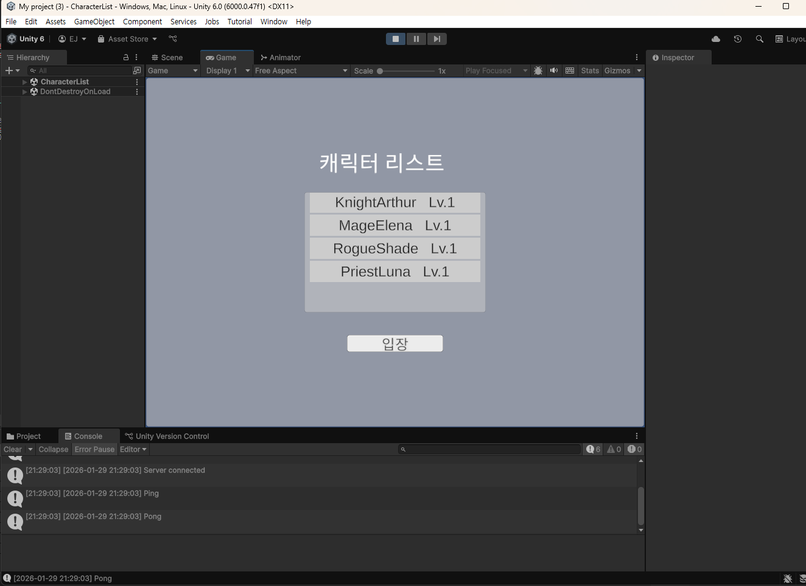
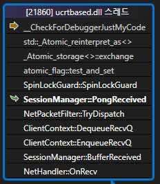

# SessionManager DeadLock Debug

## 1. 개요
[데드락 해결 및 SessionManager 수정#13](https://github.com/JoEunil/MMORPG/pull/13) 
PR에서 해결한 문제에 대해 설명하는 문서이다.
## 2. 문제 상황

> 접속 중단 된 화면  

첫번쨰 접속 유저는 로그인 이후 먹통이 되는 현상이 발생했다.
두번째 유저 부터는 정상적으로 동작했다.

## 3. 원인 분석

> DeadLock이 발생한 스레드  

- 디버그 모드에서 Ping 루프가 SpinLock을 획득하지 못하고 멈춤
- 다른 스레드에서 이미 SpinLock을 잡고 있음 (위 이미지)
- SessionManager 내부에서 호출 스택 상 SpinLock을 잡은 상태로 GetContext를 호출하며 데드락 발생
- 정상 동작한 유저는 샤드가 겹치지 않아서 문제가 발생하지 않음, Ping 루프는 이미 데드락 상태

## 4. 해결
GetContext를 통해 Context 포인터를 얻은 후, NetHandler에서 처리하도록 변경
이렇게 하면 Context 내부 작업에서 SpinLock 중첩이 발생하지 않음
```cpp
void OnRecv(SOCKET sock, uint8_t* buf, uint16_t len) const {
    ...
    auto ctx = sessionManager->GetContext(sock);
    ctx->EnqueueRecvQ(buf, len);
}
```

## 5. Note
- ClientContext의 설계의도를 간과하고 StateManager 내부에서 처리하도록 한 것이 문제

## 6. 참고
- 해당 PR: [데드락 해결 및 SessionManager 수정#14](https://github.com/JoEunil/MMORPG/pull/13)   
- ClientContext: [ClientContext 설명 문서](ClientContext.md)  
- [SessionManager.h](NetLibrary/SessionManager.h)  
- [ClientContext.h](NetLibrary/ClientContext.h)  
